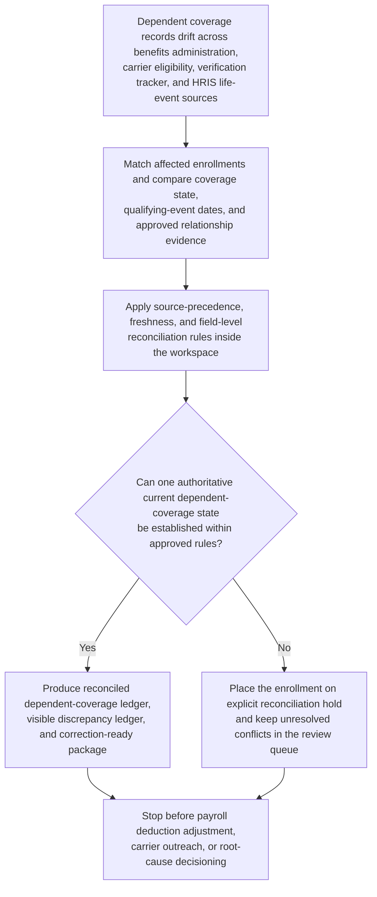

# Benefits dependent coverage state authoritative record reconciliation

## Linked pattern(s)

- `authoritative-record-reconciliation`

## Domain

HR.

## Scenario summary

After a mid-year family-status change and a delayed eligibility-feed correction, people operations discovers that dependent coverage state for several employees no longer agrees across the benefits-administration platform, the carrier eligibility ledger, the dependent-verification case tracker, and the HRIS life-event record. One source shows a newly added dependent as active for medical coverage with a corrected qualifying-event date, another still treats the prior election set as current for the same plan year, and the verification tracker contains approved document evidence that supports the relationship change but not the effective date now reflected in the carrier-facing ledger. Before any payroll deduction adjustment is executed, any carrier outreach is initiated, or any benefits specialist decides whether the drift came from stale enrollment feeds, late documentation, or manual processing error, the workflow must restore one trusted current dependent-coverage state for each affected enrollment, keep unresolved conflicts visible, and hand off a correction-ready package for controlled record repair.

## Target systems / source systems

- Benefits-administration enrollment records, dependent elections, plan-tier fields, and life-event logs
- Carrier eligibility ledgers, member-coverage extracts, effective-date history, and enrollment acknowledgments
- Dependent-verification case records with document outcomes, approved relationship evidence, and exception notes
- HRIS life-event entries, employee and dependent cross-reference identifiers, and qualifying-event timestamps
- Audit and reconciliation workspace tooling that preserves discrepancy ledgers, unresolved review items, and reversible correction packages

## Why this instance matters

This instance grounds the pattern in HR by restoring one defensible dependent-coverage record before payroll, carrier, or specialist follow-on work relies on contradictory data. It stays focused on authoritative-state restoration, discrepancy visibility, and correction-ready handoff rather than adjudication, payroll execution, employee communication, carrier negotiation, or root-cause analysis.

## Likely architecture choices

- A tool-using single agent can assemble enrollment, carrier, verification, and HRIS state into one bounded reconciliation run.
- Human-in-the-loop review remains standard for identity conflicts, disputed qualifying-event dates, missing verification evidence, or any correction that would change current coverage state.
- The workflow stops at the reconciled ledger, unresolved exception queue, and staged correction package rather than deduction changes, carrier updates, or appeal decisions.
- Shared reconciliation memory should preserve superseded values, applied precedence logic, prior adjudications, and rollback references.

## Governance notes

- Every employee and dependent identifier, coverage-tier field, effective date, verification outcome, and acknowledgment reference should retain lineage to the supporting source record and extraction time.
- The workflow should place an enrollment on explicit reconciliation hold whenever the benefits platform, carrier ledger, and verification evidence cannot be aligned within approved precedence and freshness rules.
- Human benefits and HR operations owners must approve ambiguous, bulk, or plan-sensitive corrections before publication into authoritative systems.
- Working ledgers and handoff packets should minimize exposed personal and health-related detail by using masked dependent identifiers or internal references where possible.

## Evaluation considerations

- Time to produce a human-reviewable dependent-coverage ledger with complete lineage and visible unresolved exceptions
- Agreement between the reconciled enrollment state and the final steward-accepted current-state view before any deduction or carrier update proceeds
- Percentage of conflicts routed into explicit hold or review queues rather than silently overwritten
- Reliability of correction-package generation when life-event timestamps, verification decisions, or carrier acknowledgments refresh during repeated runs
