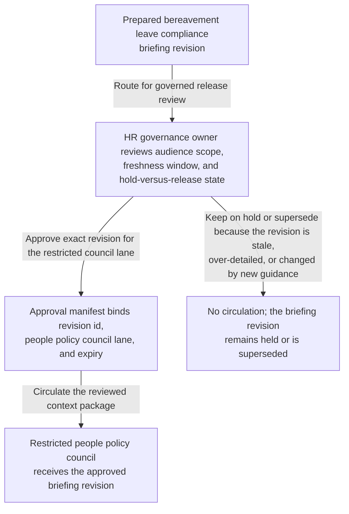
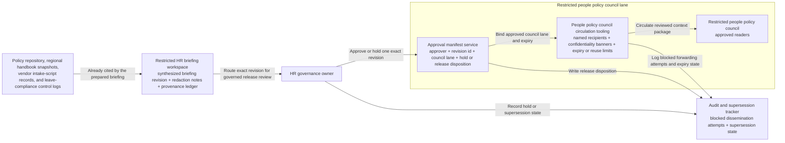

# Bereavement leave compliance briefing revision approved for people policy council circulation

## Linked pattern(s)

- `approval-gated-briefing-release`

## Domain

HR.

## Scenario summary

An HR policy and employee-relations workflow has already synthesized one revision of a bereavement leave compliance briefing after a quarterly review surfaced conflicting handbook language, vendor intake-script drift, jurisdiction-specific notice gaps, and unresolved redaction questions across several regions. Before that exact revision is circulated into the restricted people policy council lane, a named HR governance owner must approve the audience scope, freshness window, and hold-versus-release state so council readers receive the reviewed context package rather than a stale draft or an over-detailed copy. The workflow stops at governed release of that briefing revision; it does not adjudicate any employee case, decide the policy change, schedule manager training, launch communications, or execute downstream HR updates.

## Target systems / source systems

- Restricted HR briefing workspace storing the synthesized compliance briefing revision, superseded drafts, redaction notes, and provenance ledger
- Policy repository, regional handbook snapshots, vendor intake-script records, and leave-compliance control logs already cited by the prepared briefing
- People policy council circulation tooling enforcing named HR recipients, confidentiality banners, and expiry or reuse limits on released briefings
- Approval manifest service recording the HR governance owner, exact revision id, approved council lane, and explicit hold or release disposition
- Audit and supersession tracker preserving blocked dissemination attempts when newer jurisdiction analysis, counsel guidance, or redaction changes arrive before circulation

## Why this instance matters

This grounds the pattern in HR where the hard governance step is controlling visibility of one exact synthesized briefing revision, not deciding what the leave policy becomes. Workforce-policy compliance work often produces several near-current drafts that differ in redacted examples, jurisdiction annotations, or unresolved vendor-process caveats, so release authority must stay tied to one reviewed version instead of a vague permission to brief HR leadership. The example keeps the family boundary clean by ending at bounded circulation of context rather than drifting into policy adjudication, employee-case review, communication rollout, or operational execution.

## Likely architecture choices

- Approval-gated execution fits because the compliance briefing remains held until the HR governance owner approves one exact revision for the restricted people policy council lane.
- Human-in-the-loop review is necessary because only accountable HR leadership should accept residual compliance uncertainty, confirm protected-detail handling, and authorize circulation of sensitive workforce-policy context.
- A governed agent can assemble the release manifest, compare revision lineage, and block superseded copies, but it should not decide the policy remedy, assess individual leave cases, or trigger downstream handbook or communication changes.

## Governance notes

- Approval should bind to one immutable briefing revision, one named people policy council lane, one freshness deadline, and one explicit redaction profile so later edits cannot inherit permission silently.
- The released brief should preserve unresolved jurisdiction gaps, vendor-script drift, and protected-detail handling caveats rather than smoothing them into a false policy-ready narrative.
- If new counsel guidance, a regional handbook correction, or a redaction dispute appears during approval review, the pending revision should remain on hold and be superseded rather than circulated under stale approval.
- Audit records should preserve the released or held revision id, approver identity, council-recipient scope, expiry timing, redaction state, and any blocked forwarding attempts outside the authorized HR lane.

## Evaluation considerations

- Percentage of people policy council circulations where the released briefing revision id, hold or release disposition, and manifest metadata align exactly without later correction
- Rate at which stale, superseded, or out-of-scope HR compliance briefings are blocked before council visibility
- Time required to move from briefing-ready status to approved bounded circulation when provenance, redactions, and unresolved caveats are already complete
- Reviewer correction rate for missing caveats, wrong audience scope, or stale-state handling after the council receives the released briefing
