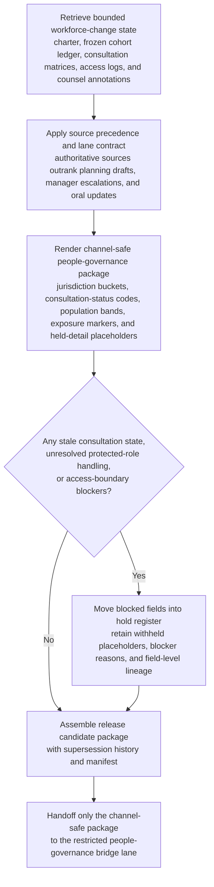
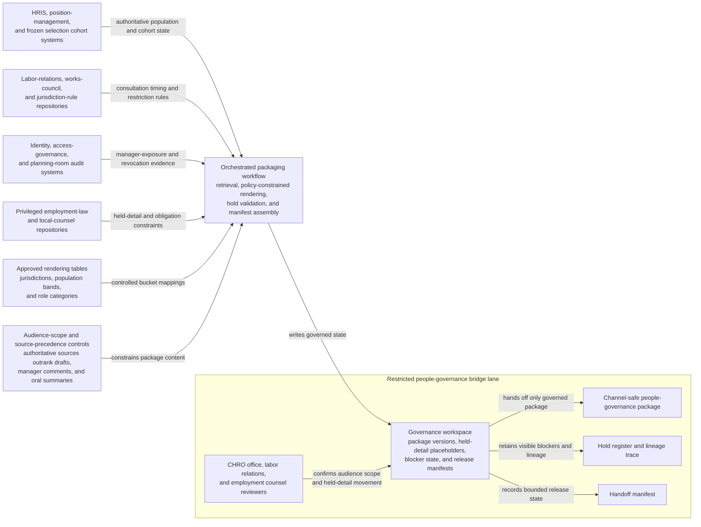

# Confidential workforce-change bridge channel-safe people-governance package

## Linked pattern(s)

- `critical-channel-safe-state-packaging`

## Domain

HR.

## Scenario summary

A restricted workforce-change governance bridge has been activated after an access-control failure exposes fragments of a confidential cross-border reduction-in-force planning cycle to managers outside the approved circle, creating immediate risk that labor-relations, employment-law, and executive participants could start coordinating from stale drafts or overshared employee detail. The authoritative state spans the approved workforce-change governance charter, frozen selection cohort ledger `FY26-Q2-RIF-batch-7`, legal-entity and jurisdiction consultation matrices, works-council timetable tracker `WRK-CNL-2026-03-18`, severance framework tables, role-criticality and backfill-exclusion rosters, manager-access revocation logs, and privilege-bound local-counsel annotations, all of which take precedence over planning spreadsheets, manager escalations, and oral status updates. Before the CHRO, employment counsel, labor-relations lead, and finance liaison can align inside one restricted people-governance lane, the workflow must transform that bounded state into the exact governed artifact `RIF-Confidentiality-Breach-People-Governance-Package-v3` with jurisdiction buckets, consultation-status codes, affected-population bands, manager-exposure markers, held-detail placeholders for named employees and protected-role handling, and explicit lineage showing what changed from `v2`. The package keeps visible blockers such as a stale Germany consultation-calendar snapshot, an unresolved protected-role mapping for a shared-services cohort, a missing acknowledgment that one regional planning folder was revoked from manager access, and an unsigned Poland local-counsel annex, and it stops at channel-safe handoff rather than selection approval, worker or manager notices, consultation submission, or downstream HR system action.

## Target systems / source systems

- Workforce-change governance workspace holding `RIF-Confidentiality-Breach-People-Governance-Package-v3`, prior package versions, held-detail placeholders, blocker state, and release manifests
- HRIS, position-management, and frozen selection cohort systems providing authoritative population scope, legal-entity assignments, role bands, and protected handling references
- Labor-relations, works-council, and jurisdiction-rule repositories defining consultation timing, audience restrictions, country-specific holds, and approved generalization rules
- Identity, access-governance, and planning-room audit systems showing which manager or leadership audiences received or lost access to confidential workforce-change material
- Privileged employment-law and local-counsel repositories governing which named-worker detail, severance assumptions, or jurisdiction-specific obligations must remain held or generalized for the restricted audience

## Why this instance matters

This grounds the pattern in HR people-governance work where the urgent need is not to decide who will be impacted, recommend severance terms, or start labor consultation, but to render one current, channel-safe representation of a critical confidential workforce-change state after the normal trust boundary has already been strained. The reusable difficulty is preserving materially necessary consultation, exposure, and population information for a narrow governance audience without letting named employees, protected-role logic, or draft selection artifacts spread further through the organization. The instance stays inside the pattern boundary because downstream notice timing, workforce-change adjudication, consultation strategy, and source-system updates remain separate workflows.

## Likely architecture choices

- An orchestrated multi-agent workflow can separate authoritative workforce-state retrieval, policy-constrained rendering, blocker and hold validation, and manifest assembly so each stage stays inspectable during the bridge.
- Human reviewers should remain in the loop because the CHRO office, labor relations, and employment counsel must confirm audience scope and decide whether any held jurisdiction or role-detail can move into a narrower annex.
- The workflow should emit only the governed package, hold register, lineage trace, and handoff manifest rather than approving selection cohorts, preparing worker communications, sequencing consultations, or mutating HR, payroll, or access systems.
- Approved rendering tables may normalize jurisdictions, employee populations, and role categories into controlled buckets, but unsupported inference about legal sufficiency, fairness, or final workforce-change decisions should remain out of scope.

## Governance notes

- Source precedence should remain explicit: the governance charter, frozen selection cohort ledger `FY26-Q2-RIF-batch-7`, jurisdiction consultation matrices, works-council tracker `WRK-CNL-2026-03-18`, access-revocation audit logs, and signed local-counsel annotations outrank draft planning sheets, manager comments, and oral bridge summaries.
- Every package field, especially consultation-status codes, affected-population bands, manager-exposure markers, and held-detail placeholders, should retain lineage to the exact frozen cohort snapshot, jurisdiction-rule version, access-log evidence, and prior `v2` package state.
- Visible blockers should remain in the hold register rather than disappearing into prose: stale Germany consultation timing, the unresolved protected-role mapping for the shared-services cohort, the missing revocation acknowledgment for one regional planning folder, and the unsigned Poland local-counsel annex each keep their own held-detail placeholder and blocker reason.
- Audience scope must stay limited to the restricted people-governance lane; the workflow ends before worker or manager notices, selection adjudication, labor-consultation filing, severance recommendation, payroll setup, or live access revocation execution.

## Evaluation considerations

- Percentage of restricted governance-bridge package versions accepted without reopening raw workforce-change planning rooms or frozen selection ledgers
- Rate of disclosure-boundary, stale-consultation-state, or hidden-blocker findings identified after the package is handed off
- Completeness of lineage and hold-state explanation for jurisdiction buckets, affected-population bands, manager-exposure markers, and protected-role placeholders
- Reliability of the package when consultation calendars shift, access-boundary evidence arrives late, or a previously held jurisdiction-specific detail must move into a narrower annex for the same restricted audience
