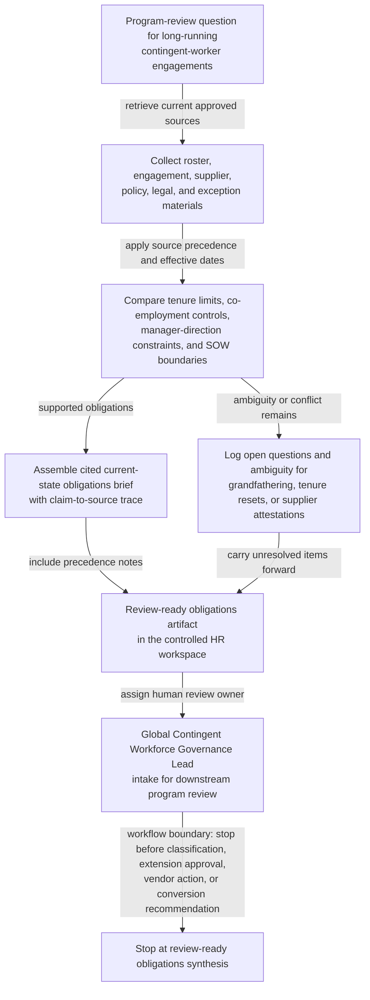

# Contingent-worker co-employment and tenure-limit obligation synthesis for program review

## Linked pattern(s)

- `research-synthesis-with-citation-verification`

## Domain

HR.

## Scenario summary

An HR contingent workforce governance team is preparing a quarterly program review for long-running contractor engagements spanning multiple business units, staffing suppliers, and jurisdictions with different labor-law overlays and internal tenure caps. Before anyone determines worker classification, approves engagement extensions, directs vendor action, recommends contractor conversion, or communicates with managers, the workflow needs a cited current-state obligations brief showing which co-employment controls, tenure-limit requirements, statement-of-work versus staff-augmentation boundaries, manager-direction constraints, vendor attestation expectations, and exception-record obligations are actually supported by the active source set. The useful artifact is a governed evidence-backed brief that makes source precedence explicit, identifies effective-date and jurisdiction ambiguity, logs open questions such as unclear policy grandfathering or inconsistent supplier attestations, and names the Global Contingent Workforce Governance Lead as the human review owner for downstream program-review intake.

## Target systems / source systems

- Controlled HR program-review workspace where the contingent-worker obligations brief, claim-to-source trace, source-precedence notes, and open-questions register are stored
- Vendor-management system, statement-of-work repository, staff-augmentation request records, and contingent-worker roster reporting that identify supplier, engagement type, work dates, tenure milestones, manager relationships, and extension history
- Internal contingent labor policy library, manager playbooks, procurement governance standards, and employee-relations guidance defining manager-direction boundaries, badge or equipment controls, tenure caps, and review obligations
- Primary-source statutory text, labor-agency guidance, court or regulator summaries approved for use, and jurisdiction trackers covering co-employment risk factors, temporary-worker limits, equal-treatment rules, and effective-date changes
- Supplier attestation archive, master services agreements, local addenda, and audit findings covering supervision commitments, substitution rights, deliverable ownership, and staffing-vs-SOW representations
- Exception register and prior review archive holding still-effective waivers, grandfathered policy interpretations, and previously escalated open questions that remain relevant to the current review cycle

## Why this instance matters

This grounds the gather/synthesize pattern in HR program governance rather than job-posting compliance, labor-governance circulation, employee monitoring, leave handling, or approval-bound release. Contingent workforce reviews often mix primary law, evolving internal policy, supplier attestations, manager practices, and legacy exception records that do not carry the same authority, recency, or jurisdiction fit. The value is a cited obligations brief that separates verified current-state constraints from unresolved ambiguity so HR, procurement, and legal reviewers can inspect what is actually supported before any classification judgment, extension decision, supplier remediation request, or workforce-program action begins.

## Likely architecture choices

- A tool-using single agent can retrieve approved roster data, engagement artifacts, policy materials, supplier attestations, and primary-source legal guidance, then assemble a structured obligations brief with claim-to-source mappings and explicit source-precedence annotations.
- Human-in-the-loop review should remain mandatory for conflicts between statute, regulator guidance, internal policy, and supplier representations, especially where jurisdiction-specific tenure clocks, supervision tests, or effective dates do not align cleanly.
- The workflow should preserve an evidence trace that distinguishes binding legal text, current internal governance policy, executed supplier commitments, and lower-authority contextual materials such as training decks or manager FAQs.
- Retrieval should stay inside approved HR, procurement, legal, and vendor-governance repositories, and the synthesis should stop at review-ready obligations framing rather than inferring worker classification, approving an engagement path, or directing downstream operational action.

## Governance notes

- Primary-source law and approved regulator guidance should outrank internal FAQs, manager notes, supplier slide decks, or copied email summaries when sources disagree about co-employment factors, tenure limits, or equal-treatment triggers.
- Current internal contingent-labor policy and executed supplier commitments should outrank stale onboarding playbooks or legacy engagement templates when assessing statement-of-work versus staff-augmentation boundaries, substitution rights, and manager-direction controls.
- The brief should explicitly identify source precedence, effective dates, jurisdiction applicability, and whether an item reflects verified obligation, supplier-asserted fact awaiting confirmation, internal policy constraint, or open question.
- Open questions should remain visible for issues such as uncertain grandfathering of pre-policy engagements, conflicting tenure-clock resets after assignment changes, inconsistent supplier attestations on supervision, or ambiguity about whether a local addendum changed the applicable review threshold.
- The named human review owner should be the Global Contingent Workforce Governance Lead, with employment counsel and procurement labor compliance partners listed as required reviewers for unresolved legal-source or supplier-attestation conflicts.
- Engagement identifiers, supplier details, and manager-assignment metadata should follow least-privilege handling, with copied excerpts minimized to what reviewers need to inspect each cited claim.

## Evaluation considerations

- Percentage of material claims about tenure limits, manager-direction controls, SOW-versus-staff-augmentation boundaries, supplier attestation requirements, and review-trigger obligations backed by inspectable citations to the current approved source set
- Reviewer correction rate for source precedence, jurisdiction mapping, effective-date handling, or unsupported co-employment assertions during program-review preparation
- Rate at which unresolved ambiguity about tenure resets, local law applicability, supplier supervision commitments, or grandfathered policy treatment is surfaced explicitly before downstream extension, conversion, or remediation workflows begin
- Usefulness of the open-questions and named-review-ownership sections for helping HR, procurement, and employment-counsel reviewers close evidence gaps without reconstructing the source corpus from scratch
