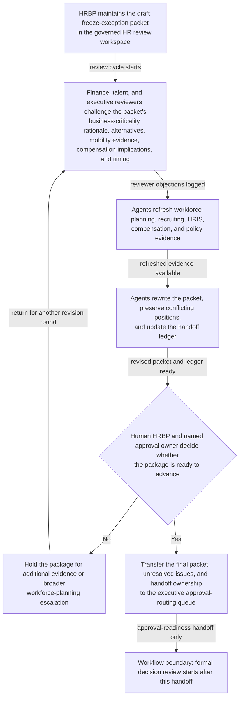

# Critical backfill headcount-freeze exception package readiness loop

## Linked pattern(s)

- `approval-centered-collaboration`

## Domain

HR.

## Scenario summary

An HR business partner is coordinating a formal exception package because a business unit wants to backfill a manager-level role during an active headcount freeze, and the request must be refined through finance, talent, and executive review before a final human approval owner will consider it. In a governed HR collaboration workspace, the HRBP and agent support iterate on the packet as reviewers challenge the business-criticality rationale, organizational-design alternatives, internal-mobility evidence, compensation-band implications, and the proposed timing for opening the requisition. The agents help preserve conflicting reviewer positions, refresh workforce-planning and recruiting evidence, rewrite the packet to reflect accepted edits and unresolved objections, and keep a handoff ledger that shows who owns the next approval-readiness checkpoint. The human HRBP and named approval owner remain responsible for deciding whether the package is actually ready to advance, whether reviewer objections have been sufficiently answered, and whether the request should stop for additional evidence or broader workforce-planning escalation instead of moving toward adjudication.

## Target systems / source systems

- Governed HR review workspace with the draft exception packet, comment history, readiness status, and named handoff ownership
- Workforce-planning and org-design records showing current headcount targets, freeze rules, vacancy impact, and approved operating-plan assumptions
- Recruiting and internal-mobility systems with pipeline status, prior candidate pools, redeployment options, and role-fill history
- HRIS and compensation-planning records containing job level, reporting structure, comp-band constraints, and prior role changes
- Policy and delegation repositories with headcount-freeze guidance, exception criteria, approval order, and required reviewer authorities
- Executive approval-routing queue where the final human-approved packet, unresolved issues, and handoff ownership are transferred for formal decision review

## Why this instance matters

This grounds the pattern in an HR workflow where the difficult work is making a sensitive exception package ready for human approval without blurring whether the freeze should actually be lifted. The instance is materially different from an open-ended accommodation memo or a recommendation-ranking exercise because it centers on repeated readiness collaboration, objection handling, and explicit transfer of ownership into a final approval checkpoint. It shows why agents can add value by tracking evidence and reviewer state while still stopping short of adjudicating workforce decisions or triggering requisition actions.

## Likely architecture choices

- Human-in-the-loop collaboration should remain primary because workforce-priority tradeoffs, freeze-policy interpretation, and executive escalation posture require accountable HR and finance ownership.
- An orchestrated multi-agent setup fits when separate agent roles refresh workforce evidence, reconcile reviewer objections, check approval-order completeness, and maintain the shared handoff ledger across multiple revision rounds.
- Agents may prepare revised packet sections, evidence-response tables, and readiness summaries, but opening a requisition, granting the exception, or changing the final approval owner should remain explicitly human-controlled.

## Governance notes

- The shared packet should distinguish raw workforce-planning data, quoted freeze-policy requirements, reviewer objections, agent-drafted revisions, and human-accepted statements so the next approver can see what is still contested.
- Every material claim about business criticality, vacancy cost, internal-mobility exhaustion, compensation fit, or freeze-policy exception basis should link to inspectable evidence such as workforce-plan snapshots, recruiting metrics, org-design reviews, or policy sections; stale support should block readiness.
- Reviewer objections from finance, talent acquisition, compensation, or executive staff should remain visible in the packet and handoff ledger unless a named human reviewer explicitly accepts the residual risk of carrying them into formal approval.
- The handoff ledger should record the current approval owner, required reviewers, unresolved blockers, and the exact boundary where approval-readiness collaboration ends and human adjudication begins, preventing the packet from being mistaken for an approved headcount action.
- Sensitive workforce-plan details, succession discussions, and compensation data should be limited to the minimum necessary in the collaboration surface, with role-based access and audit history for every retrieved record or copied excerpt.

## Evaluation considerations

- Time to produce an internal-review-ready freeze-exception packet that preserves reviewer disagreement, evidence lineage, and explicit ownership of the next approval handoff
- Reviewer correction rate for sections where agent-assisted revisions overstated urgency, minimized available alternatives, or implied the request was approval-ready before required evidence was complete
- Reliability of the handoff ledger, including whether approval owner, pending reviewers, unresolved issues, and accepted residual risks remain synchronized with the latest packet version
- Rate at which formal executive review sends the packet back because the collaboration loop hid objections, lost supporting evidence, or blurred the boundary between readiness and approval
