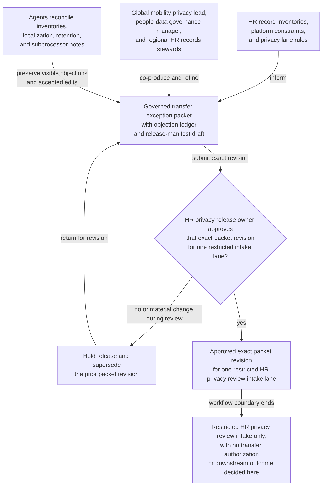

# Cross-border employee-record transfer exception packet approved for restricted HR privacy review intake

## Linked pattern(s)

- `approval-gated-collaborative-artifact-release`

## Domain

HR.

## Scenario summary

A global mobility privacy lead, a people-data governance manager, and regional HR records stewards are co-producing one governed transfer-exception packet because an EMEA business unit wants to move a bounded set of employee file materials into a U.S.-hosted mobility-case platform after a legal-entity consolidation left the original regional workspace unable to support ongoing assignment administration. Agents help reconcile record-category inventories, localization caveats, retention-rule conflicts, vendor-subprocessor notes, and disputed minimization wording into the shared packet while preserving which objections remain unresolved and which redaction or annex changes the human artifact owner accepted explicitly. The workflow ends only when the named HR privacy release owner approves that exact packet revision for one restricted HR privacy review intake lane, where downstream reviewers may decide whether the proposed cross-border record transfer can proceed, needs narrower scope, or requires additional legal controls. It does not notify employees, authorize the transfer, update payroll or mobility systems, or decide the downstream privacy review outcome.

## Target systems / source systems

- Governed HR collaboration workspace holding the cross-border transfer-exception packet, revision history, objection ledger, and release-manifest draft
- HRIS, document-management, and regional personnel-file index systems supplying authoritative record inventories, worker-population scope, legal-entity lineage, and source-of-truth references
- Global mobility, vendor-management, and data-processing-agreement repositories providing destination-platform constraints, approved subprocessors, transfer-mechanism status, and retention obligations
- Privacy-governance, records-retention, and localization-policy systems defining required signers, approved review audiences, annex restrictions, and the single downstream intake lane
- Audit, approval-routing, and supersession logs preserving held-release reasons, exact packet revision lineage, accepted residual objections, and downstream handoff traceability

## Why this instance matters

This grounds the pattern in HR people-data governance rather than accommodation handling, return-to-work coordination, or recommendation drafting. The reusable challenge is collaborative stewardship of one sensitive transfer-exception artifact whose exact revision must be approved before it can cross into a restricted HR privacy review lane, while disagreements about minimization, localization, subprocessor scope, and retention handling stay visible instead of being polished away. The example stays inside the pattern boundary because transfer adjudication, employee communication, vendor enablement, and system updates remain separate downstream workflows.

## Likely architecture choices

- Approval-gated execution fits because the transfer-exception packet can be collaboration-ready while still blocked from HR privacy intake until the human release owner approves the exact revision.
- Human-in-the-loop control is required because only accountable HR privacy and records-governance leaders may accept residual disagreement, confirm audience scope, and authorize release of the packet itself.
- Agents may crosswalk record inventories, refresh transfer-mechanism references, normalize disputed wording, and maintain the release trace, but they must not approve the cross-border transfer, contact employees, or launch downstream data movement.

## Governance notes

- The release manifest should bind one exact packet revision, the named restricted HR privacy review-intake lane, signer identities, the covered worker population, and any residual objections the human release owner accepted explicitly.
- Disagreement about record-category necessity, localization exceptions, retention conflicts, annex redactions, and vendor subprocessor scope should remain visible in the packet or boundary ledger rather than being normalized away before release.
- Audience scope should stay limited to the approved HR privacy intake lane; reuse of the packet for employee notices, payroll or mobility operations, vendor onboarding, or legal-entity integration planning should require separate downstream approval.
- If transfer-mechanism status, destination hosting controls, covered record categories, or reviewer assignments change materially during approval review, the workflow should hold release and supersede the prior packet revision rather than letting stale approval carry forward.

## Evaluation considerations

- Rate at which HR privacy intake accepts the released packet without finding hidden localization issues, stale transfer-control evidence, or audience-boundary mistakes
- Time required to keep one collaborative transfer-exception packet synchronized as record inventories, signer state, and privacy objections evolve
- Reliability of binding between the released artifact revision, accepted residual disagreement, covered worker-population scope, and the bounded restricted HR privacy review-intake lane
- Frequency with which humans reject agent-assisted edits because they drifted into transfer adjudication, employee communication, system updates, or downstream vendor enablement
