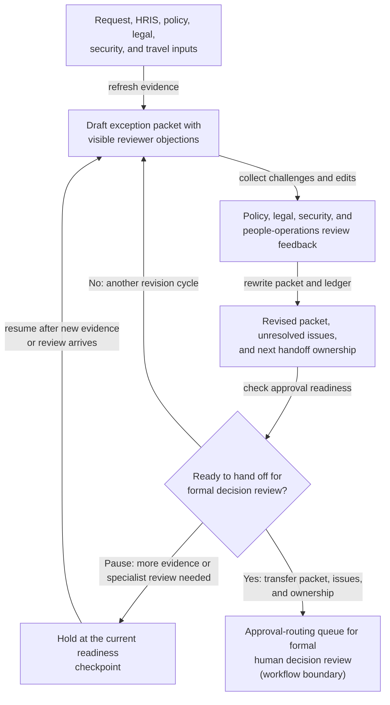
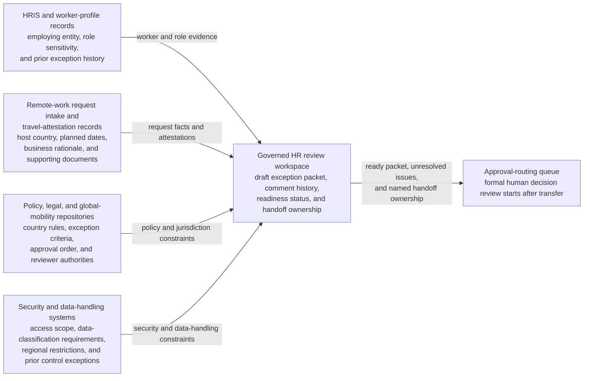

# Cross-border remote-work exception package readiness loop

## Linked pattern(s)

- `approval-centered-collaboration`

## Domain

HR.

## Scenario summary

An HR mobility partner is coordinating a formal exception package because an employee wants to work remotely for several weeks from a country outside the company's pre-cleared remote-work list, and the request must be refined through policy, legal, security, and people-operations review before a named human approval owner will consider it. In a governed HR collaboration workspace, the mobility partner and agent support iterate on the packet as reviewers challenge whether the proposed stay dates and location facts are evidenced clearly, whether role sensitivity and data-access constraints are described accurately, whether existing country-coverage rules or local-employment limits leave unresolved gaps, and whether reviewer objections remain visible enough for the next readiness checkpoint. The agents help preserve conflicting reviewer positions, refresh itinerary, policy, and role evidence, rewrite the packet to reflect accepted edits and unresolved objections, and keep a handoff ledger that shows who owns the next approval-readiness checkpoint. The human mobility partner and named approval owner remain responsible for deciding whether the packet is ready to advance, whether objections require another revision cycle, and whether the request should pause for more evidence or specialist review rather than move toward adjudication.

## Target systems / source systems

- Governed HR review workspace with the draft exception packet, comment history, readiness status, and named handoff ownership
- HRIS and worker-profile records showing employing entity, job family, reporting line, role sensitivity, and prior approved work-location exceptions
- Remote-work request intake and travel-attestation records containing proposed host country, planned dates, business rationale, and submitted supporting documents
- Policy, legal, and global-mobility repositories with pre-cleared country rules, exception criteria, local-employment constraints, approval order, and required reviewer authorities
- Security and data-handling systems with role-based access scope, data-classification requirements, regional access restrictions, and prior control exceptions
- Approval-routing queue where the final human-approved packet, unresolved issues, and handoff ownership are transferred for formal decision review

## Why this instance matters

This grounds the pattern in an HR workflow where the hard work is repeated approval-readiness collaboration on a sensitive cross-border remote-work packet without implying that the remote-work arrangement has been authorized or that any downstream filing or system action should begin. The scenario is clearly distinct from the headcount-freeze backfill example because the contested issues center on location eligibility, jurisdiction-sensitive constraints, evidence freshness, and objection visibility rather than staffing urgency or org-design tradeoffs. It shows how agents can add value by keeping reviewer disagreement, source evidence, and handoff ownership aligned while still stopping short of deciding whether the exception should be granted.

## Likely architecture choices

- Human-in-the-loop collaboration should remain primary because location exceptions, jurisdiction-sensitive policy interpretation, and data-access exposure require accountable HR, legal, security, and people-operations judgment.
- An orchestrated multi-agent setup fits when separate agent roles refresh itinerary and worker-profile evidence, normalize reviewer objections, verify policy and approval-order completeness, and maintain the shared handoff ledger across several revision rounds.
- Agents may prepare revised packet sections, evidence-response tables, and readiness summaries, but granting the exception or triggering downstream operational changes should remain outside the workflow and explicitly human-controlled.

## Governance notes

- The packet should distinguish raw worker and travel facts, quoted policy or legal guidance, reviewer objections, agent-drafted revisions, and human-accepted statements so the next approver can inspect what remains contested.
- Every material claim about proposed location, duration, employing-entity coverage, role sensitivity, data-handling constraint, or exception basis should link to inspectable evidence such as HRIS records, request attestations, policy sections, access classifications, or prior exception history; stale support should block readiness.
- Reviewer objections from HR policy, legal, security, global mobility, or people-operations reviewers should remain visible in the packet and handoff ledger unless a named human reviewer explicitly accepts the residual risk of carrying them into formal approval.
- The handoff ledger should record the current approval owner, required reviewers, unresolved blockers, and the exact boundary where approval-readiness collaboration ends and human adjudication begins, preventing the packet from being mistaken for an approved remote-work authorization.
- Sensitive personal travel details, residency signals, and role-access information should be limited to the minimum necessary in the collaboration surface, with role-based access and audit history for every retrieved record, excerpt, or ownership change.

## Evaluation considerations

- Time to produce an internal-review-ready cross-border remote-work exception packet that preserves reviewer disagreement, evidence lineage, and explicit ownership of the next approval handoff
- Reviewer correction rate for sections where agent-assisted revisions understated location or access constraints, overstated policy fit, or implied the packet was ready before required evidence was complete
- Reliability of the handoff ledger, including whether approval owner, pending reviewers, unresolved issues, and accepted residual risks remain synchronized with the latest packet version
- Rate at which formal approval review sends the packet back because the collaboration loop hid objections, lost supporting evidence traceability, or blurred the boundary between readiness and authorization
