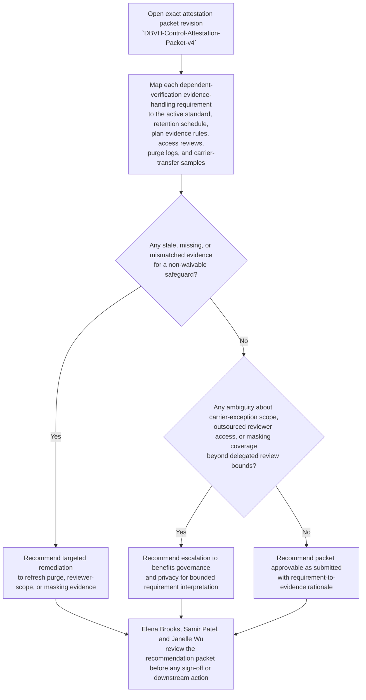
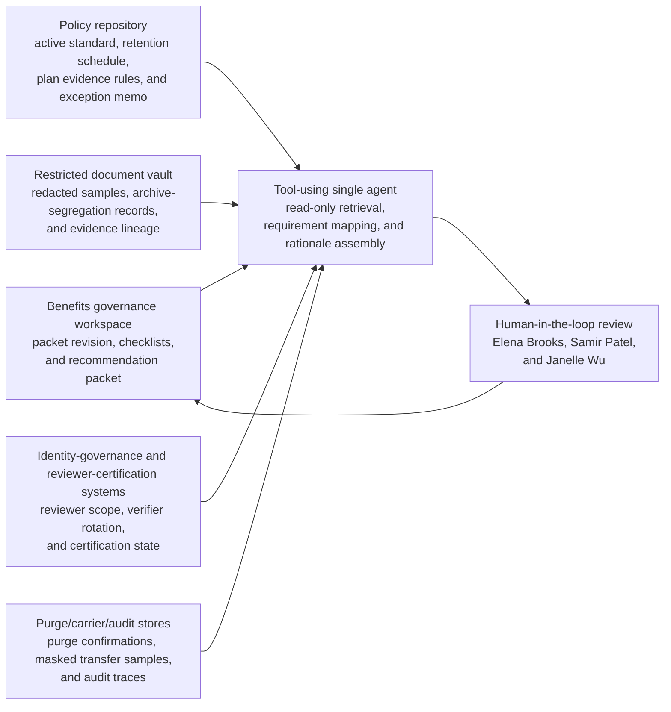

# Dependent-benefits verification evidence-handling control attestation recommendation

## Linked pattern(s)

- `control-requirement-attestation-recommendation`

## Domain

HR.

## Scenario summary

Elena Brooks, Director of Benefits Evidence Governance, is preparing the quarterly internal attestation for one exact governed packet, `DBVH-Control-Attestation-Packet-v4`, covering the restricted dependent-benefits verification evidence lane used for spouse, child, foster-care, and domestic-partner documentation. The prerequisite state is fixed before review begins: benefits evidence-handling standard `BEN-STD-2026-03` is the active policy baseline, retention schedule `HRR-42` governs dependent-verification artifacts, masking profile release `mask-2.8` is the approved redaction baseline for reviewer-visible samples, carrier transfer exception memo `CarrierBridge-2026-01` is the only active temporary export exception, and the restricted reviewer roster for the quarter has already been frozen. Source precedence is explicit and must remain explicit in the recommendation: the active benefits evidence-handling standard, retention schedule, and approved plan-document evidence rules outrank vendor runbooks or workspace interpretations; those authoritative policy sources outrank current access-review exports, purge-verification logs, masked sample packets, carrier-upload traces, and queue manifests; and case comments or reviewer notes are advisory only when they conflict with the higher-order sources. Packet v4 supersedes `DBVH-Control-Attestation-Packet-v3` after refreshed archive-segregation evidence was attached, but visible blockers remain for the named human reviewers Samir Patel, Benefits Privacy Counsel, and Janelle Wu, Payroll Controls Manager: one purge-verification log for a closed domestic-partner affidavit batch is still missing, one reviewer access-certification export predates an outsourced verifier rotation, and one carrier-upload sample does not clearly prove taxpayer-id masking was preserved in a narrow supporting-document extract. The workflow must recommend whether the packet is supportable as submitted, requires targeted remediation, or should escalate for bounded requirement interpretation before Elena Brooks signs the attestation, before Samir Patel or Janelle Wu accept the evidence posture, and before anyone adjudicates benefits eligibility, contacts employees or carriers, changes reviewer access, rewrites retention policy, or executes downstream enrollment or payroll action.

## Target systems / source systems

- Benefits-governance workspace holding `DBVH-Control-Attestation-Packet-v4`, prior packet revisions, attestation checklists, and reviewer annotations for the dependent-verification evidence lane
- Plan-document and policy repository containing the active benefits evidence-handling standard, dependent-verification evidence rules, retention schedule `HRR-42`, and the approved carrier transfer exception memo
- Restricted dependent-verification document vault with redacted sample packets, archive-segregation records, document-class tagging, and evidence lineage for spouse, child, foster-care, and domestic-partner support files
- Identity-governance and reviewer-certification systems showing approved reviewers, outsourced verifier rotations, just-in-time access grants, training acknowledgements, and prior attestation outcomes
- Purge-verification, carrier-transfer, and audit-log stores recording deletion confirmations, masked export samples, transmission manifests, exception use, and unresolved evidence-handling failures

## Why this instance matters

This grounds the pattern in HR through a control-attestation problem that is materially different from benefits anomaly review, dependent-state reconciliation, accommodation intake dispatch, or post-review closure synchronization. The reusable challenge is deciding whether one exact dependent-verification evidence-handling packet actually proves that sensitive household and relationship documents are retained, masked, accessed, and transferred according to fixed HR control requirements without letting a tidy summary hide source precedence, prerequisite state, visible blockers, or named accountability. It stays inside the recommendation boundary because the workflow does not decide worker or dependent eligibility, request more documents, contact employees or carriers, change reviewer permissions, or execute enrollment and payroll updates.

## Likely architecture choices

- A tool-using single agent can retrieve the exact packet revision, align each evidence-handling requirement to the active standard, retention schedule, plan evidence rules, access-certification records, purge logs, and carrier-transfer samples, and assemble one reviewable rationale packet.
- Human-in-the-loop review is required because Elena Brooks remains accountable for the attestation recommendation outcome and Samir Patel plus Janelle Wu must decide whether masking ambiguity, reviewer-scope drift, or exception use stays within delegated interpretation bounds.
- Read-only integration with benefits governance, policy, document-vault, identity-governance, and purge-log systems is preferable so the workflow cannot silently approve the attestation, alter reviewer access, delete evidence, change retention settings, or trigger downstream benefits processing.

## Governance notes

- The recommendation must stay attached to one exact governed artifact revision, `DBVH-Control-Attestation-Packet-v4`, while preserving lineage to `DBVH-Control-Attestation-Packet-v3` so reviewers can see what changed, which archive-segregation evidence was refreshed, and which blockers remain open.
- Source precedence must remain explicit in both the packet and the recommendation: the active benefits evidence-handling standard, retention schedule, and approved plan-document evidence rules outrank vendor runbooks or workspace interpretations; those sources outrank access exports, purge logs, masked samples, transfer manifests, and reviewer notes.
- Prerequisite state must stay visible to reviewers, including the active policy baseline, current masking release, frozen reviewer roster, active carrier transfer exception, and the fact that the dependent-verification lane remains bounded to the reviewed quarter.
- Visible blockers should remain inspectable rather than summarized away: the missing domestic-partner affidavit purge confirmation, the stale reviewer-certification export after outsourced verifier rotation, and the carrier-upload sample that does not clearly prove taxpayer-id masking.
- Named accountability should remain explicit: Elena Brooks owns the attestation recommendation packet, while Samir Patel and Janelle Wu are the named human reviewers for benefits privacy and payroll-control fit.
- Dependent records, household relationship evidence, taxpayer identifiers, and reviewer identities should remain visible only to authorized benefits governance, privacy, payroll-controls, and audit reviewers under normal need-to-know and retention controls.
- The family boundary must stay explicit: approving the attestation, adjudicating dependent eligibility, requesting additional proof, changing reviewer scope, revising retention policy, contacting employees or carriers, or executing enrollment and payroll actions remains outside this workflow.

## Evaluation considerations

- Reviewer agreement with the recommended approve, remediate, or escalate posture without major corrections to source-precedence handling or requirement mapping
- Rate at which missing purge proof, reviewer-certification drift, or masking ambiguity is surfaced before quarterly attestation sign-off
- Quality of traceability from each evidence-handling requirement to the active standard, retention schedule, restricted document-vault evidence, access-governance records, and carrier-transfer samples used
- Stability of recommendations when reviewer rosters, masking profiles, carrier exception posture, or document-archive evidence changes during the review period
