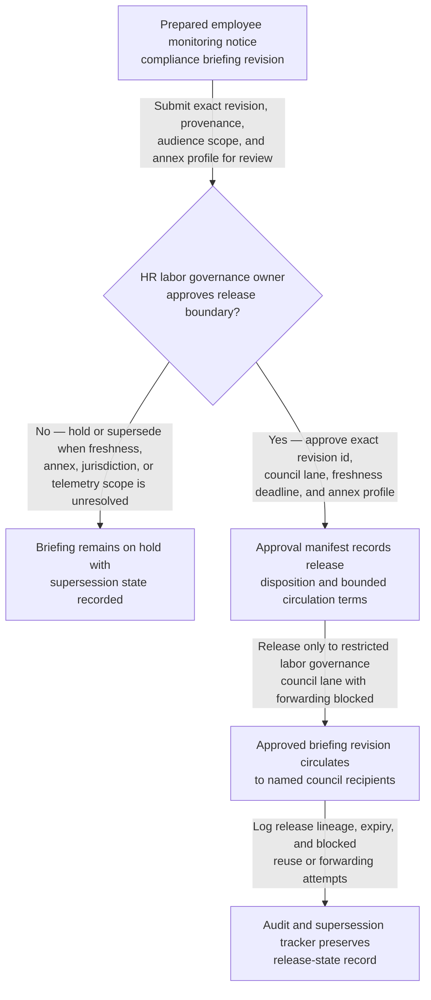

# Employee monitoring notice compliance briefing revision approved for labor governance council circulation

## Linked pattern(s)

- `approval-gated-briefing-release`

## Domain

HR.

## Scenario summary

An HR labor-governance and people-privacy workflow has already synthesized one revision of an employee monitoring notice compliance briefing after a planned workforce monitoring expansion surfaced conflicting jurisdiction summaries, vendor annex drift, unresolved home-office scope caveats, and open questions about whether the current notice set accurately describes retained telemetry fields and manager-visible outputs. Before that exact revision is circulated into the restricted labor governance council lane, a named HR labor governance owner must approve the audience scope, freshness window, annex profile, and hold-versus-release state so council readers receive the reviewed context package rather than a stale draft, an over-broad copy, or a version carrying restricted monitoring annex material beyond the approved lane. The workflow stops at governed release of that briefing revision; it does not adjudicate whether the notice is legally sufficient, decide monitoring policy, contact employees or works councils, schedule communications, or execute downstream HR, legal, or platform changes.

## Target systems / source systems

- Restricted HR briefing workspace storing the synthesized monitoring-notice compliance briefing revision, superseded drafts, annex bindings, and provenance ledger
- Monitoring notice repository, jurisdiction-specific labor-notice matrix, HR privacy impact records, vendor data-processing annexes, and telemetry field inventory already cited by the prepared briefing revision
- Labor governance council circulation tooling enforcing named HR, labor-relations, and people-privacy recipients, confidentiality banners, expiry controls, and blocked forwarding outside the approved lane
- Approval manifest service recording the HR labor governance owner, exact revision id, approved council lane, annex profile, freshness deadline, and explicit hold or release disposition
- Audit and supersession tracker preserving release lineage, expiry events, and blocked reuse or forwarding attempts when a newer vendor annex, jurisdiction note, or telemetry-scope correction appears before circulation

## Why this instance matters

This grounds the pattern in HR where the hard governance step is releasing one exact synthesized employee-monitoring notice briefing revision into a tightly bounded labor-governance lane, not deciding whether the monitoring program may proceed. Monitoring-notice compliance work often produces several near-final drafts that differ in annex treatment, jurisdiction annotations, retention-language caveats, or home-office coverage notes, so release authority must stay tied to one reviewed version rather than a vague permission to brief HR leadership. The example keeps the family boundary clean by ending at bounded circulation of context rather than drifting into policy adjudication, employee-case handling, communications rollout, deployment approval, or downstream execution.

## Likely architecture choices

- Approval-gated execution fits because the monitoring-notice compliance briefing remains held until the HR labor governance owner approves one exact revision for the restricted labor governance council lane.
- Human-in-the-loop review is necessary because only accountable HR leadership should accept residual notice uncertainty, confirm audience scope and annex handling, and authorize circulation of sensitive workforce-monitoring context.
- A governed agent can assemble the release manifest, compare revision lineage, and block stale reuse or forwarding, but it should not determine notice sufficiency, resolve labor objections, or trigger employee communications, works-council outreach, or monitoring-system changes.

## Governance notes

- Approval should bind to one immutable briefing revision, one named labor governance council lane, one freshness deadline, and one explicit annex profile so later edits, copied versions, or detached annexes cannot inherit permission silently.
- The released brief should preserve unresolved jurisdiction differences, telemetry-field description caveats, retention-language gaps, and home-office scope limits rather than smoothing them into a false notice-ready narrative.
- If a new vendor annex, updated labor-law interpretation, changed telemetry inventory, or revised manager-visibility statement appears during approval review, the pending revision should remain on hold and be superseded rather than circulated under stale approval.
- Audit records should preserve the released or held revision id, approver identity, council-recipient scope, expiry timing, annex state, and any blocked forwarding attempts to line managers, broader HR operations, security operations, or other non-approved recipients.

## Evaluation considerations

- Percentage of labor governance council circulations where the released briefing revision id, hold or release disposition, annex profile, and manifest metadata align exactly without later correction
- Rate at which stale, superseded, expired, or out-of-scope monitoring-notice briefings are blocked before council visibility
- Time required to move from briefing-ready status to approved bounded circulation when provenance, annex handling, and jurisdiction freshness are already complete
- Reviewer correction rate for missing caveats, wrong audience scope, or blocked-forwarding failures after the council receives the released briefing
