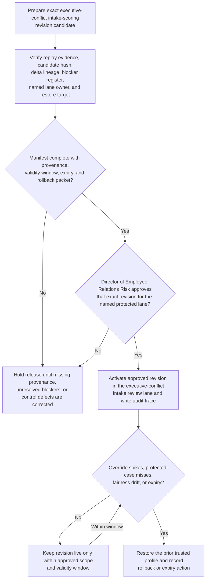
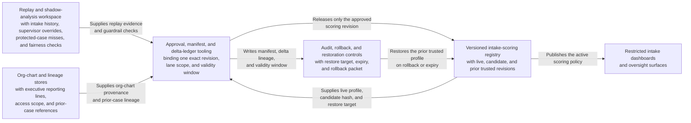

# Executive-conflict investigation-intake scoring revision approved for live use

## Linked pattern(s)

- `approval-gated-optimization-state-release`

## Domain

HR.

## Scenario summary

An employee-relations risk steward has prepared one exact intake-scoring revision for executive-conflict workplace investigation review after replay shows that the current live profile underweights reporting-line proximity, prior protected-concern linkage, and access-sensitive retaliation indicators when senior-leader cases arrive in bursts. The candidate revision raises sensitivity for those protected conflict signals, carries forward the prior trusted profile as the restore target, and exposes blocker state if org-chart provenance, prior-case lineage, or delta-signoff evidence is incomplete. The workflow must release that exact scoring revision into bounded live use only after the Director of Employee Relations Risk approves the manifest, delta lineage, validity window, rollback packet, and named executive-conflict intake lane, while staying centered on governed optimization-state release rather than allegation substantiation, investigator assignment, executive communication, policy adjudication, or downstream case execution.

## Target systems / source systems

- Versioned employee-relations intake-scoring registry with the current live profile, candidate revision hash, prior trusted revisions, and supersession links
- Replay and shadow-analysis workspace with hotline and manager-escalation intake history, supervisor overrides, protected-case misses, fairness checks, and committee bounce-back outcomes
- Org-chart, executive reporting-line, access-scope, and prior-case lineage stores used to prove provenance for the candidate revision and highlight blocker conditions when source snapshots are stale
- Approval, manifest, and delta-ledger tooling used by employee-relations leadership to authorize one bounded live scoring revision for the named executive-conflict intake lane
- Audit, rollback, and restoration controls that can re-activate the prior profile if protected-case handling, fairness posture, or reviewer trust worsens
- Restricted intake-review dashboards and oversight surfaces that consume the active scoring policy after approval

## Why this instance matters

This grounds the pattern in an HR governance lane that is materially different from leave and accommodation review. The released artifact is one versioned intake-scoring revision for executive-conflict investigations, not a recommendation about case outcomes and not a decision about whether any allegation is substantiated. The approval boundary matters because sensitive investigation intake tuning can look strong in replay while still requiring explicit human sign-off on provenance, visible blockers, expiry timing, rollback readiness, and named lane ownership before one exact revision becomes live.

## Likely architecture choices

- Approval-gated execution fits because the scoring revision can be technically ready in the registry while activation remains blocked until a named employee-relations owner approves that exact version and restricted intake-lane scope.
- Human-in-the-loop review remains necessary because accountable HR risk leaders must accept the trade-offs among protected-case sensitivity, reviewer burden, and fairness posture before bounded live use begins.
- A governed release agent can compare revision hashes, verify provenance snapshots, surface unresolved blockers, register the restore target, and write the audit trace, but it should not assign investigators, contact executives or reporters, decide retaliation findings, or trigger downstream case actions.

## Governance notes

- Approval should bind to one exact scoring revision, one named executive-conflict intake lane, one approver, and one validity window so later tuning edits cannot inherit stale authority.
- The release manifest should preserve explicit provenance: replay cohort window, org-chart snapshot id, prior-case lineage references, candidate hash, prior trusted revision id, and field-level delta summary against the live profile.
- Visible blockers such as stale executive hierarchy data, unresolved prior-case linkage gaps, or unsigned delta evidence should hold release rather than being collapsed into a generic ready state.
- Expiry should restore the prior trusted profile automatically unless employee-relations leadership deliberately renews the revision after reviewing live override, miss, and fairness signals.
- Rollback triggers should include unusual supervisor or committee override spikes, degraded handling of protected retaliation-adjacent cases, or fairness regression across lower-visibility worker populations.
- Audit records should preserve the approved and prior revision ids, provenance artifacts consulted, blocker state at approval time, approver identity, validity timing, rollback criteria, restore action, and any manual extension or rollback decision.
- The workflow must not substantiate allegations, assign investigation owners, communicate with reporters or executives, impose employment action, or open downstream execution workflows; it only governs release of the scoring revision used by human intake-review surfaces.

## Evaluation considerations

- Reduction in protected-case misses, supervisor overrides, and late committee bounce-backs after the approved scoring revision becomes live
- Accuracy of manifest binding among the approved revision hash, provenance artifacts, named executive-conflict lane, and activated live scope
- Reliability of automatic expiry or rollback when fairness posture, protected-case sensitivity, or reviewer-trust assumptions breach the approved guardrails
- Time required for employee-relations leaders to inspect one revision, verify blocker visibility and delta lineage, approve bounded live use, and confirm safe restoration to the prior trusted profile
