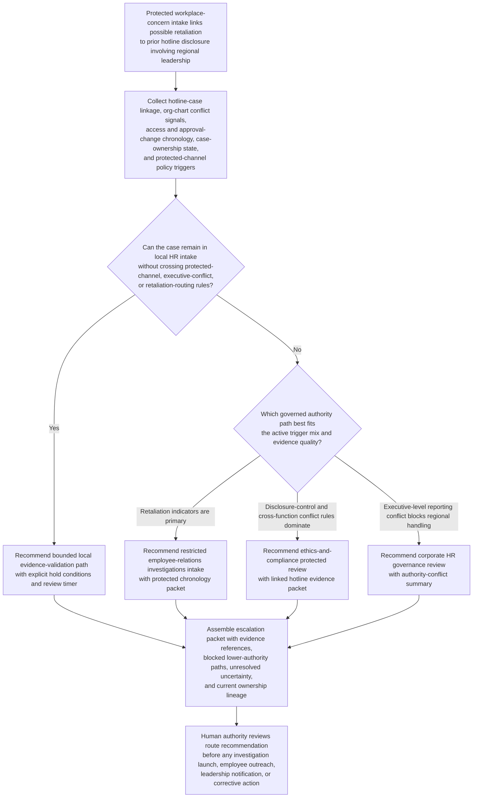
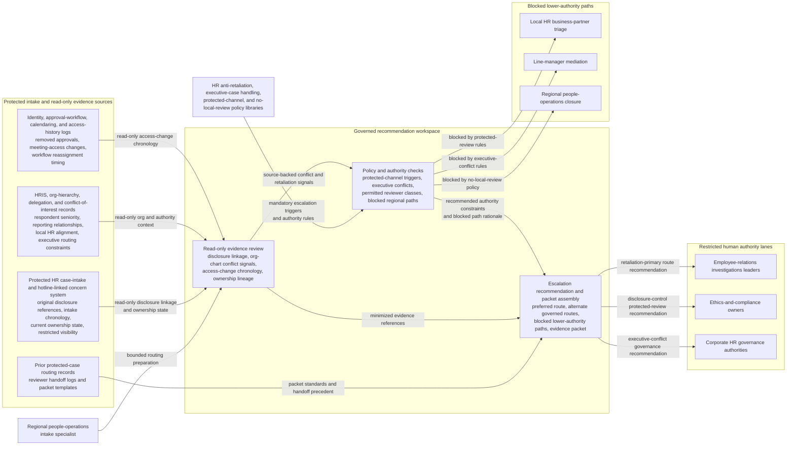

# Executive retaliation concern protected-review escalation routing

## Linked pattern(s)

- `policy-constrained-escalation-routing`

## Domain

HR.

## Scenario summary

A regional people-operations intake specialist receives a protected workplace-concern case after an engineering director reports that, within days of filing a hotline disclosure about possible revenue-recognition manipulation by a regional vice president, the director lost approval authority in the planning system, was removed from forecast meetings, and was told to route future concerns through the same local HR business partner who sits inside the respondent executive's reporting sphere. The specialist can verify the disclosure linkage, org-chart conflict signals, access-change chronology, and current case ownership, but cannot let local HR or line management screen the matter, decide whether retaliation occurred, choose protective measures, contact witnesses, or authorize executive notification. The workflow must recommend the governed escalation route - such as restricted employee-relations investigations intake when retaliation indicators dominate, ethics-and-compliance protected review when cross-function disclosure controls are primary, and corporate HR governance review when executive-level conflict rules block ordinary regional handling - assemble the supporting evidence and policy packet, keep blocked lower-authority paths visible, and stop before any investigation, employee communication, leadership outreach, or downstream case action.

## Target systems / source systems

- Protected HR case-intake and hotline-linked concern system with original disclosure references, intake chronology, current ownership state, and restricted visibility settings
- HRIS, org-hierarchy, delegation, and conflict-of-interest records showing respondent seniority, reporting relationships, local HR alignment, and executive-case routing constraints
- Identity, approval-workflow, calendaring, and access-history logs covering removed approvals, meeting-access changes, workflow reassignment, and timing relative to the protected disclosure
- HR anti-retaliation, executive-case handling, protected-channel, and no-local-review policy libraries defining mandatory escalation triggers, blocked regional paths, and permitted reviewer classes
- Prior protected-case routing records, reviewer handoff logs, and packet templates showing what evidence, minimization controls, and authority-path rationale were required in similar conflict-sensitive escalations

## Why this instance matters

This grounds the pattern in HR through a governance-heavy protected-concern case where the central problem is choosing the right authority lane when local HR and line management may themselves be conflicted. The hard step is not deciding whether retaliation occurred; it is recognizing when disclosure linkage, executive seniority, and reporting-line conflicts mean the case must bypass ordinary regional handling and move into a protected review path with a defensible evidence packet before anyone starts adjudication or outreach.

## Likely architecture choices

- A recommendation-only workflow can combine disclosure linkage, org-conflict signals, access-change chronology, current ownership state, and escalation-policy triggers into one ranked routing recommendation.
- Human-in-the-loop review is mandatory because employee-relations investigations leaders, ethics-and-compliance owners, or corporate HR governance authorities must decide whether to accept the recommended lane and what downstream handling is authorized.
- Read-only integration with intake, HRIS, access-log, calendar, and policy systems is preferable so the workflow cannot open a formal investigation, change case visibility, notify the employee, alert executives, or assign corrective tasks on its own.

## Governance notes

- The output should distinguish the preferred escalation destination, alternate governed routes, and blocked lower-authority paths such as local HR business-partner triage, line-manager mediation, regional people-operations closure, direct executive outreach, or informal concern handling outside the protected case system.
- Any recommendation should show which policy triggers fired, including protected-disclosure linkage, respondent seniority, reporting-line conflict, local-HR involvement, access-change timing, and any prior protected-channel ownership already in flight.
- Hotline identifiers, witness references, calendar details, access-change evidence, and prior concern history should remain minimized and visible only to authorized HR, ethics, and protected-review owners under normal need-to-know, retention, and confidentiality controls.
- The packet should preserve source evidence, blocked-path rationale, unresolved uncertainty, and ownership lineage so later audit can reconstruct why ordinary regional handling was disallowed and why one authority lane was recommended.
- The boundary between routing and execution must stay explicit: determining retaliation merits, interviewing witnesses, contacting the reporting employee, instructing managers, opening a formal investigation, or assigning protective measures remains outside this workflow.

## Evaluation considerations

- Reviewer agreement that the recommended escalation destination matched the eventually accepted protected authority lane without avoidable rerouting between employee-relations investigations, ethics-and-compliance review, and corporate HR governance
- Time from protected-concern qualification to delivery of a complete escalation packet to the authorized human reviewer
- Rate at which blocked lower-authority paths and mandatory protected-routing triggers are surfaced before local HR, line management, or executive staff attempt to handle the case informally
- Stability of routing recommendations when org-conflict evidence, access-change chronology, or protected-disclosure linkage changes during the same intake window
