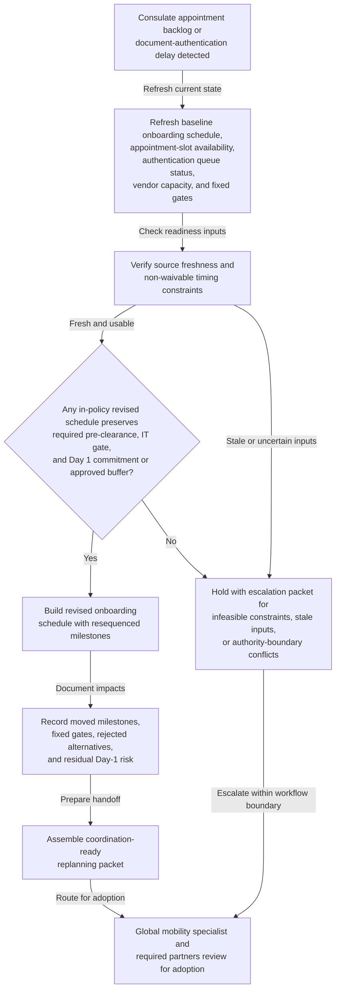

# Global-mobility onboarding timeline replanning after visa appointment backlog

## Linked pattern(s)

- `schedule-adjustment-and-replanning`

## Domain

HR.

## Scenario summary

A new hire has accepted a role that requires international relocation. The global mobility team already has an approved onboarding schedule that sequences consulate visa-application lodgment, biometric or in-person appointment slot, document authentication and apostille completion, relocation vendor move-coordination window, destination-country pre-clearance notification, IT provisioning readiness gate, and Day 1 reporting date. Then the baseline plan stops being feasible: a consulate appointment backlog pushes the earliest available slot several weeks past the lodgment date, compressing the remaining authentication and vendor-coordination milestones and placing the committed Day 1 date at risk. A secondary delay in document authentication from a notarization authority compounds the constraint. The workflow should recompute a revised onboarding schedule, document which milestones can be resequenced or buffered and which must remain fixed, and prepare a coordination-ready replanning packet for the global mobility specialist, HR business partner, hiring manager, and IT provisioning lead rather than deciding the candidate's immigration eligibility, communicating the revised date to the candidate, issuing an amended offer, approving a legal visa strategy, or executing the relocation vendor booking itself.

## Target systems / source systems

- Global mobility case management system with the approved baseline onboarding schedule, milestone ownership, Day 1 commitment, prior schedule versions, and any approved Day 1 buffer policy
- Consulate appointment portal or immigration tracking system showing available appointment slots, current wait-time estimates, and lodgment confirmation status
- Document authentication and apostille queue showing notarization status, authentication authority lead times, and the earliest expected completion date for each required credential
- Relocation vendor coordination system showing current move-coordination windows, destination-country vendor capacity, and blocked booking dates that depend on visa issuance confirmation
- IT provisioning tracker with access-provisioning milestones, required pre-start lead times, and hard gates tied to confirmed start date
- HR calendar and stakeholder availability register capturing hiring-manager review windows, HR business partner sign-off capacity, and any corporate new-hire cohort dates that act as fixed anchors
- Planning and coordination workspace where the revised schedule, rationale ledger, unresolved blockers, stakeholder acknowledgements, and adoption status are recorded

## Why this instance matters

This grounds the replanning pattern in HR global mobility where timing pressure comes from external appointment availability, third-party authentication queues, and a committed Day 1 date rather than from simple calendar-slot coordination. The valuable output is a revised onboarding schedule, an explicit rationale and impact ledger, and a coordination-ready handoff packet that lets human owners decide whether to accept the revised plan, request an exception, or escalate to immigration counsel. The workflow stays inside the planning family boundary by avoiding immigration strategy decisions, candidate-facing communication issuance, offer amendments, payroll setup, or relocation-vendor execution.

## Likely architecture choices

- An orchestrated multi-agent workflow fits because one role can refresh current appointment and authentication state from external queues and vendor systems, another can test candidate schedules against fixed Day 1 anchors and pre-clearance lead-time rules, and another can package the accepted replanning proposal with downstream impacts and unresolved blockers for human review.
- Human-in-the-loop adoption remains necessary because the global mobility specialist, HR business partner, and hiring manager must jointly accept any consequential shift in the Day 1 date, milestone resequencing, or vendor-coordination window before the revised schedule becomes authoritative and any communication to the candidate can begin.
- Recommendation-only autonomy is the right ceiling: the workflow can propose a feasible revised milestone order and surface at-risk downstream gates, but it should not determine immigration eligibility, select a visa pathway, issue a candidate-facing communication, amend the employment offer, execute a relocation booking, or make payroll-setup decisions.

## Governance notes

- Hard constraints should remain explicit throughout replanning: the minimum pre-clearance notification lead time required by the destination country, any non-waivable IT provisioning gate tied to confirmed start date, cohort or business-unit alignment dates that limit Day 1 flexibility, and approved Day 1 buffer policy limits beyond which escalation to a senior HR leader is required.
- The rationale and impact ledger should preserve lineage from the baseline onboarding schedule to the revised proposal, including which milestones moved, which stayed fixed, what alternatives were rejected, and what residual Day-1 risk remains open at handoff time.
- Source freshness matters because a revised schedule built on stale consulate wait-time estimates, outdated authentication queue status, or unconfirmed vendor capacity can create false confidence and trigger another avoidable replanning cycle after the candidate has already been informed.
- The coordination-ready handoff packet should contain only role-relevant timing, dependency, and blocker detail; it should not copy sensitive immigration document content, candidate personal identification details, or privileged legal strategy notes into broad scheduling channels.
- A named human owner—the global mobility specialist assigned to the case—is accountable for reviewing the replanning packet, confirming the revised schedule is within policy authority, and routing it to additional approvers if Day 1 movement exceeds delegated limits.
- The workflow should escalate instead of improvising when no in-policy schedule can preserve Day 1 within the approved buffer, when authentication or appointment uncertainty makes any revised plan misleading, when a proposed change would require immigration-counsel input, or when the new schedule would create a gap in work authorization for the candidate.

## Evaluation considerations

- Time from consulate-backlog or authentication-delay trigger to a revised onboarding schedule with explicit dependency impacts and adoption-ready handoff, measured against the available decision window before candidate communication must occur
- Rate of replanning events resolved with an accepted revised schedule without requiring a full manual rebuild of the onboarding milestone sequence by the mobility specialist
- Frequency of adopted revised schedules that still miss hard pre-clearance, IT-gate, or Day-1 commitments because constraint interactions between external queues and internal gates were not surfaced early enough
- Audit usefulness of the rationale ledger for reconstructing which milestones moved, which remained fixed, what Day-1 risk remained at handoff, and what human approvals or escalations followed before the revised schedule became authoritative
