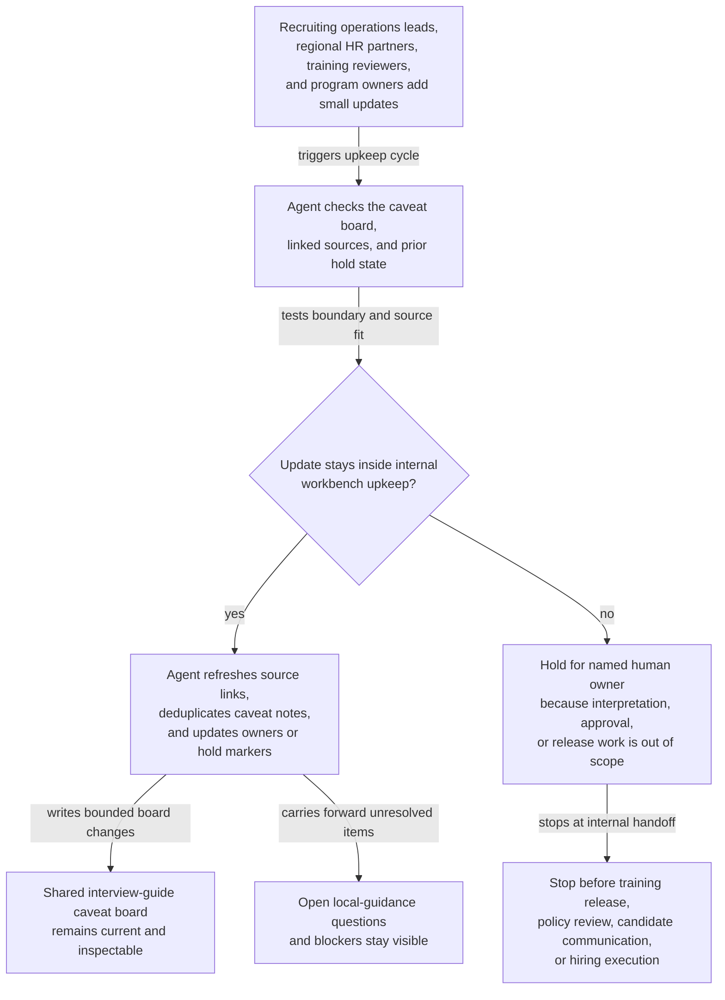
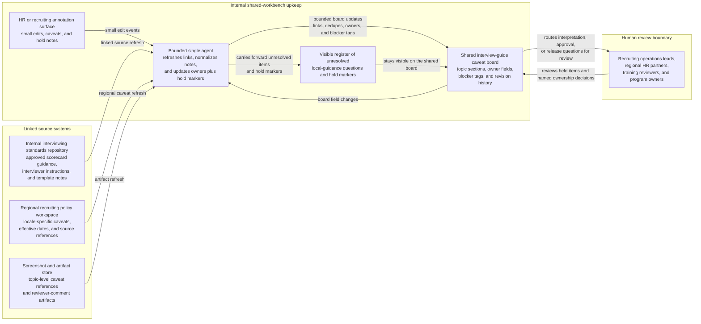

# Hiring panel interview-guide caveat board shared workbench upkeep

## Linked pattern(s)

- `shared-workbench-orchestration`

## Domain

HR.

## Scenario summary

A talent acquisition enablement team maintains an internal interview-guide caveat board while recruiting operations leads, regional HR partners, interviewer-training reviewers, and hiring-program owners continuously refine interviewer-instruction coverage for a recurring hiring loop. Small updates arrive throughout the cycle: one reviewer links a revised scorecard note, a regional partner flags a stale locale-specific prohibited-question example, a training reviewer marks one screenshot as outdated, and a program owner reassigns section ownership after recruiter rotation. The agent keeps that internal workbench usable by refreshing linked source references, normalizing duplicate caveat notes, updating section ownership and hold markers, and carrying unresolved local-guidance questions forward in a visible register. Humans remain responsible for deciding what interviewing guidance is actually approved, which wording is legally or policy-safe, whether any note changes evaluation criteria, and when any material should move into separate training release, policy review, candidate communication, or hiring execution workflows.

## Target systems / source systems

- Shared interview-guide caveat board with topic sections, owner fields, blocker tags, and revision history
- Internal interviewing standards repository containing approved scorecard guidance, interviewer instructions, and structured interview template notes
- Regional recruiting policy workspace with locale-specific caveats, effective dates, and linked source references
- Screenshot and artifact store referenced by topic-level caveats and reviewer comments
- HR or recruiting annotation surface where enablement owners, regional partners, and training reviewers add small edits, caveats, and hold notes

## Why this instance matters

This grounds the pattern in a low-risk HR collaboration loop where the maintained artifact is an internal interviewer-guidance workbench used to keep caveats organized before any training material or active hiring workflow is updated. The useful work is not approving interview policy, changing evaluation criteria, or messaging candidates. It is keeping one bounded board current, inspectable, and resumable as many small edits and linked-source changes arrive from different human collaborators.

## Likely architecture choices

- Event-driven monitoring fits because upkeep should react when interviewing-standard notes, regional caveats, screenshots, or board fields change.
- A tool-using single agent can refresh source links, normalize duplicated caveat text, and keep ownership plus hold markers synchronized inside one bounded board.
- Human-in-the-loop review remains necessary when a note changes interview-policy interpretation, sounds ready for interviewer-facing release, or could remove a caveat that a human owner still considers unresolved.
- Bounded delegation works because the team can predefine allowable field updates, source boundaries, and hold conditions without delegating approval of final interviewer guidance or downstream hiring actions.

## Governance notes

- The board should clearly distinguish approved source excerpts, reviewer proposals, unresolved local-guidance questions, and interviewer-facing wording candidates so internal upkeep does not imply final policy guidance.
- Scorecard references, locale tags, screenshot links, and owner assignments should be revalidated before a section is marked current or a blocker is cleared.
- The agent may normalize structure and merge duplicate comments, but it should not decide what interviewing guidance means, approve a local exception, or remove a caveat that a human owner accepted.
- If a requested update would release interviewer training, change hiring criteria, send candidate or manager guidance, or trigger active recruiting execution, the workflow should stop and hand off to the appropriate communication, approval, or execution pattern.

## Evaluation considerations

- Percentage of board refreshes that preserve correct guidance links, screenshot references, ownership fields, and unresolved-question state across repeated update cycles
- Reviewer correction rate for merged caveat notes, refreshed source references, or automatically updated blocker markers
- Rate at which interviewer-facing or interpretation-heavy edits are held for human review instead of being silently folded into the internal board
- Usefulness of the maintained workbench for helping recruiting and training reviewers resume internal interview-guide upkeep without reconstructing stale context by hand
