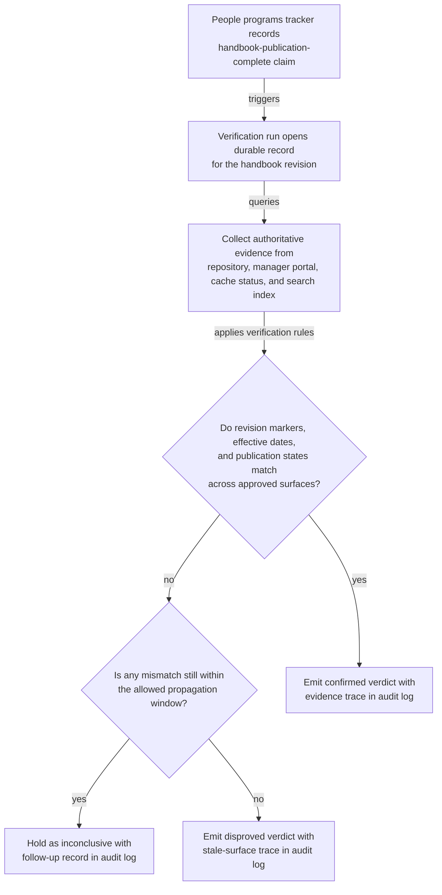

# Internal job architecture handbook publication verification

## Linked pattern(s)

- `claimed-state-verification`

## Domain

HR.

## Scenario summary

A people programs team marks an updated internal job architecture handbook as published after refreshing the handbook source repository, manager self-service portal, and internal search index for the new leveling-framework revision. HR business partners and recruiting operations still need to know whether that claimed publication state is actually supported by the approved internal handbook surfaces before they rely on the handbook link for routine manager guidance and role-leveling coordination. The workflow verifies the claim against authoritative evidence and emits a bounded confirmed, disproved, or inconclusive verdict; it must not rewrite handbook content, interpret leveling policy for a specific employee, notify managers, or trigger downstream system changes.

## Target systems / source systems

- Internal job architecture handbook repository containing the approved handbook revision, publication status, and effective-date metadata
- Manager self-service portal that serves the current handbook revision to authenticated people managers and HR partners
- Internal search-index status endpoint showing the indexed handbook revision and freshness timestamp for the handbook page
- Content-delivery cache or mirror-status service indicating whether the approved handbook revision propagated to supported internal portal surfaces
- People programs workflow tracker or event feed recording the handbook-publication-complete claim and any replayed status events
- Verification audit log preserving evidence checks, observed revision ids, verdict history, and bounded follow-up records

## Why this instance matters

This grounds the pattern in an HR workflow where a publication-complete claim can appear trustworthy even though one approved manager-facing surface still serves an older job architecture revision or the search index has not yet caught up. The useful work is confirming whether the claimed low-risk publication state is real before partners cite the handbook as the current leveling reference. The workflow remains inside investigate/reconcile/verify because it stops at evidence-backed verdicting rather than changing the handbook, resolving leveling disputes, or launching communications.

## Likely architecture choices

- Event-driven monitoring fits because the verification run should begin when the handbook-publication-complete claim is recorded rather than only after managers notice mismatched content.
- A tool-using single agent can compare handbook identifiers, revision markers, effective dates, cache state, and search-index freshness across the approved internal surfaces while applying propagation tolerances.
- Bounded delegation is appropriate because HR governance owners can predefine the authoritative handbook systems, tolerated lag windows, and required corroborating fields while humans retain authority over any republish, policy clarification, or downstream notification.
- Durable verification state should preserve duplicate publication claims and prior inconclusive checks so repeated runs do not create contradictory verdicts for the same handbook revision.

## Governance notes

- Only the approved handbook repository, manager portal, cache-status surface, and search-index endpoint should count as authoritative evidence; screenshots, chat confirmations, or copied handbook excerpts should not confirm the claim.
- Verification records should stay privacy-minimized by preserving handbook identifiers, revision markers, timestamps, and propagation status rather than employee-specific leveling discussions or compensation notes.
- If one approved internal surface remains stale within an allowed propagation window, the workflow should keep the result explicitly inconclusive instead of overstating full publication or failure.
- Republishing the handbook, changing career-framework language, adjudicating job-level placement, or sending manager-facing communications remains outside this verification workflow and under human control.

## Evaluation considerations

- Percentage of internal job architecture handbook publication claims that receive a verdict with complete repository, portal, cache, and search-status traceability
- Rate at which stale or partially propagated handbook revisions are detected before HR partners and managers rely on the updated guidance
- Reviewer agreement that the workflow applied the correct revision-match, freshness, and lag-tolerance rules
- Clarity of follow-up records when one approved internal handbook surface remains out of date beyond the allowed publication window
