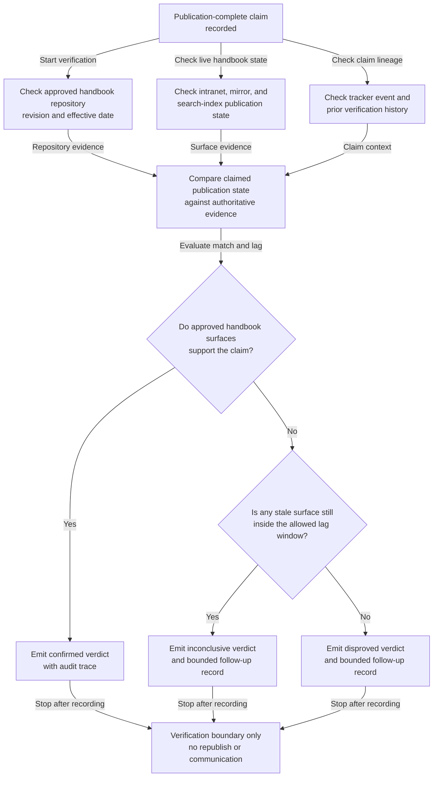
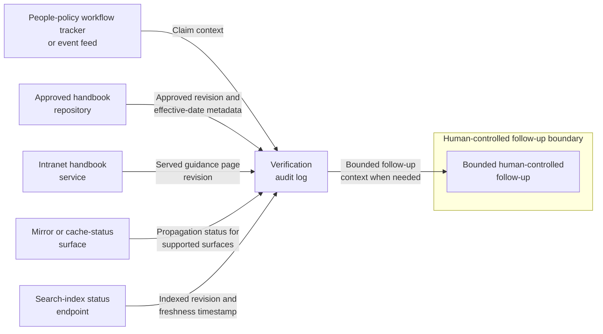

# Internal parental leave guidance publication verification

## Linked pattern(s)

- `claimed-state-verification`

## Domain

HR.

## Scenario summary

A people policy team marks an updated internal parental leave guidance page as published after the handbook content repository, employee intranet handbook service, and internal search-index job report success. HR business partners still need to know whether that claimed publication state is actually true across the approved internal handbook surfaces before they rely on the guidance link for routine employee-support coordination. The workflow verifies the claim against authoritative evidence and emits a bounded confirmed, disproved, or inconclusive verdict; it must not send employee communications, adjudicate leave eligibility, alter handbook records, or trigger downstream rollout work.

## Target systems / source systems

- Internal handbook content repository containing the approved parental leave guidance revision, publication status, and effective-date metadata
- Employee intranet handbook service that serves the current guidance page revision to authenticated staff and HR partners
- Regional handbook mirror or cache-status service showing whether the approved revision propagated to the supported internal handbook surfaces
- Internal handbook search-index status endpoint that records the indexed page revision and freshness timestamp for the guidance page
- People-policy workflow tracker or event feed that records the original publication-complete claim and any replayed status events
- Verification audit log preserving evidence checks, observed revision ids, verdicts, and bounded follow-up records

## Why this instance matters

This grounds the pattern in a low-risk HR workflow where a publication-complete claim may look trustworthy even though one internal handbook surface still serves an older revision or one mirror remains inside an allowed propagation window. The useful work is not deciding what the parental leave policy means and not pushing any employee-facing communication. It is proving whether the already-approved internal guidance is actually live on the authoritative internal surfaces before HR teams treat the publication claim as true.

## Likely architecture choices

- Event-driven monitoring fits because the verification run should begin when the publication-complete claim is recorded rather than only after a partner notices inconsistent handbook behavior.
- A tool-using single agent can compare page identifiers, revision markers, effective dates, cache freshness, and search-index state across the approved handbook systems while applying propagation tolerances.
- Bounded delegation is appropriate because HR governance owners can predefine the authoritative handbook surfaces, acceptable lag windows, and required corroborating fields while humans retain authority over any republish, policy interpretation, or employee communication.
- Durable verification state should preserve duplicate publication claims and prior inconclusive checks so repeated runs do not create contradictory verdicts for the same guidance revision.

## Governance notes

- Only the approved handbook repository, intranet handbook service, mirror-status surface, and search-index status endpoint should count as authoritative evidence; screenshots, chat confirmations, or copied page text should not confirm the claim.
- Verification records should stay privacy-minimized by preserving document identifiers, revision markers, timestamps, and propagation status rather than employee questions, case details, or leave-history content.
- If one approved internal surface remains stale within an allowed propagation window, the workflow should keep the result explicitly inconclusive instead of overstating full publication or failure.
- Republishing the guidance, changing the policy text, instructing managers, or issuing employee-facing notifications remains outside this verification workflow and under human control.

## Evaluation considerations

- Percentage of internal parental leave guidance publication claims that receive a verdict with complete repository, intranet, mirror, and search-status traceability
- Rate at which stale or partially propagated handbook revisions are detected before HR partners rely on the updated guidance link
- Reviewer agreement that the workflow applied the correct revision-match, freshness, and lag-tolerance rules
- Clarity of follow-up records when one approved internal handbook surface remains out of date beyond the allowed publication window
