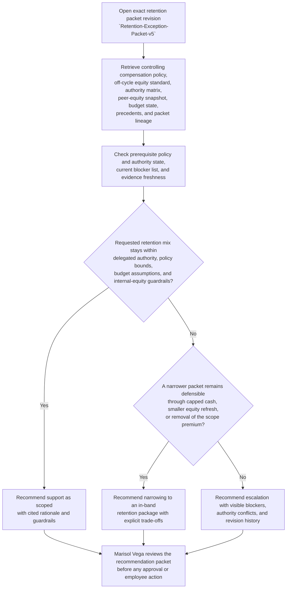
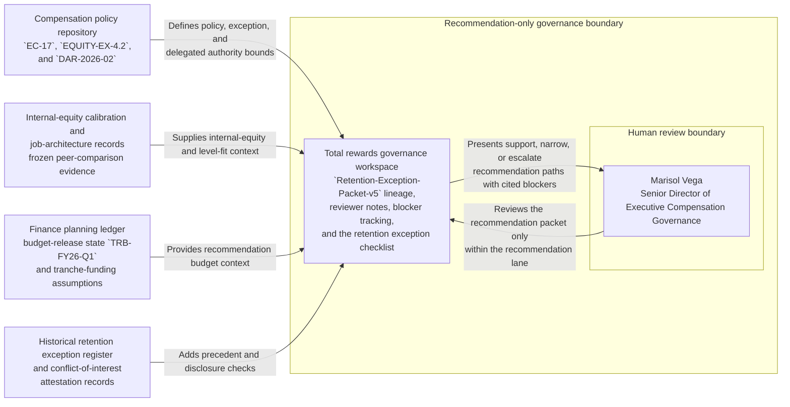

# Internal retention equity and cash package recommendation

## Linked pattern(s)

- `deal-desk-recommendation-support`

## Domain

HR.

## Scenario summary

An HR total rewards governance team is reviewing one exact governed recommendation packet, `Retention-Exception-Packet-v5`, for a critical internal retention case involving a principal machine learning platform leader who has presented an outside executive-level offer and is requesting an off-cycle equity refresh, a cash retention award payable in two tranches, and a temporary scope premium while a broader org redesign remains unsettled. The prerequisite state is fixed before recommendation work begins: FY2026 retention budget release `TRB-FY26-Q1` is the active funding baseline, executive compensation policy `EC-17` and off-cycle equity exception standard `EQUITY-EX-4.2` are the controlling policy sources, delegated authority matrix `DAR-2026-02` is the current approval baseline, and the quarterly internal-equity calibration snapshot for peer technical leaders was frozen on 2026-03-15. Source precedence is explicit and must remain explicit in the packet: active executive compensation policy, the off-cycle equity exception standard, and the delegated authority matrix outrank manager narratives, recruiter intelligence, and retention-risk commentary; those authoritative sources outrank the frozen peer-equity snapshot, current incentive budget ledger, prior retention exception register, and stakeholder notes; and free-form comments are advisory only when they conflict with higher-order policy or authority records. Packet v5 supersedes `Retention-Exception-Packet-v4` after the requesting VP narrowed the cash component and added updated attrition-risk evidence, but visible blockers remain for review: one peer-equity comparison still reflects a stale pre-reorg reporting line, the finance business partner has not countersigned the second-tranche funding assumption, and the sponsoring VP's conflict-of-interest attestation is still missing for a prior direct-report relationship. Marisol Vega, Senior Director of Executive Compensation Governance, owns the recommendation lane. The workflow must recommend whether HR should support the packet as scoped, narrow it to an in-band retention mix, or escalate because authority, internal-equity, or governance limits remain outside delegated review bounds. It stops before committee approval, employee communication, compensation changes, payroll action, equity grant issuance, or any downstream HRIS update.

## Target systems / source systems

- Total rewards governance workspace holding `Retention-Exception-Packet-v5`, prior packet revisions, reviewer notes, and the retention exception checklist
- Compensation policy repository containing executive compensation policy `EC-17`, off-cycle equity exception standard `EQUITY-EX-4.2`, and delegated authority matrix `DAR-2026-02`
- Internal-equity calibration records, job architecture data, and frozen peer-compensation comparison snapshots for principal and senior technical leaders
- Finance planning ledger, retention budget release records, and tranche-funding assumptions for FY2026 exception capacity
- Historical retention exception register, stakeholder comment history, and conflict-of-interest attestation records for sponsoring leaders and reviewers

## Why this instance matters

This grounds the recommendation pattern in HR through an internal retention governance problem rather than an external recruiting relocation package. The hard part is producing a defensible recommendation for one exact packet revision while keeping policy precedence, authority boundaries, frozen peer-equity evidence, visible blockers, and named accountability explicit before anyone treats a retention request as approved or starts compensation execution. It stays inside the recommendation boundary because the workflow does not approve the package, negotiate with the employee, issue an equity grant, update payroll, or change records in HR systems.

## Likely architecture choices

- A recommendation-only workflow can retrieve the exact retention packet revision, align it to current compensation policy, authority thresholds, internal-equity evidence, budget state, and historical precedent, and assemble one inspectable option set for review.
- Human-in-the-loop review is mandatory because Marisol Vega remains accountable for the recommendation lane and must decide whether unresolved equity, funding, or conflict-of-interest blockers require narrowing or escalation.
- Read-only integration with compensation, finance, job architecture, and governance systems is preferable so the workflow cannot convert a recommendation into an approved retention action, payroll change, or equity issuance event.

## Governance notes

- Source precedence must stay explicit on the face of the recommendation packet: executive compensation policy `EC-17`, off-cycle equity exception standard `EQUITY-EX-4.2`, and delegated authority matrix `DAR-2026-02` outrank manager narratives or retention-risk commentary; those sources outrank frozen peer-equity snapshots, budget ledgers, precedent records, and free-form reviewer notes.
- Prerequisite state must remain visible, including the active FY2026 retention budget release, the frozen quarterly peer-equity calibration snapshot, the currently effective authority matrix, and the fact that the packet is bounded to `Retention-Exception-Packet-v5`.
- Visible blockers should remain inspectable rather than summarized away: the stale pre-reorg peer comparison, the missing finance countersignature for second-tranche funding, and the absent sponsoring-VP conflict-of-interest attestation.
- Revision lineage should remain inspectable across packet updates: v4 carried the broader cash request and older attrition-risk evidence, while v5 narrowed the cash component, added refreshed risk evidence, and preserved the unresolved blocker list.
- Named accountability should remain explicit: Marisol Vega, Senior Director of Executive Compensation Governance, owns the recommendation lane for this packet.
- Recommendations must distinguish supportable options, narrower fallback options, and escalation-only paths without implying that committee approval, employee notice, compensation execution, equity issuance, payroll action, or HRIS changes have occurred.
- Employee compensation context, peer-equity comparisons, risk narratives, and conflict disclosures should remain visible only to authorized HR, finance, legal, and executive compensation reviewers under normal confidentiality controls.

## Evaluation considerations

- Reviewer agreement with whether `Retention-Exception-Packet-v5` should be supported, narrowed, or escalated before any employee-facing or compensation-system action is attempted
- Rate at which stale peer-equity evidence, unsigned funding assumptions, or conflict-of-interest blockers are surfaced before a retention package is treated as decision-ready
- Quality of evidence linking policy precedence, authority limits, frozen peer comparisons, and packet revision history to the recommendation
- Stability of recommendations when updated peer calibrations, budget countersignatures, or sponsor-governance disclosures change during review
