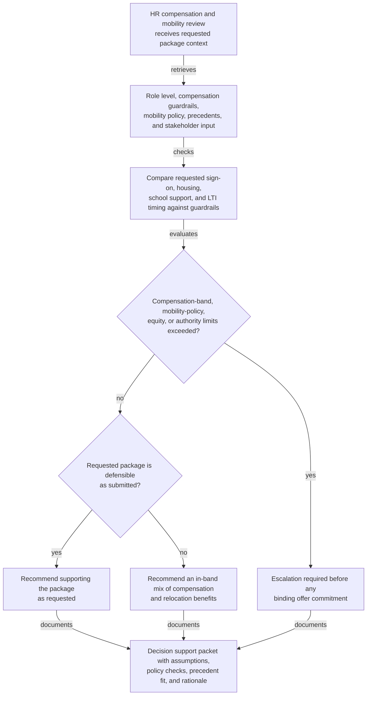
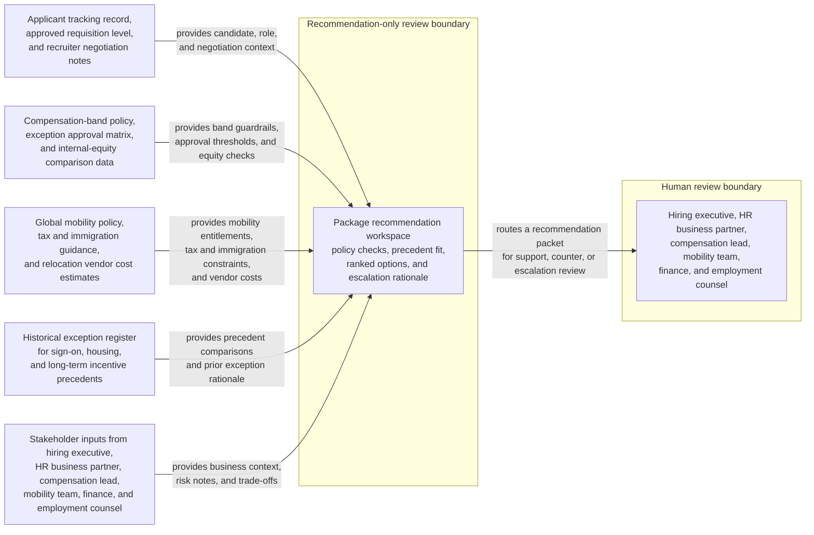

# International relocation and sign-on package recommendation

## Linked pattern(s)

- `deal-desk-recommendation-support`

## Domain

HR.

## Scenario summary

An HR compensation and mobility review team is evaluating an offer package for a finalist who would relocate from Singapore to London for a regional general manager role. The candidate is requesting a higher sign-on bonus to offset forfeited equity, temporary housing beyond standard policy, school-search support, and an earlier review for long-term incentive eligibility. The workflow must recommend whether HR should support the package as requested, counter with an in-band mix of compensation and relocation benefits, or escalate because compensation-band limits, mobility-policy thresholds, internal-equity concerns, and executive-approval triggers move outside delegated authority before anyone makes a binding offer commitment.

## Target systems / source systems

- Applicant tracking record, approved requisition level, and recruiter negotiation notes
- Compensation-band policy, exception approval matrix, and internal-equity comparison data for similar leaders
- Global mobility policy, tax and immigration guidance, and relocation vendor cost estimates
- Historical exception register covering sign-on, housing, and long-term incentive precedents
- Stakeholder input from the hiring executive, HR business partner, compensation lead, mobility team, finance, and employment counsel

## Why this instance matters

This instance grounds the recommendation pattern in HR without drifting into sourcing, interview coordination, or offer execution. The hard problem is producing a defensible recommendation when candidate-specific context, policy thresholds, historical precedent, and downstream employee-relations risk all matter, but final authority over the exception package must remain with human approvers.

## Likely architecture choices

- A recommendation-only workflow can retrieve approved role level, compensation guardrails, mobility entitlements, precedent exceptions, and stakeholder comments into one ranked option set for governed review.
- Human-in-the-loop review is mandatory because the workflow should advise on package structure and escalation triggers, not approve compensation exceptions, authorize immigration commitments, or issue the offer.
- Read-only integration with the applicant tracking system, compensation tools, mobility repositories, and approval records is preferable so the agent cannot silently alter candidate terms or convert a recommendation into a live commitment.

## Governance notes

- The output should distinguish in-policy offer paths, conditional options that require additional executive or finance approval, and blocked elements that would breach band, relocation, tax, or equity guardrails.
- Any recommendation that relies on precedent should show whether the earlier case matched role level, destination market, relocation distance, business urgency, and rationale for prior approval.
- Requests that would exceed delegated sign-on authority, create unequal treatment versus comparable employees, or introduce unresolved tax or immigration exposure should trigger explicit escalation rather than weighted scoring alone.
- Candidate compensation expectations, immigration details, family-relocation context, and internal-equity comparisons should remain visible only to authorized HR, finance, legal, and hiring stakeholders under normal privacy and need-to-know controls.
- Recommendation packets should preserve the assumptions, policy checks, precedent references, and reviewer comments used so leaders can later audit why an exception package was supported, narrowed, or escalated.

## Evaluation considerations

- Reviewer agreement with the recommended package and escalation route before any offer terms are communicated to the candidate
- Rate at which band, equity, tax, or mobility-policy blockers are surfaced before a binding approval path is implied
- Quality of evidence linking candidate context, policy thresholds, precedent fit, and stakeholder input to the recommendation
- Stability of recommendations when candidate compensation demands, relocation timing, or approval constraints change during final review
