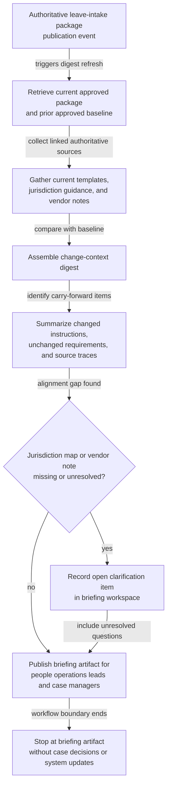
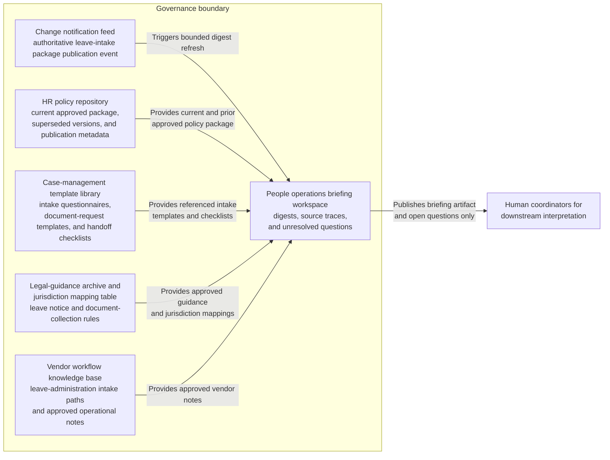

# Leave intake policy change digest for people operations briefing

## Linked pattern(s)

- `change-triggered-context-briefing`

## Domain

HR.

## Scenario summary

A people operations team maintains a controlled leave-intake policy package covering intake-form wording, required supporting documents, jurisdiction-specific notice language, handoff checkpoints to payroll and benefits, and approved vendor workflow notes. When the policy package is revised, case coordinators need a grounded digest showing what changed, which prior intake requirements still stand, and which counsel or vendor clarifications remain unresolved. The workflow should stop at a briefing artifact for people operations leads and case managers; it should not determine employee eligibility, recommend accommodations, or execute any case update in downstream HR systems.

## Target systems / source systems

- HR policy repository containing the current approved leave-intake package, superseded versions, and publication metadata
- Case-management template library with intake questionnaires, document-request templates, and handoff checklists referenced by the policy package
- Approved legal-guidance archive and jurisdiction mapping table for leave notice and document-collection rules
- Vendor workflow knowledge base describing current leave-administration intake paths and approved operational notes
- People operations briefing workspace where case-manager digests, source traces, and unresolved questions are stored
- Change notification feed that emits the authoritative leave-intake package publication event

## Why this instance matters

This grounds the pattern in an HR workflow where teams need timely contextual briefing about approved source changes without reopening legal research or making case-by-case determinations. People operations coordinators often work from templates and procedural memory, so a raw policy update can leave uncertainty about what actually changed for the next intake cycle. The instance shows how change-triggered context assembly can keep HR briefings grounded, privacy-aware, and explicitly bounded away from eligibility or accommodation decisions.

## Likely architecture choices

- Event-driven monitoring is a good fit because the workflow should refresh the digest when the approved leave-intake package changes, not only during manual policy review cadences.
- A tool-using single agent can compare policy versions, retrieve linked templates and jurisdiction notes, and publish a people-operations briefing with versioned source traceability.
- Bounded delegation fits because policy owners can define the source bundle and publication rules while human coordinators remain responsible for any downstream case interpretation or action.
- The digest should distinguish newly changed intake instructions, unchanged carry-forward requirements, and unresolved counsel or vendor questions that need manual follow-up before the next case wave.

## Governance notes

- Only approved policy revisions, current legal guidance snapshots, and sanctioned vendor workflow notes should feed the digest; draft policy comments or case anecdotes should not be treated as authoritative.
- The briefing should avoid copying employee-sensitive examples or unnecessary compensation and medical detail into broad team channels, favoring citations or narrow excerpts instead.
- If a jurisdiction mapping or vendor workflow note lags behind the newly published policy package, the workflow should record that as an open question rather than implying the intake path is fully aligned.
- Audit logs should retain the triggering policy version, the compared baseline, and any human clarifications added before the briefing is distributed to case managers.

## Evaluation considerations

- Percentage of approved leave-intake policy revisions that produce a digest with complete version and provenance traceability
- Reviewer correction rate for changed-intake summaries, carry-forward requirements, or jurisdiction-note mappings during people-operations review
- Rate at which unresolved legal or vendor-alignment questions are surfaced explicitly before case coordinators rely on the briefing
- Usefulness of the digest for helping case managers understand the current intake package without drifting into eligibility, accommodation, or execution decisions
