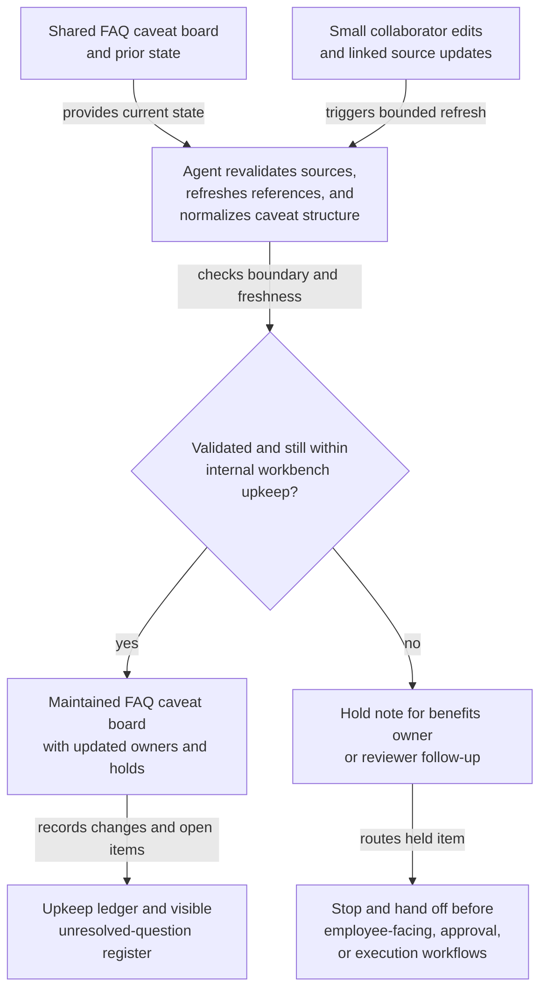

# Open enrollment FAQ caveat board shared workbench upkeep

## Linked pattern(s)

- `shared-workbench-orchestration`

## Domain

HR.

## Scenario summary

A people operations benefits team maintains an internal open enrollment FAQ caveat board while benefits specialists, policy owners, regional HR partners, and internal communications reviewers continuously refine employee-question coverage for the upcoming enrollment window. Small updates arrive throughout the cycle: a carrier liaison adds one plan-note caveat, a regional partner flags a stale dependent-eligibility example, a reviewer marks one screenshot as outdated, and a policy owner links a newly approved portal instruction change. The agent keeps that internal workbench usable by refreshing linked source references, normalizing duplicate caveat notes, updating section ownership and hold markers, and carrying unresolved policy-interpretation questions forward in a visible register. Humans remain responsible for deciding what the benefits rules actually mean, which wording is safe for employee-facing use, whether any exception or clarification is approved, and when any material should move into separate communication, approval, or execution workflows.

## Target systems / source systems

- Shared FAQ caveat board with topic sections, owner fields, blocker tags, and revision history
- Internal benefits policy repository containing current plan summaries, enrollment guidance, and approved portal instruction notes
- Carrier or vendor operations notes workspace with approved clarifications, effective dates, and linked source references
- Screenshot and artifact store referenced by topic-level caveats and reviewer comments
- HR annotation or review surface where benefits specialists, regional partners, and communications reviewers add small edits, caveats, and hold notes

## Why this instance matters

This grounds the pattern in a low-risk HR collaboration loop where the maintained artifact is an internal workbench used to keep evolving FAQ caveats organized before any employee-facing content is finalized. The useful work is not deciding benefits policy, sending enrollment guidance, or assigning downstream updates. It is keeping one bounded board current, inspectable, and resumable as many small edits and linked-source changes arrive from different human collaborators.

## Likely architecture choices

- Event-driven monitoring fits because upkeep should react when policy notes, carrier clarifications, screenshots, or board fields change.
- A tool-using single agent can refresh source links, normalize duplicated caveat text, and keep ownership and blocker markers synchronized inside one bounded board.
- Human-in-the-loop review remains necessary when a note changes policy interpretation, sounds employee-facing, or could remove a caveat that a benefits owner still considers unresolved.
- Bounded delegation works because the team can predefine allowable field updates, source boundaries, and hold conditions without delegating approval of final FAQ wording or downstream communications.

## Governance notes

- The board should clearly distinguish approved source excerpts, reviewer proposals, unresolved interpretation questions, and employee-facing wording candidates so internal upkeep does not imply final policy guidance.
- Plan references, effective dates, screenshot links, and carrier-note identifiers should be revalidated before a section is marked current or a blocker is cleared.
- The agent may normalize structure and merge duplicate comments, but it should not decide what a benefits rule means, approve an exception, or remove a caveat that a human owner accepted.
- If a requested update would publish FAQ text, commit to employee guidance, trigger enrollment operations changes, or approve a policy interpretation, the workflow should stop and hand off to the appropriate communication, approval, or execution pattern.

## Evaluation considerations

- Percentage of board refreshes that preserve correct policy links, screenshot references, ownership fields, and unresolved-question state across repeated update cycles
- Reviewer correction rate for merged caveat notes, refreshed source references, or automatically updated blocker markers
- Rate at which employee-facing or interpretation-heavy edits are held for human review instead of being silently folded into the internal board
- Usefulness of the maintained workbench for helping benefits and communications reviewers resume internal FAQ preparation without reconstructing stale context by hand
