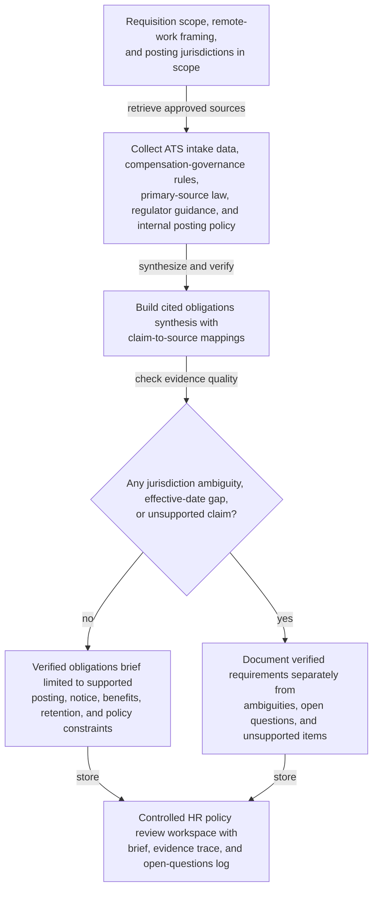
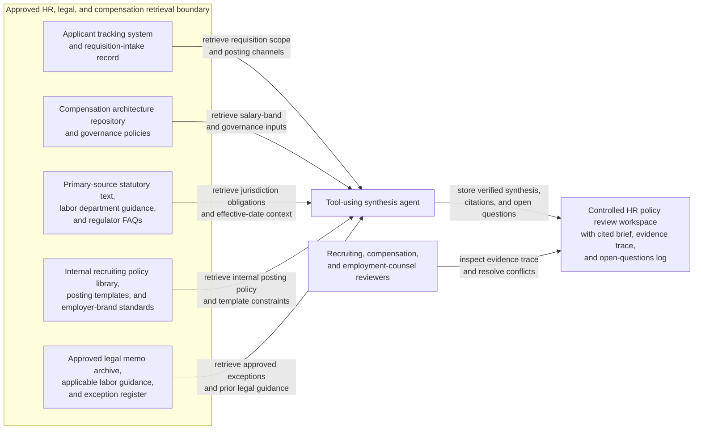

# Pay transparency posting obligation synthesis for requisition launch review

## Linked pattern(s)

- `research-synthesis-with-citation-verification`

## Domain

HR.

## Scenario summary

An HR operations and talent acquisition team is preparing to open a requisition for a remotely eligible manager role that may be posted across multiple U.S. states and one Canadian province. Before anyone finalizes the job posting, sets disclosure language, requests compensation-range exceptions, or gives legal advice, the workflow needs a cited current-state brief showing which pay-transparency obligations, salary-range disclosure rules, benefits-disclosure expectations, applicant notice duties, record-retention requirements, and internal policy constraints are actually supported by the active source set. The useful artifact is an evidence-backed obligations synthesis that separates verified requirements from jurisdictional ambiguity, effective-date questions, and open items still requiring employment counsel or compensation-owner review.

## Target systems / source systems

- Controlled HR policy review workspace where the cited obligations brief, evidence trace, and open-questions log are stored
- Applicant tracking system and requisition-intake record containing role location options, remote-work eligibility, job family, and posting channels
- Approved compensation architecture repository with current salary bands, geographic differential rules, and compensation-governance policies
- Primary-source statutory text, labor department guidance, and regulator FAQs for the posting jurisdictions in scope
- Internal recruiting policy library, posting templates, and employer-brand content standards
- Approved legal memo archive, collective bargaining or works-council guidance where applicable, and exception register for non-standard posting practices

## Why this instance matters

This grounds the gather/synthesize pattern in an HR workflow where fluent summarization is not enough because posting obligations can change by jurisdiction, work-location framing, and effective date. Recruiting teams often pull from old templates, recruiter memory, or generic compensation guidance that does not cleanly answer what must be disclosed for a specific requisition. The value is a source-grounded brief with inspectable provenance that gives recruiting, compensation, and employment counsel a shared evidence base before any public posting, internal exception approval, or policy update begins.

## Likely architecture choices

- A tool-using single agent can retrieve the approved requisition metadata, compensation-policy artifacts, primary-source legal materials, and current posting templates, then assemble a structured synthesis with claim-to-source mappings.
- Human-in-the-loop review should remain mandatory for conflicts between statutes, regulator guidance, internal compensation policy, and role-location assumptions, especially when the requisition spans multiple jurisdictions or remote-work interpretations.
- The workflow should preserve an evidence trace that distinguishes binding legal text, regulator interpretation, approved internal policy, and lower-authority contextual materials such as template language or recruiter playbooks.
- Retrieval should stay within approved HR, legal, and compensation repositories, and the synthesis should stop at a cited obligations brief rather than inferring the final posting language, compensation decision, or exception outcome.

## Governance notes

- Primary-source law, current regulator guidance, and approved internal compensation-governance policies should outrank recruiter notes, stale templates, slide decks, or copied chat guidance when sources disagree.
- Effective dates, jurisdiction applicability, remote-work location assumptions, and superseded internal policy versions should be explicit because stale disclosure rules can create compliance and employee-relations risk.
- The brief should clearly separate verified posting obligations, internal policy constraints, optional template conventions, and unresolved interpretation questions instead of flattening them into one narrative.
- Salary bands, geographic differential logic, and requisition metadata should be handled with least-privilege access, and copied excerpts should minimize unnecessary employee or candidate-sensitive compensation details while preserving auditability.
- Retrieval and synthesis actions should be logged so compensation, legal, and recruiting reviewers can inspect which sources were consulted and why unsupported claims were excluded.

## Evaluation considerations

- Percentage of material pay-range, benefits-disclosure, notice, and retention claims backed by inspectable citations to the current effective source set
- Reviewer correction rate for jurisdiction mapping, source precedence, effective-date handling, or citation mismatch during requisition review
- Rate at which ambiguous remote-location coverage, outdated posting templates, or unsupported compensation-policy assumptions are surfaced explicitly before the role is posted
- Usefulness of the open-questions section for helping recruiting, compensation, and employment counsel resolve evidence gaps without reconstructing the source corpus from scratch
