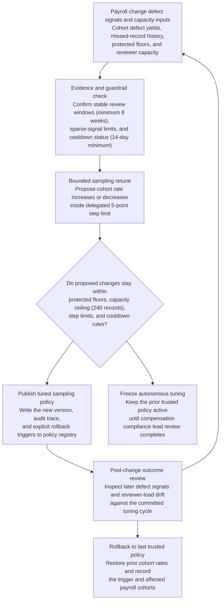

# Payroll change audit spot-check sampling-rate tuning

## Linked pattern(s)

- `adaptive-review-sampling-rate-tuning`

## Domain

HR.

## Scenario summary

A compensation compliance team runs a monthly spot-check program that samples completed
payroll change records--salary adjustments, manual off-cycle corrections, retroactive pay
fixes, and same-day termination final-pays--to catch data-entry errors, authorization gaps,
and regulatory-compliance lapses before ledger close. The current static sampling policy
over-samples routine annual merit increases (historically low defect rate, roughly 1.4 per
cent across three fiscal years) while under-sampling manual off-cycle corrections and
same-day termination final-pays, where a rising miss rate has been flagged in two
consecutive quarterly audits. The four-person compensation audit team is at capacity during
payroll-close weeks, and any naive increase in total review volume would push reviewers into
overtime or cause audits to spill past the close window. The workflow must autonomously
retune bounded sampling rates so high-defect-signal cohorts receive more spot checks per
cycle while holding protected minimums for executive-compensation adjustments, cross-border
payroll records, and leave-of-absence-adjacent pay changes--all within a five-percentage-
point autonomous step limit and a hard reviewer-capacity ceiling of 240 sampled records per
close week--and must produce a versioned policy artifact plus full audit trace with named
human ownership and explicit rollback triggers.

## Target systems / source systems

- Compensation policy registry holding the active spot-check sampling policy, per-cohort
  protected-floor values, prior policy versions, and the delegated step-size and capacity
  limits approved by the VP of Total Rewards
- Payroll system of record supplying completed change records by cohort (merit, off-cycle,
  retro, termination final-pay, LOA-adjacent, cross-border, executive) with authorization
  metadata, effective dates, and completion timestamps
- Audit findings store capturing defect classifications, authorization-gap flags, back-out
  events, reviewer overrides, and regulatory citations from prior spot-check cycles
- Reviewer-capacity dashboard tracking the four-person compensation audit team's current
  load, close-week availability, and the 240-record weekly ceiling
- Governance workspace used by the compensation compliance lead (named owner: Compensation
  Compliance Lead, reports to VP Total Rewards) to inspect sampled tuning runs, freeze
  autonomous changes, and restore the last trusted policy
- Payroll-close calendar indicating active close weeks, blackout periods during which
  sampling changes are frozen, and any audit-cycle gate dates

## Why this instance matters

This grounds the pattern in an HR compensation-compliance workflow where the change artifact
is a governed spot-check sampling policy rather than a payroll action, case determination,
or remediation step. A naive loop could reduce review on quieter merit-cycle weeks, miss a
latent authorization-gap regression in off-cycle corrections, or push the four-person audit
team into unsustainable load by reacting to a single bad fortnight of termination final-pays.
The instance stays firmly within the optimize/adapt boundary because the output is only a
reversible policy update and audit trace; it does not back out pay changes, reassign
reviewers, escalate individual records to HR leaders, or alter the payroll processing
workflow itself.

The scenario illustrates key governance tensions specific to HR:

- Reviewer-capacity constraints are tighter than in most domains because payroll-close
  windows are short and the team is small.
- Protected-cohort floors matter for equity reasons (executive-pay transparency obligations,
  cross-border regulatory requirements, LOA pay accuracy tied to leave-status rights) not
  only for risk-management reasons.
- Defect history must be treated carefully because a single high-severity authorization gap
  in an executive record has very different regulatory exposure than a routine data-entry
  correction.

## Authoritative source precedence

1. Delegated sampling-rate bounds and protected floors approved by VP Total Rewards
   (versioned in the compensation policy registry; last ratified at annual governance review)
2. Payroll regulatory calendar and close-window blackout rules (managed by Payroll
   Operations lead)
3. Current reviewer-capacity ceiling (240 records per close week; updated quarterly by
   Compensation Compliance Lead)
4. Audit findings store with minimum 8-week evidence window required before any autonomous
   rate decrease is applied

## Protected floors and governance constraints

- Executive-compensation adjustments: minimum 30 per cent spot-check rate; cannot be
  lowered autonomously regardless of defect yield
- Cross-border and multi-jurisdiction payroll records: minimum 25 per cent spot-check rate;
  any change requires compensation compliance lead approval
- LOA-adjacent pay changes (STD top-ups, salary continuance, reinstatement adjustments):
  minimum 20 per cent spot-check rate to protect leave-status accuracy
- Maximum autonomous step size: five percentage points per cohort per cycle
- Cooldown: a cohort cannot be adjusted again for 14 days after the last autonomous change
- Reviewer-capacity ceiling: total sampled records across all cohorts must not exceed 240
  per close week; the loop must reduce discretionary cohort rates before touching protected
  floors when capacity headroom is exhausted
- Close-week blackout: no autonomous rate changes are applied during the 72 hours before
  ledger close; the prior trusted policy remains active through close
- Evidence floor: rate decreases require a minimum 8-week stable review window with defect
  yield below the cohort historical average; rate increases may trigger on a shorter 4-week
  window when a rising-miss pattern is confirmed

## Freeze and rollback triggers

Freeze autonomous tuning and route to compensation compliance lead when:
- A proposed move would cross any protected-floor value even after applying the step limit
- Total projected record volume would exceed the 240-record weekly capacity ceiling after
  adjusting discretionary cohorts
- The evidence window for a cohort is fewer than the minimum required weeks
- A close-week blackout is active
- Defect yield or back-out rate rises in any protected cohort following a recent autonomous
  decrease (immediate rollback and human notification required)
- The payroll system of record or audit findings store signals a data-quality issue that
  could invalidate the current defect-yield calculation

Rollback is triggered automatically when:
- A protected cohort's confirmed miss rate rises by more than two percentage points after a
  downward rate adjustment in that cohort within the prior two close cycles
- Reviewer overtime is logged during a close week where sampled volume was within the ceiling
  (indicating capacity model drift requiring human recalibration)

## Visible blockers

- Sparse evidence: cohorts with fewer than 40 completed changes in the evidence window are
  excluded from autonomous downward tuning until volume is sufficient
- Policy change invalidation: if the VP Total Rewards updates protected-floor values or
  approved bounds, autonomous tuning freezes until the new parameters are confirmed in the
  policy registry
- Regulatory calendar events: FLSA reporting periods and country-specific payroll deadlines
  are recorded in the payroll-close calendar; the loop will not decrease cross-border or
  executive sampling rates in the 30 days before a known regulatory deadline

## Named human ownership

- Compensation Compliance Lead: primary autonomous-tuning owner; reviews sampled tuning
  runs, approves exceptions to delegated bounds, triggers manual freeze, restores the last
  trusted policy, and escalates to VP Total Rewards when governance boundaries are
  approached
- VP Total Rewards: approves the delegated rate bands, protected floors, and capacity
  ceiling at annual governance review; must be notified within one business day of any
  rollback event
- Payroll Operations Lead: maintains the close-window blackout calendar and notifies the
  compliance team of regulatory calendar changes that may affect sampling validity

## Likely architecture choices

- Event-driven monitoring should trigger reevaluation at the end of each payroll close cycle
  when new defect signals, back-out events, and reviewer overrides are committed to the
  findings store.
- A tool-using single agent can compare bounded sampling moves against protected floors,
  capacity ceilings, and cooldown rules, publish the approved policy version, and append the
  cycle audit record.
- Autonomous-with-audit fits because in-policy sampling changes can apply automatically at
  cycle end, while the compensation compliance lead reviews sampled tuning logs and freezes
  the loop when governance boundaries are approached.
- The surrounding review program must be able to backfill spot-check coverage in the next
  cycle if a later audit reveals that an autonomous rate decrease was too aggressive.

## Governance notes

- Executive-compensation adjustments, cross-border records, and LOA-adjacent pay changes
  hold protected sample floors that the tuning loop cannot lower without named human
  approval, regardless of local defect yield.
- Audit logs must capture the defect-yield window analyzed, reviewer-capacity assumptions,
  blocked or deferred moves, rollback triggers, and the prior and new rates for each cohort
  in every sampling cycle.
- Privacy controls should aggregate defect signals at the cohort level; individual employee
  names, compensation figures, and medical-status indicators must not appear in general
  tuning logs. Restricted annexes for authorized HR audit review are permissible when
  supporting evidence is required.
- The workflow must not reverse pay changes, initiate regulatory filings, assign reviewers
  to specific records, trigger discipline actions, or send worker-facing communications; it
  only adjusts how much spot-check coverage different payroll change cohorts receive.
- Configuration history must retain prior policy versions, freeze events, and rollback
  lineage so the VP Total Rewards or an external auditor can reconstruct every autonomous
  change.

## Evaluation considerations

- Change in defect yield per review hour for high-signal cohorts (off-cycle corrections,
  same-day termination final-pays) after autonomous rate increases are applied
- Escaped-defect or back-out trends for protected cohorts (executive, cross-border, LOA)
  following any autonomous rate adjustment
- Reviewer-load stability across close weeks, including whether bounded tuning reduces
  wasted review on low-risk merit increases without creating blind spots in higher-risk
  cohorts
- Frequency of compensation-compliance-lead freezes, backfill sweeps, or rollbacks
  indicating the loop is reacting to noise rather than genuine drift
- Accuracy of the capacity model: whether the 240-record ceiling reliably prevents close-
  week overtime after an autonomous rate increase
