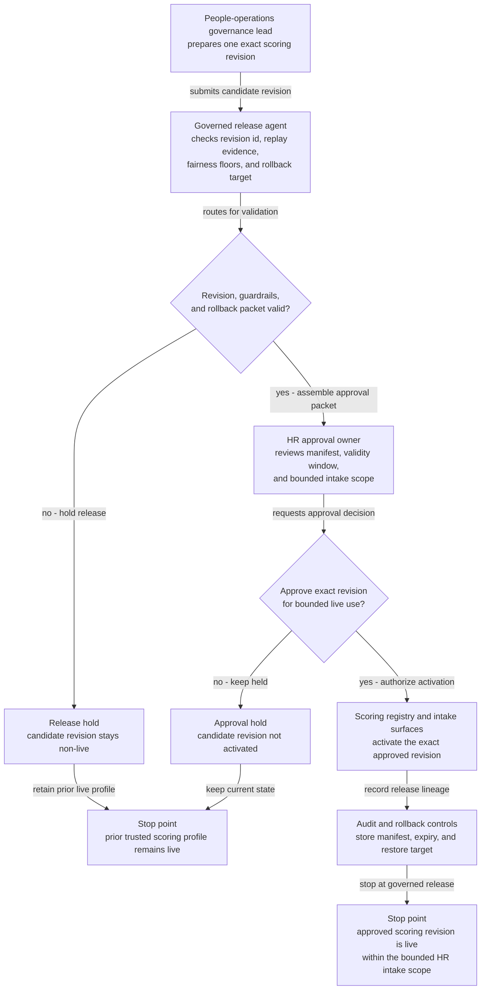
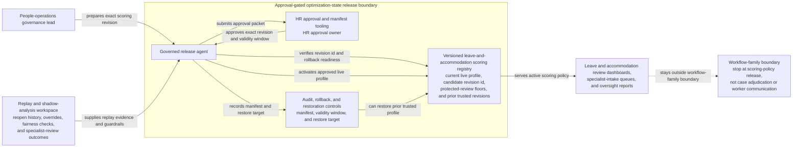

# Protected leave accommodation-review scoring revision approved for live use

## Linked pattern(s)

- `approval-gated-optimization-state-release`

## Domain

HR.

## Scenario summary

A people-operations governance lead has prepared one exact scoring-policy revision for protected leave and workplace accommodation review intake after replay shows that the current live profile underweights intermittent-leave renewals, medically complex accommodation updates, and lower-visibility worker populations when specialist review capacity tightens. The candidate revision raises protected-case sensitivity, strengthens documentation-volatility weighting, and preserves a restore target if reopen churn or fairness drift rises. The workflow must release that exact scoring revision into bounded live use only after an HR approval owner confirms the manifest, validity window, and rollback packet, while staying centered on governed optimization-state release rather than leave eligibility adjudication, accommodation approval, staffing assignment, or worker communication.

## Target systems / source systems

- Versioned leave-and-accommodation scoring registry with the current live profile, candidate revision id, protected-review floors, and prior trusted revisions
- Replay and shadow-analysis workspace with reopen history, supervisor overrides, follow-up misses, fairness checks, and specialist-review outcomes across protected case cohorts
- HR approval and manifest tooling used by people-operations leadership to authorize one bounded live scoring revision for leave and accommodation intake
- Audit, rollback, and restoration controls that can re-activate the prior profile if protected-case handling, reopen risk, or follow-up stability worsens
- Leave and accommodation review dashboards, specialist-intake queues, and oversight reports that consume the active scoring policy

## Why this instance matters

This grounds the pattern in HR without drifting into case adjudication. The released artifact is one versioned review-scoring revision that changes how future protected leave and accommodation cases are surfaced and weighted for human review, not a recommendation about a specific worker outcome and not a case action in the HR system. The approval-gated release boundary is essential because people-risk tuning can look beneficial in replay while still requiring explicit sign-off on fairness posture, expiry timing, and restore readiness before one exact revision becomes live.

## Likely architecture choices

- Approval-gated execution fits because the scoring revision can be technically ready in the registry while activation remains blocked until a named HR release owner approves that exact version and bounded cohort scope.
- Human-in-the-loop review remains necessary because accountable leave and employee-relations leaders must accept the trade-offs among review timeliness, fairness protections, and specialist-load impact before live use begins.
- A governed release agent can compare revision ids, verify replay evidence, register the rollback target, and write the audit trace, but it should not determine leave eligibility, approve accommodations, or assign specialists to individual cases.

## Governance notes

- Approval should bind to one exact scoring revision, one named leave-and-accommodation intake scope, and one validity window so later tuning edits cannot inherit stale authority.
- Protected-worker fairness floors, intermittent-leave safeguards, and sensitive-medical-document handling should remain explicit release conditions rather than being buried inside a generic throughput narrative.
- Expiry should be automatic unless HR leadership explicitly renews the revision after reviewing live reopen, escalation, and follow-up signals.
- Rollback triggers should include increased supervisor overrides, worsening reopen rates for protected cohorts, or reduced stability on medically complex accommodation cases.
- Audit records should preserve the approved and prior revision ids, replay cohorts, approver identity, validity timing, restore action, and any manual extension or rollback decision.
- The workflow must not adjudicate leave, authorize accommodations, update payroll, or send worker-facing actions; it only governs release of the live scoring revision used by human review surfaces.

## Evaluation considerations

- Reduction in reopen churn, supervisor overrides, and missed follow-up windows after the approved scoring revision becomes live
- Accuracy of binding among the approved revision id, protected-review floors, and activated intake scope
- Reliability of automatic expiry or rollback when fairness checks degrade or specialist-load assumptions fail
- Time required for HR leaders to inspect one revision, approve bounded live use, and verify safe restoration to the prior trusted profile
