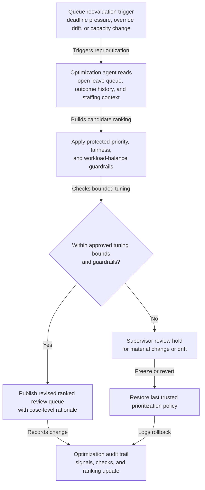
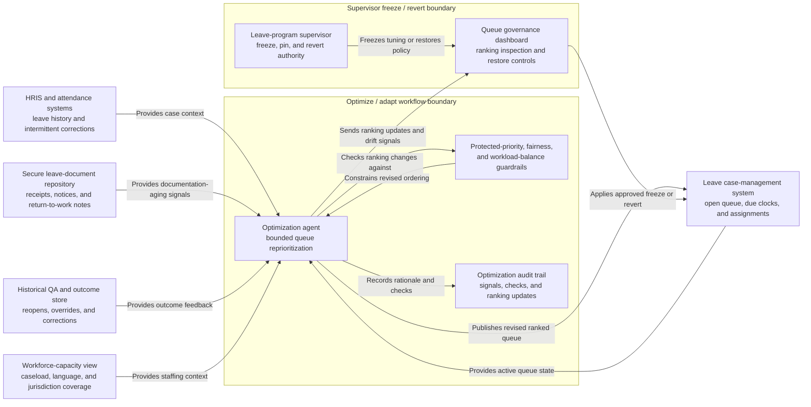

# Protected leave case review queue reprioritization

## Linked pattern(s)

- `queue-prioritization-optimization`

## Domain

HR.

## Scenario summary

An HR leave operations manager is overseeing a backlog of open protected-leave cases that need document-sufficiency review, recertification follow-up, intermittent-use verification, return-to-work restriction handling, or case-closure checks before employee commitments and statutory response windows slip. The queue mixes new family and medical leave requests, disability-related leave extensions, military-family leave inquiries, and intermittent leave cases with repeated attendance-code corrections. Recent handling data shows that specialists have been pulling forward straightforward cases with complete paperwork while medically sensitive, multilingual, or manager-disputed cases are aging longer and creating missed callback commitments, uneven specialist load, and late escalations to employee relations. The optimization workflow must reprioritize the existing review queue within bounded limits so imminent service deadlines, employee-impact severity, documentation-aging risk, and protected-priority leave events rise appropriately without letting complex cases, certain worksites, or employees needing language support be systematically pushed back.

## Target systems / source systems

- Leave case-management system with open case state, intake dates, callback commitments, due-date clocks, current queue order, and specialist assignments
- HRIS and attendance systems with employer entity, work schedule, leave balances, pay-status flags, prior leave history, and intermittent-use corrections
- Secure leave-document repository with certification receipts, recertification requests, return-to-work notes, accommodation overlap flags, and missing-information notices
- Historical QA and outcome store with reopened leave cases, missed service commitments, supervisor overrides, complaint escalations, and downstream payroll or attendance corrections
- Workforce-capacity view showing leave-specialist caseload, language coverage, jurisdiction expertise, and temporary staffing changes during absence spikes
- Queue governance dashboard used by leave-program supervisors to inspect ranking changes, freeze tuning, and restore the last trusted prioritization policy

## Why this instance matters

This grounds the optimization pattern in an HR workflow where queue order affects employee trust, protected-leave timeliness, specialist workload balance, and privacy-sensitive case handling rather than generic service throughput. A naive reprioritization loop could overfavor easy-to-close cases, leave medically complex or disputed matters to age until callback promises are missed, or overload the few specialists authorized to handle certain jurisdictions or language needs. The example keeps the work squarely in optimize/adapt territory: the system is tuning backlog order using outcome feedback and operating context, not deciding leave eligibility, drafting employee letters, or executing payroll changes.

## Likely architecture choices

- Event-driven monitoring should trigger queue reevaluation when callback commitments near breach, recertification deadlines tighten, reopen rates climb, specialist capacity shifts, or supervisors repeatedly override the current ordering.
- A tool-using single agent can recompute bounded prioritization weights, simulate the impact on service-level attainment and specialist workload balance, and publish a revised ranked queue with case-level rationale for supervisory inspection.
- Exception-gated autonomy fits because in-policy tuning can adjust ordering automatically within preapproved ranges, but changes that materially alter protected-priority handling, deadline buffers, fairness thresholds, or specialist load caps should require leave-program supervisor review before activation.
- Human supervisors should remain able to freeze optimization updates, pin sensitive cases, and revert to the last trusted ranking policy when feedback quality drops, privacy concerns emerge, or a policy change makes recent outcome history unreliable.

## Governance notes

- Cases involving imminent statutory or policy response deadlines, employees currently unpaid because of pending leave review, military-service protections, safety-sensitive return-to-work restrictions, or potential retaliation concerns should remain protected classes that cannot be demoted for closure-speed reasons.
- Fairness checks should test for repeated deferral of multilingual cases, lower-visibility worksites, intermittent-leave reviews, or medically complex packets instead of letting historical ease-of-resolution or manager responsiveness become a proxy for priority.
- Workload balancing should be explicit so the optimizer does not keep routing the hardest backlog slice to the same leave specialists or exhaust the limited reviewers with language, jurisdiction, or accommodation-overlap expertise.
- Optimization features and audit displays should minimize medical and personal detail to the least information needed for prioritization quality, while still logging the due-date pressure, queue-aging signals, override history, staffing assumptions, and guardrail checks that justified each ranking change.
- Reversibility should be operationalized: if callback breaches increase, specialist override rates spike, fairness drift appears, or reprioritization creates privacy-handling concerns, the workflow should restore the prior trusted policy and escalate the tuning packet for supervisory review.
- Auditability should be durable enough for HR compliance, employee-relations, or internal-audit review to reconstruct why a leave case moved, what constraints were checked, who approved material tuning changes, and when rollback or manual pinning occurred.

## Evaluation considerations

- Reduction in missed callback commitments, aged recertification reviews, reopened leave cases, and downstream attendance or payroll corrections after tuned queue ordering is applied
- Change in wait-time distribution for protected-priority, multilingual, and medically complex leave cases versus routine document-complete reviews, including whether fairness guardrails prevent systematic delay
- Frequency and pattern of supervisor overrides that indicate the optimized ranking conflicted with policy, privacy, fairness, or workload-balance expectations
- Speed and clarity of rollback when updated tuning degrades service-level performance, overconcentrates difficult work on a small specialist group, or conflicts with new leave-policy guidance
