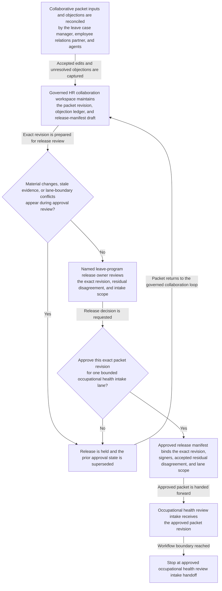
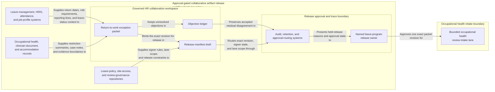

# Protected leave return-to-work exception packet approved for occupational health review intake

## Linked pattern(s)

- `approval-gated-collaborative-artifact-release`

## Domain

HR.

## Scenario summary

A leave case manager, an employee relations partner, and occupational health reviewers are co-producing one governed exception packet because an employee's planned return-to-work date now conflicts with site-access restrictions, duty limitations, and manager coverage concerns. Agents help reconcile clinician summaries, essential-function notes, interactive-process comments, and disputed wording about temporary restrictions into the shared packet while preserving which objections remain unresolved and which edits the human artifact owner accepted. The workflow ends only when the named leave-program release owner approves that exact packet revision for one bounded occupational health review intake lane, where downstream reviewers may decide whether additional restrictions, phased return conditions, or escalation are required. It does not decide the return-to-work outcome, notify the employee, or update payroll or scheduling systems.

## Target systems / source systems

- Governed HR collaboration workspace storing the return-to-work exception packet, comment history, objection ledger, and release-manifest draft
- Leave-management, HRIS, attendance, and job-profile systems providing authoritative return dates, role requirements, reporting lines, and leave-status context
- Occupational health, clinician-document, and accommodation records supplying current restriction summaries, prior case notes, and evidence boundaries
- Leave-policy, site-access, and review-governance repositories defining required signers, approved occupational health intake scope, and release-lane constraints
- Audit, retention, and approval-routing systems preserving superseded packet versions, accepted residual disagreement, and held-release reasons

## Why this instance matters

This grounds the pattern in HR where the primary reusable challenge is collaborative ownership of one sensitive review artifact plus explicit approval to release that artifact itself into one bounded occupational health lane. The packet is not a recommendation shortlist and not a transactional case update: humans and agents repeatedly refine one exception artifact, keep disagreement visible, and then attach approval to the exact revision being handed forward. The example stays inside the collaboration-family boundary because the occupational health determination, employee communication, and downstream system updates remain separate workflows.

## Likely architecture choices

- Approval-gated execution fits because the packet can be collaboration-complete while still blocked from occupational health intake until the human release owner approves the exact revision.
- Human-in-the-loop control is required because only accountable HR leaders may accept residual disagreement, confirm privacy-safe audience scope, and authorize the release boundary.
- Agents may reconcile restrictions, refresh policy references, and maintain the release trace, but they must not decide fitness-for-duty conditions, notify the employee, or update leave-state records.

## Governance notes

- The release manifest should bind one exact packet revision, the named occupational health review lane, signer identities, and any residual objections that the human release owner explicitly accepted.
- Clinician summaries, manager concerns, temporary-duty caveats, and leave-policy disagreements should remain visible in the packet or boundary ledger instead of being flattened before release.
- Audience scope should stay limited to the approved review lane; reuse of the packet for employee messaging, labor-relations handling, or payroll processing should require separate downstream approval.
- If new medical documentation, job-duty changes, or site-access rules materially change the packet during approval review, the workflow should hold release and supersede the prior revision rather than letting stale approval carry forward.

## Evaluation considerations

- Rate at which occupational health intake accepts the released packet without finding hidden disagreement, stale restriction evidence, or wrong audience scope
- Time required to keep one collaborative exception packet synchronized as clinician notes, HR comments, and signer state change near the planned return date
- Reliability of binding between the released artifact revision, accepted residual disagreement, and the bounded occupational health intake lane
- Frequency with which humans reject agent-assisted edits because they drifted into outcome adjudication, employee communication, or downstream leave administration
