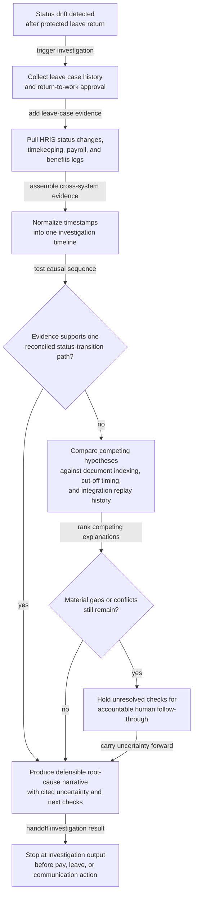
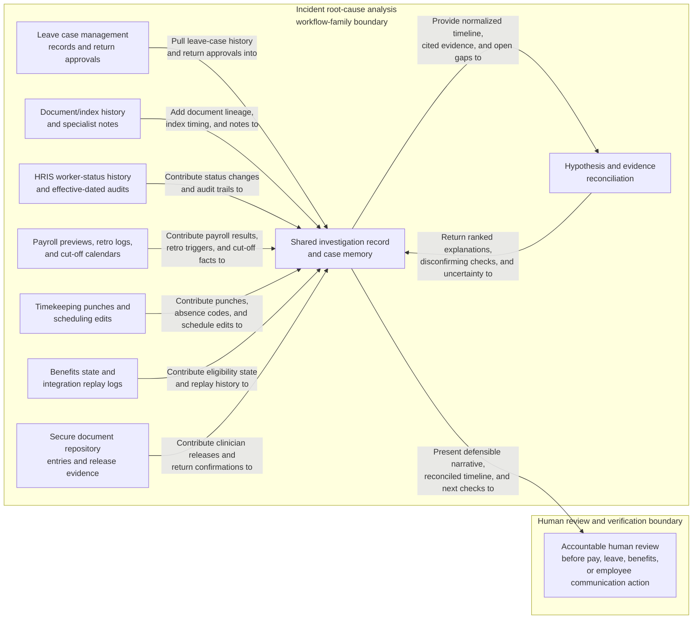

# Protected leave return-to-work status drift root-cause investigation

## Linked pattern(s)

- `incident-root-cause-analysis`

## Domain

HR.

## Scenario summary

After an employee is cleared to return from protected medical leave, time punches and manager scheduling records show the worker back on shift, but the next payroll preview still treats the employee as unpaid leave while benefits administration keeps the case in an active leave state. Several plausible causes conflict: the leave case may have been closed without the return-to-work event posting to the HRIS, a faxed provider release may have been indexed to the wrong worker record, a backdated schedule correction may have arrived after the payroll cut-off and masked the real status transition, or an integration retry may have replayed an older leave segment after the return was already approved. The workflow reconciles leave-case history, document intake timestamps, HRIS status changes, payroll calculations, timekeeping events, integration logs, and specialist notes into a defensible explanation of what actually failed, what remains uncertain, and which verification checks still need accountable human follow-through before anyone restores pay, adjusts leave balances, or tells the employee the case is resolved.

## Target systems / source systems

- Leave case-management records, return-to-work approvals, document-index history, and specialist handoff notes for the affected leave event
- HRIS worker-status history, job and leave segment records, effective-dated transactions, and audit trails for status corrections
- Payroll previews, earnings and deduction calculations, pay-code mappings, retro trigger logs, and payroll cut-off calendars for the impacted pay period
- Timekeeping punches, schedule edits, manager attendance adjustments, and absence-code history around the employee's return date
- Benefits-administration eligibility state, carrier-feed acknowledgments, and integration middleware logs showing outbound and replayed status messages
- Secure document repository entries for clinician releases, employee return confirmations, and any exception-review comments tied to the case

## Why this instance matters

This grounds `incident-root-cause-analysis` in HR work where the hard problem is explaining a consequential record mismatch, not deciding what payroll correction to issue or how to reprioritize a queue. Protected-leave return failures blend sensitive medical documentation, effective-dated worker records, payroll timing, and cross-system integrations, so the first plausible explanation can easily be wrong and create additional employee harm. The instance keeps the family boundary clear by centering bounded evidence reconciliation, competing hypotheses, and a defensible root-cause narrative before any human-owned corrective action or communication occurs.

## Likely architecture choices

- An orchestrated multi-agent workflow can separate leave-case retrieval, effective-dated timeline reconstruction, payroll-result reconciliation, and integration-log verification while preserving one normalized investigation record.
- Shared case memory should retain candidate explanations, supporting and disconfirming evidence, timestamp-normalization decisions, and unresolved gaps across leave, payroll, HRIS, and benefits handoffs.
- Human-in-the-loop review remains necessary before declaring the primary cause, classifying the issue as a payroll error versus leave-record integrity failure, or authorizing any retro pay, leave-balance correction, benefits reinstatement, or employee-facing explanation.

## Governance notes

- Evidence should remain linked to the original leave case, payroll audit entry, HRIS transaction, timekeeping event, and document record so every causal claim can be reconstructed during employee-relations, compliance, or internal-audit review.
- Broad investigation summaries should minimize medical details, personal identifiers, and payroll specifics, while restricted evidence views preserve only the least information necessary for authorized reviewers to inspect the root-cause narrative.
- The workflow should distinguish observed status drift from inferred staff error or policy breach; a replayed integration message, misindexed document, or missing effective date should not be treated as misconduct without separate human review.
- If conflicting timestamps, missing carrier acknowledgments, or incomplete audit logs prevent one clear explanation, the workflow should preserve that uncertainty explicitly instead of forcing premature closure.
- Decisions to restore pay, reopen or close leave, amend attendance records, notify benefits carriers, or communicate a final explanation to the employee and manager must remain explicitly human-owned.

## Evaluation considerations

- Time to first defensible hypothesis set with cited leave-case, HRIS, payroll, timekeeping, and integration evidence
- Completeness of the reconciled timeline across return-to-work approval, document indexing, effective-dated status changes, payroll processing, and benefits feed activity
- Agreement between the workflow's ranked hypotheses and the final HR-, payroll-, and leave-operations-accepted explanation of the status drift
- Rate at which unresolved ambiguity, privacy-sensitive evidence, and audit gaps are surfaced before any retro correction, leave-status amendment, or employee communication is approved
