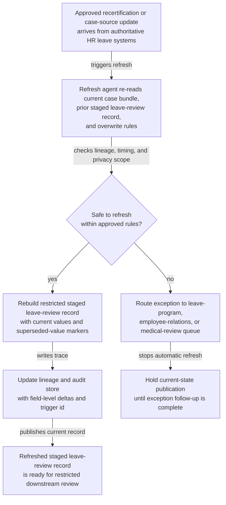
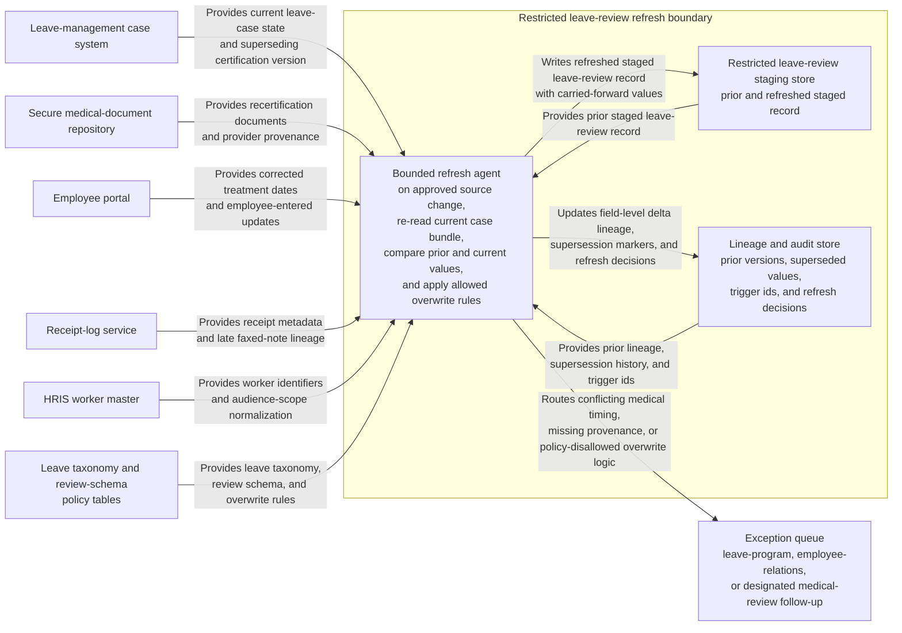

# Protected leave review record refresh after recertification update

## Linked pattern(s)

- `change-triggered-representation-refresh`

## Domain

HR.

## Scenario summary

An HR leave operations program already maintains a restricted staged review record for an active protected-leave case so leave specialists can inspect one privacy-scoped package instead of reopening the HRIS case, document repository, employee portal, and manager attendance notes every time the file changes. After that staged record is issued, authoritative source changes still arrive: a clinician submits recertification that narrows intermittent-frequency limits, the employee corrects expected treatment dates in the secure portal, receipt metadata is fixed for a late faxed provider note, or the leave case source record is updated to reflect a superseding certification version. Each approved source change should trigger refresh of the staged leave-review record, preserving field-level delta lineage, explicit current-versus-superseded values, and exception routing whenever conflicting medical timing, incomplete provider provenance, or policy-disallowed overwrite logic would make the refreshed package unsafe for downstream restricted review.

## Target systems / source systems

- Restricted leave-review staging store holding the already-issued structured record used by leave specialists
- Leave-management case system, secure medical-document repository, employee portal, and receipt-log service publishing authoritative recertification and case-source updates
- HRIS worker master, approved leave episode taxonomy, and review-schema policy tables used only to normalize identifiers, audience scope, and allowed overwrite rules
- Lineage and audit store tracking prior staged-record versions, superseded field values, trigger ids, and refresh decisions
- Exception queue for leave-program, employee-relations, or designated medical-review follow-up before the refreshed record is treated as current

## Why this instance matters

This grounds the pattern in HR work where the valuable artifact is one current staged leave-review record, not an eligibility verdict, accommodation recommendation, or manager-facing action. Protected-leave cases often receive sensitive recertification updates after a review packet already exists, and a stale or silently overwritten record can mislead downstream reviewers about work restrictions, schedule expectations, or what evidence actually changed. The instance shows how transform-family refresh remains family-safe when it re-materializes a restricted staged representation with explicit supersession and lineage instead of drifting into adjudication, approval gating, collaboration, or operational execution.

## Likely architecture choices

- Event-driven monitoring should listen only to approved recertification, case-record, receipt-lineage, and employee-portal updates that are authorized to refresh the staged leave-review record.
- A tool-using single agent can re-read the changed case bundle, compare the current authoritative source state against the prior staged version, rebuild the structured review record, and emit a delta trace plus supersession markers.
- Automatic refresh should stay bounded to approved overwrite rules for staged review fields; conflicting provider dates, privacy-scope changes, missing source lineage, or schema-breaking case updates should route to exceptions instead of forcing a new current record.
- The workflow should stop at the refreshed staged record, lineage trace, and exception handling rather than issuing a leave eligibility determination, accommodation decision, payroll instruction, manager notice, or return-to-work action.

## Governance notes

- Every consequential field, especially leave episode identifier, certification-effective dates, intermittent-frequency summary, work-restriction summary, document receipt status, and privacy-scope markers, should retain prior and current source references across refreshes.
- Refresh should mark superseded staged values explicitly rather than silently replacing prior certification facts, so reviewers can see which authoritative update changed the record and which values were carried forward.
- The workflow should halt when a clinician submission arrives through an unapproved channel, when recertification timing conflicts with the active leave episode, when the changed source would expose medical detail beyond the restricted audience, or when source lineage is too weak to support overwrite.
- Leave-program governance owners should approve any expansion of trigger sources, field precedence rules, or schema revisions; the workflow ends before formal leave review adjudication, employee outreach, attendance correction, payroll coordination, or accommodation handling.

## Evaluation considerations

- Percentage of authoritative protected-leave source changes that produce one current staged review record with complete delta lineage and explicit supersession markers
- Rate of conflicting provider updates, incomplete receipt provenance, or privacy-scope mismatches correctly routed to exception review before restricted downstream use
- Reviewer ability to understand what changed between staged record versions without reopening the full medical-document set or reconstructing the case history manually
- Reliability of idempotent refresh behavior when recertification updates arrive out of order, a faxed note is replaced by a portal upload, or the restricted review schema adds a new required field
