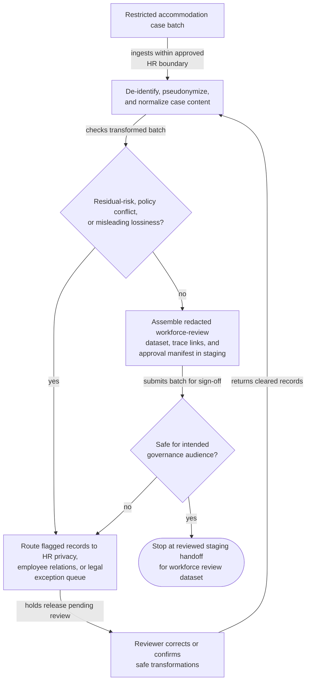

# Redacted accommodation case batch to workforce review dataset

## Linked pattern(s)

- `batch-content-transformation`

## Domain

HR.

## Scenario summary

An employee relations and accommodations governance team is preparing a quarterly review of how workplace accommodation requests are being handled across several operating regions. The raw batch includes case narratives from HR partners, medical documentation excerpts, manager emails, leave-coordination notes, vendor correspondence, and spreadsheet annotations about turnaround time, work restrictions, location constraints, and disputed interactive-process steps. Before any workforce policy review, cross-region governance discussion, or external counsel briefing can begin, the workflow must transform the batch into a redacted structured review dataset with case-level pseudonymous identifiers, normalized accommodation categories, request-stage fields, timeline markers, restricted-detail flags, coded escalation reasons, and trace links held inside the approved boundary while keeping medical specifics, employee identities, manager names, and site details out of the release-safe package.

## Target systems / source systems

- Restricted HR case-management repository holding accommodation case notes, attachments, and timeline updates
- Redaction and de-identification tooling for medical, employment, location, and manager-identifying content across text, spreadsheets, and attached documents
- Workforce-governance schema registry defining approved review fields, controlled taxonomies, and audience-specific release rules
- Review workbench and staging store for the redacted dataset, transformation trace, and approval manifest
- Exception queue for HR privacy, employee relations, or legal review before any batch leaves the restricted case workspace

## Why this instance matters

This grounds the transform pattern in an HR setting where governance stakeholders need a structured view of sensitive case patterns without broadening access to medical or personally identifying information. The goal is a reviewed release-safe dataset for workforce governance, not adjudication of individual accommodation requests, manager action, or payroll or benefits execution. The instance shows why protected-detail minimization, policy-constrained generalization, and explicit exception handling are necessary when batches combine clinical language, employment context, and small-population details that can make cases identifiable even after obvious names are removed.

## Likely architecture choices

- An orchestrated multi-agent workflow can divide narrative segmentation, medical-detail detection, category normalization, and residual-risk validation so sensitive handling remains explicit and auditable.
- Human reviewers should remain in the normal loop because accommodation data often contains nuanced contextual clues that automated detectors cannot safely release without HR privacy and legal judgment.
- The workflow should emit only a release-safe governance dataset and reviewed manifest rather than updating live employee records, issuing policy findings, or sending materials to managers or vendors.
- Approved rules may generalize work locations, restrictions, and role titles into coarse governance categories, but unsupported inference about disability status, legal sufficiency, or case outcome should never be added to the transformed output.

## Governance notes

- Every structured field should retain restricted-boundary lineage to the case note, attachment excerpt, or timeline event that supports it so authorized reviewers can verify contested redaction or category choices.
- The workflow should route exceptions when a case involves a rare role or site combination, free-text medical detail that resists safe generalization, pending litigation signals, or conflicting notes that would make the release-safe summary misleading.
- Lossy transformations, such as compressing nuanced accommodation narratives into a short coded escalation reason or broad category, should be explicit in the trace and approval manifest.
- HR privacy, employee relations, and legal reviewers must decide whether the batch is safe for the intended governance audience; the transformation workflow stops at the reviewed dataset and does not adjudicate any case.

## Evaluation considerations

- Percentage of transformed accommodation-case records accepted for governance review without reopening raw case files
- Rate of residual employee, manager, medical, or site-identifying detail found during reviewer sampling after batch approval
- Quality of semantic preservation when detailed accommodation narratives are converted into normalized categories, timeline markers, and escalation codes
- Reliability of the handoff when cases contain scanned medical notes, mixed-language manager emails, or region-specific policy tags that change over time
