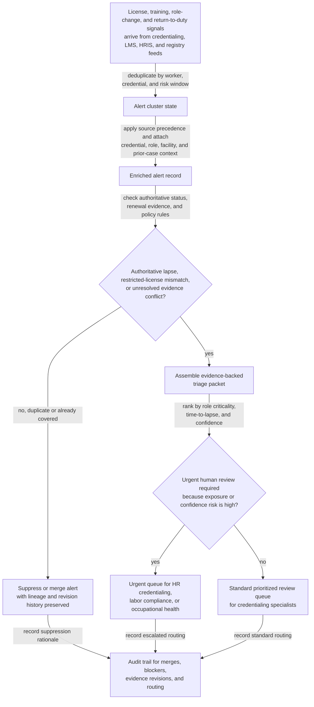
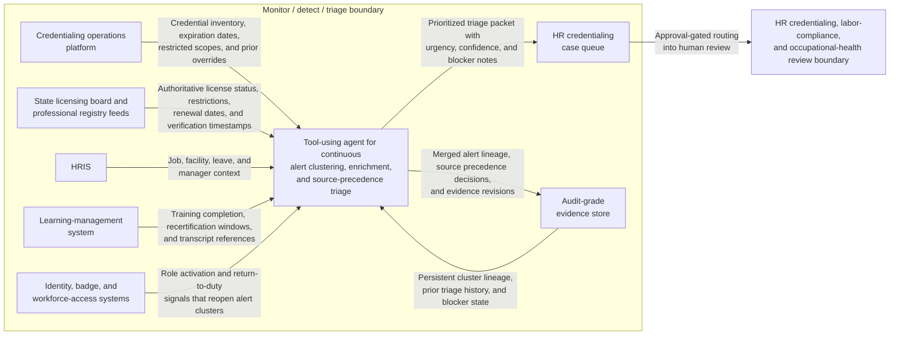

# Restricted-license and training lapse risk alert triage

## Linked pattern(s)

- `risk-alert-triage`

## Domain

HR.

## Scenario summary

A workforce credentialing operations team within HR monitors a continuous stream of regulated-role risk signals, including upcoming professional-license expirations, license-status changes from state boards, mandatory training completion lapses, role transfers into restricted duty scopes, badge reactivations after leave, and manager-submitted exception notes. The workflow must collapse duplicate alerts tied to the same worker, credential, and risk window; enrich each case with job code, facility, restricted duty scope, prior triage history, renewal evidence, and whether the worker is already on a governed watchlist; and then prioritize which alerts need immediate human review. Evidence posture is explicit: primary-source state licensing board verification and internal credentialing-system snapshots outrank LMS completions, badge-access signals, and manager attestations, while scanned renewal receipts or vendor-uploaded continuing-education documents remain provisional until matched to an authoritative source. The goal is to produce an evidence-backed triage queue for HR credentialing specialists, labor-compliance partners, or occupational-health reviewers before an eligibility lapse or restricted-license mismatch becomes operationally risky, but not to remove the worker from duty, advise on legal eligibility, notify the employee, alter schedules, or approve an exception automatically. Named human owner: Maya Chen, Director of Workforce Credentialing Operations.

## Target systems / source systems

- Credentialing operations platform with worker credential inventories, expiration dates, restriction codes, prior override history, and review ownership
- State licensing board or professional registry feeds providing authoritative license status, disciplinary restrictions, renewal effective dates, and verification timestamps
- HRIS worker master, effective-dated job and facility assignments, leave or return-to-duty status, and manager-of-record data
- Learning-management system with mandatory-course completion, recertification windows, provider metadata, and transcript or exam-result references
- Identity, badge, or workforce-access systems showing role activation, facility access restoration, and return-from-leave timing that may reopen dormant alert clusters
- HR credentialing case queue and audit-grade evidence store preserving raw alert lineage, source precedence decisions, blocker flags, routing rationale, threshold versions, and human overrides

## Why this instance matters

This grounds `risk-alert-triage` in HR work where calendar reminders alone are not enough because a nominally routine credential renewal can become materially urgent when authoritative license status changes, a worker moves into a restricted scope, or training evidence exists only in lower-confidence systems. A weak workflow would either flood credentialing specialists with repetitive reminders for workers already covered by verified renewal state or under-rank the one case where the internal tracker looks current but the primary registry shows a restriction or lapse. The instance stays inside monitor/detect/triage because the agentic work is continuous watching, duplicate suppression, evidence-weighted context assembly, explainable prioritization, and governed routing into human review rather than employee outreach, staffing moves, facility access changes, legal interpretation, or downstream compliance execution.

## Likely architecture choices

- Event-driven monitoring should continuously ingest registry status changes, LMS recertification events, HRIS role moves, return-to-duty signals, and credentialing-system updates, then reopen, merge, or reprioritize alert clusters as evidence changes.
- A tool-using single agent can correlate worker identities across credentialing, HRIS, registry, and LMS systems; suppress duplicate reminder chatter; apply explicit source precedence; and publish a prioritized queue with urgency drivers and evidence confidence notes.
- Human-in-the-loop review should remain mandatory for any alert involving an authoritative restriction, a primary-source lapse within a protected review window, a conflict between authoritative and internal records, or unresolved blocker conditions such as registry outages, unmatched license numbers, or missing continuing-education verification.
- Approval-gated escalation is the right boundary because the workflow can recommend urgent routing to credentialing, labor-compliance, or occupational-health reviewers, but it should not independently notify managers, deactivate access, alter assignments, or approve temporary workarounds.

## Governance notes

- Triage packets should show which licensing, restriction, training, role-scope, and recertification rules fired; which raw alerts were merged; which sources were treated as authoritative versus provisional; and why the case entered a given urgency tier.
- Source precedence should be explicit and reviewable: state board or registry verification outranks internal credentialing records; internal credentialing records outrank LMS and badge telemetry for current eligibility posture; and manager attestations or uploaded receipts may inform context but cannot close or down-rank an alert on their own.
- Visible blockers and unresolved items should travel with the alert, including registry feed outages, name or license-number mismatches, pending renewal submissions without authoritative confirmation, disputed restriction codes, and transcript uploads that have not yet been validated.
- Lineage and revision awareness should be preserved across every evidence update so reviewers can reconstruct how an alert changed as renewed licenses posted, training completions were corrected, or worker assignment data shifted after the original signal arrived.
- Privacy controls should minimize medical, disciplinary, training-score, and worker personal-identification detail in broad queue views while retaining traceable evidence in restricted systems for authorized reviewers.
- Approval boundaries must remain firm: only authorized HR credentialing leaders, labor-compliance reviewers, occupational-health partners, or designated legal stakeholders may decide whether outreach occurs, whether work eligibility is restricted, whether an exception is recognized, or whether a case can be closed.

## Evaluation considerations

- Recall of historically material credential-lapse, restricted-license, or mandatory-training-risk cases that should have reached urgent human review before a lapse or mismatch window closed
- Reduction in duplicate reviewer work from merged renewal reminders, role-change events, and return-to-duty signals without lowering capture of genuinely high-risk workforce eligibility cases
- Median time from first relevant registry, credentialing, or LMS signal to a triage packet containing source-ranked evidence, blocker visibility, revision history, and routing rationale
- Reviewer override rate for alerts that were over-ranked because provisional evidence looked authoritative or under-ranked because cross-system restriction or role-scope context was not surfaced clearly enough
- Auditability of suppression, merge, source-precedence, policy-version, and escalation decisions during internal controls testing, labor-compliance review, or case reconstruction
