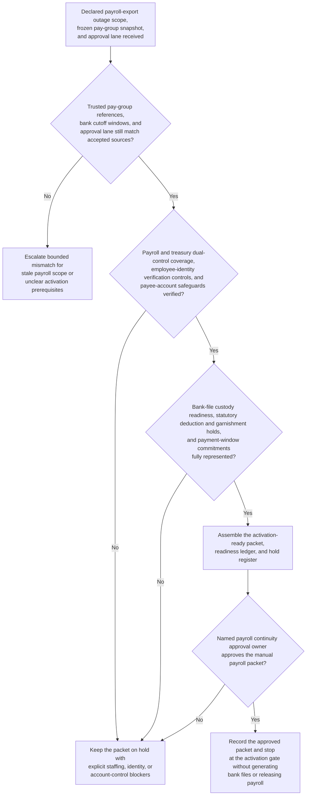
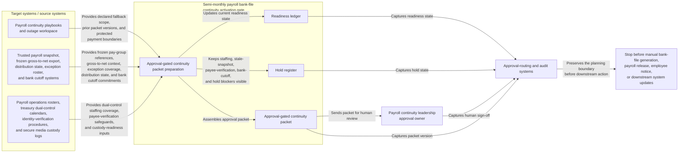

# Semi-monthly payroll bank-file continuity activation gate

## Linked pattern(s)

- `contingency-plan-activation-gate`

## Domain

HR.

## Scenario summary

After a payroll processing and bank-file export outage is declared inside the final pre-transmission window, payroll operations leadership has already identified the bounded fallback path and accountable approval owner: a governed manual payroll continuity path for one semi-monthly employee pay run whose direct-deposit and pay-card release window would otherwise be missed before banking cutoff deadlines. Upstream truth-restoration and authority-routing work has already established the trusted pay-group snapshot, frozen gross-to-net references, approved exception roster, bank cutoff windows, and approval lane. The planning workflow now has to prepare one activation-ready packet showing payroll and treasury dual-control staffing by cutoff window, employee-identity and payee-account verification controls, protected pay-group and exception coverage, statutory deduction and garnishment hold handling, and bank-file custody readiness. It should preserve explicit holds for any uncovered payroll or treasury shift, stale pay-group snapshot, unresolved employee-identity mismatch, missing bank cutoff acknowledgement, unresolved garnishment or stop-payment hold, or approval-scope ambiguity, and stop at the approval gate rather than generating manual bank files, releasing payroll, notifying employees, changing benefits, opening payroll cases, or performing downstream system updates.

## Target systems / source systems

- Payroll continuity playbooks and outage workspace with the declared fallback scope, frozen semi-monthly run references, prior packet versions, and protected payment boundaries
- Trusted payroll snapshot, gross-to-net export, direct-deposit and pay-card distribution state, exception roster, and banking cutoff systems already accepted as authoritative inputs for contingency preparation
- Payroll operations rosters, treasury dual-control calendars, bank relationship commitments, identity-verification procedures, and secure media custody logs for payroll, treasury, and people operations teams
- Approval-routing and audit systems that capture packet versions, open holds, resource commitments, and human sign-off before any manual payroll continuity mode may start
- Restricted communication-planning and disbursement tooling for employee notice timing, banking transmission, pay-card release, and downstream payroll case handling that remain outside the planning gate

## Why this instance matters

This grounds the pattern in HR where the hard problem is not deciding whether employees should be paid, calculating the payroll from scratch, or executing the manual disbursement fallback itself. The hard problem is keeping one approval-gated readiness packet current while staffing coverage, employee-identity controls, protected holds, and bank cutoff windows can all drift under payroll-close pressure. It shows why contingency planning deserves its own slice apart from outage truth restoration, authority recommendation, payroll execution, employee communication, or downstream case handling: leaders need a disciplined activation gate artifact before any manual payroll continuity path can be approved safely.

## Likely architecture choices

- Approval-gated execution fits because the manual payroll continuity mode may be operationally prepared while still blocked until payroll leadership approves the packet.
- The readiness ledger should tie frozen pay-group scope, dual-control staffing, employee-identity and payee-account safeguards, bank cutoff commitments, and statutory or garnishment holds to one current packet version.
- Explicit holds should remain visible whenever staffing coverage, payee verification, bank acknowledgements, or protected payroll holds are incomplete rather than being compressed into a nominally ready packet.
- The workflow should stop at the packet and hold register rather than recommending a different authority lane, re-establishing payroll truth, generating manual bank files, or initiating employee or banking communications.

## Governance notes

- Protected prerequisites such as trusted pay-group scope, dual-control staffing, employee-identity and payee-account verification controls, bank cutoff confirmation, and statutory deduction or garnishment hold visibility should be encoded as non-waivable holds in the packet.
- Shared packets should expose timing, readiness, and blocker state without copying full compensation details, bank account numbers, tax elections, benefits data, or employee case narratives outside governed payroll and treasury channels.
- Human payroll continuity ownership is required before the packet becomes the authoritative basis for any manual payroll continuity activation.
- Repeated packet revisions should preserve append-only lineage so audit, finance controls, and people operations teams can reconstruct exactly which pay-group references, staffing commitments, bank-window confirmations, and protected holds changed before approval.

## Evaluation considerations

- Time from updated payroll continuity preparation request to a human-reviewable activation packet with complete staffing, identity-control, payment-window, and hold state
- Percentage of staffing, payee-verification, or bank-window blockers kept explicit in the hold register rather than hidden in a partially prepared continuity packet
- Agreement between the workflow's packet and the final human-approved activation gate used for downstream payroll continuity
- Stability of the readiness packet when cutoff windows, pay-group scope, or protected payroll holds change within the same payroll-close cycle
