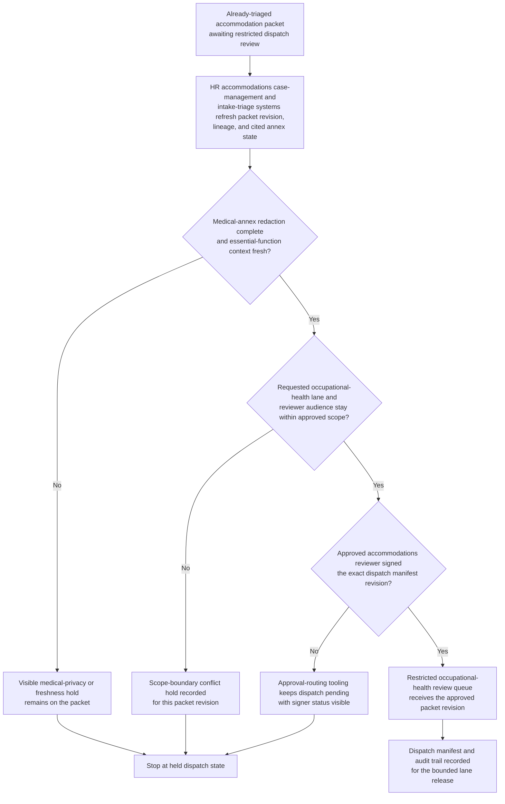
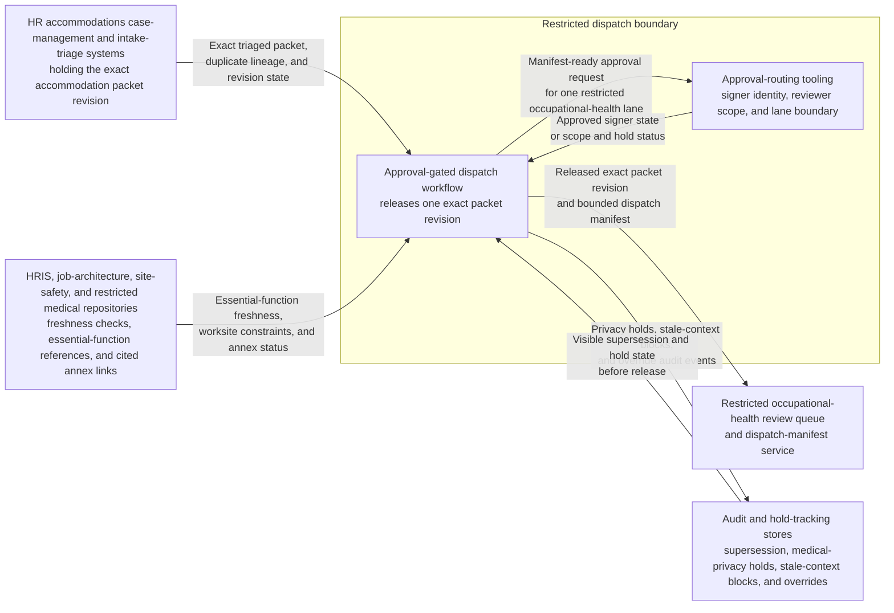

# Sensitive workplace accommodation intake triage packet approved for restricted occupational-health review dispatch

## Linked pattern(s)

- `approval-gated-triage-dispatch`

## Domain

HR.

## Scenario summary

An HR accommodations operations team already has one evidence-backed workplace-accommodation intake packet assembled from earlier triage, with the worker's requested support category, essential-function mapping, worksite constraints, provider-document status, prior duplicate intake lineage, and unresolved uncertainty documented. The next step is not to decide accommodation eligibility, contact the worker or manager, interpret disability law, or implement workplace changes; it is to decide whether the exact packet revision may cross into the restricted occupational-health review lane that can trigger those downstream human workflows. The dispatch workflow watches medical-annex redaction state, essential-function freshness, signer approval, reviewer-scope rules, visible hold status, and dispatch-manifest lineage, then releases the triaged packet only when the approved accommodations reviewer signs the dispatch manifest for that one bounded lane.

## Target systems / source systems

- HR accommodations case-management and intake-triage systems holding the already-triaged accommodation packet, intake lineage, and prior duplicate merges
- HRIS, job-architecture, site-safety, and restricted medical-document repositories contributing essential-function references, worksite context, provider-note freshness checks, and held annex links already cited in the packet
- Restricted occupational-health review queue and dispatch-manifest service used to release the exact packet revision into the protected downstream lane
- Approval-routing tooling recording signer identity, approved reviewer audience, queue-boundary scope, and blocked dispatch attempts
- Audit and hold-tracking stores preserving superseded packet revisions, medical-privacy holds, stale-context blocks, and manual override history

## Why this instance matters

This grounds `approval-gated-triage-dispatch` in HR work where there is a meaningful governance gap between triaging a sensitive accommodation intake and allowing that packet to enter a restricted review lane that may expose protected medical context and trigger consequential downstream assessment. Many HR teams can assemble a bounded accommodation packet, but still require explicit approval before the case may cross into a lane with narrower reviewer access and stronger privacy controls. The instance keeps the family boundary clean because the workflow owns packet release, hold visibility, reviewer scope, and dispatch lineage only, not accommodation adjudication, worker or manager outreach, legal analysis, or implementation of a workplace adjustment.

## Likely architecture choices

- Event-driven monitoring fits because provider documentation, essential-function mappings, and worksite constraints can change while the packet waits at the dispatch gate.
- Approval-gated execution fits because the triaged packet is prepared for one restricted occupational-health review lane but remains concretely blocked until the required accommodations approver signs the exact packet revision and reviewer scope.
- Human-in-the-loop review should remain in the normal path because releasing the packet into an occupational-health lane changes who may inspect protected medical information even though this workflow still stops short of any accommodation decision.
- The workflow should emit only the released queue entry, dispatch manifest, hold register, and audit trail rather than an accommodation recommendation, worker communication plan, manager instruction, or implementation task.

## Governance notes

- The dispatch manifest should bind approval to one exact accommodation packet revision, one restricted occupational-health review queue identifier, one approved reviewer audience, and the visible medical-annex scope authorized for dispatch.
- Dispatch should remain held when provider-document redaction is incomplete, the essential-function attachment changes, the packet is superseded by a newer intake or worksite update, or the requested downstream lane exceeds the approved occupational-health boundary.
- Broad queue views should minimize diagnosis details, treatment references, personal contact data, and freeform manager commentary while preserving traceable references in controlled HR systems.
- HR accommodations governance owners must approve changes to signer roles, reviewer-roster boundaries, freshness rules, medical-privacy hold logic, and hold-release handling; this workflow ends before eligibility adjudication, worker or manager outreach, legal interpretation, or workplace-adjustment execution begins.

## Evaluation considerations

- Median time from packet readiness to approved restricted-lane dispatch or explicit placement into medical-privacy, freshness, or scope hold state
- Rate of wrong-version, wrong-audience, or stale-context corrections detected after dispatch approval
- Completeness of audit lineage connecting packet revision, cited accommodation sources, signer approval, and the single downstream queue boundary
- Reliability of hold behavior when provider documentation, essential-function context, or worksite metadata changes during the approval window
