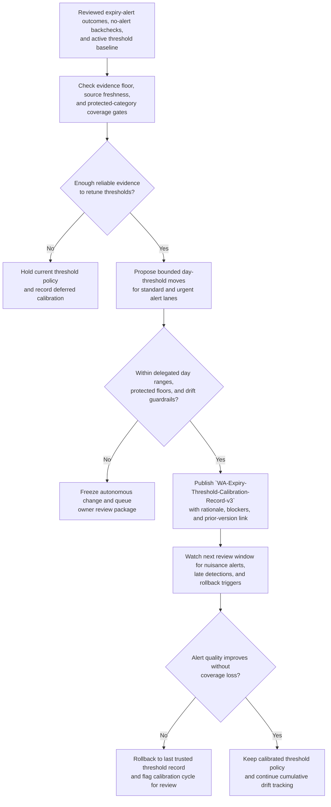
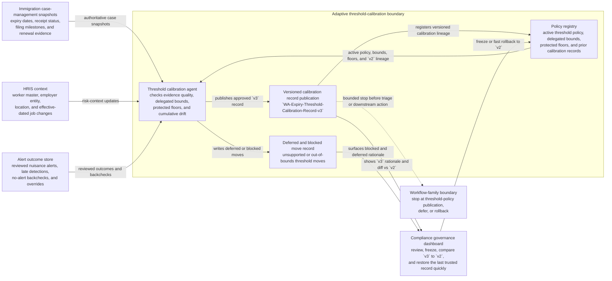

# Work authorization expiry alert threshold calibration

## Linked pattern(s)

- `adaptive-threshold-calibration`

## Domain

HR.

## Scenario summary

An HR immigration compliance team maintains one exact governed calibration artifact,
`WA-Expiry-Threshold-Calibration-Record-v3`, which controls when upcoming work-
authorization expiry cases enter standard and urgent human-review lanes. The current
threshold policy raises a standard alert 150 days before recorded expiry and an urgent
alert 75 days before expiry when no authoritative renewal evidence is present, but the
last two quarters show persistent nuisance volume for workers already covered by
automatic-extension rules or recently receipted renewals while several short-validity job-
change cases were surfaced later than reviewers wanted. The calibration workflow must
retune only those future alert thresholds inside pre-approved day-range limits, preserve
protected minimum lead-time floors for high-interruption-risk categories, require reviewed
outcome volume plus no-alert backcheck evidence before changing anything, and record
why any candidate move was applied, deferred, or rolled back. Source precedence is
explicit: the approved immigration compliance standard, employer-entity-specific work-
authorization rule matrix, and authoritative immigration case-system snapshots outrank
HRIS convenience extracts, manager notes, and worker-uploaded provisional receipts.
Prerequisite state is fixed before calibration begins: the active threshold baseline,
current employer-entity routing rules, the frozen trailing review window, and the last
trusted calibration record from `v2`. Visible blockers remain visible rather than being
smoothed into the model, and the workflow stops hard at publishing or deferring
`WA-Expiry-Threshold-Calibration-Record-v3` rather than triaging live cases, notifying
workers, assigning reviewers, changing employment status, or directing downstream legal
or payroll action. Named human owner: Neha Patel, Director of Work Authorization
Compliance.

## Target systems / source systems

- Immigration compliance policy registry holding the active expiry-alert threshold policy,
  employer-entity rule matrix, protected minimum lead-time floors, prior calibration
  records, and delegated adjustment bounds
- Immigration case-management system or vendor portal with visa category, expiration date,
  receipt status, filing milestones, automatic-extension eligibility, and authoritative
  renewal evidence timestamps
- HRIS worker master, employer entity, work location, effective-dated job changes, and
  leave or return-to-work state used to detect contexts that alter lead-time risk
- Alert outcome store with reviewed nuisance-alert dispositions, confirmed late-detection
  incidents, no-alert backcheck results, suppression overrides, and reviewer comments
- Compliance governance dashboard used to inspect proposed threshold moves, freeze
  autonomous tuning, compare `v3` against `v2`, and restore the last trusted threshold
  record quickly

## Why this instance matters

This grounds `adaptive-threshold-calibration` in HR compliance without drifting into live
immigration case handling. The output is a governed threshold calibration record that
changes only when future expiry signals enter standard or urgent review lanes; it does not
decide whether any worker is authorized, which case should be worked first, whether a
manager or employee must be contacted, or whether any filing or employment action should
occur. That boundary keeps the adaptation loop low risk, reversible, and distinct from the
existing HR alert-triage and closure examples in adjacent slices.

## Authoritative source precedence

1. Approved immigration compliance standard and delegated threshold-adjustment bounds
   maintained in the policy registry
2. Employer-entity-specific work-authorization rule matrix covering reverification timing,
   automatic-extension treatment, and protected category floors
3. Authoritative immigration case-management snapshots and vendor receipt-status updates
   with verification timestamps
4. Effective-dated HRIS worker, employer-entity, and job-change records needed to interpret
   expiry risk context
5. Reviewed alert outcome history and no-alert backcheck results from the compliance
   evidence store
6. Lower-precedence manager notes, worker-uploaded provisional receipts, and queue comments
   used only as contextual hints and never as sole grounds to relax a protected threshold

## Prerequisite state

- Active threshold baseline `wa-expiry-threshold-policy-v2` is pinned before any
  recalibration run starts
- Frozen trailing 90-day review window with closed alert outcomes and no-alert backchecks
  has been quality-checked for disposition completeness
- Current employer-entity routing rules and automatic-extension matrix are confirmed as the
  effective governance baseline for the calibration window
- Last trusted calibration artifact `WA-Expiry-Threshold-Calibration-Record-v2` is
  available for direct comparison and fast rollback
- Protected-category floor table is current for high-interruption-risk cohorts such as
  expiring temporary work permits with no extension bridge, location-sensitive visa
  transfers, and employer-specific authorizations nearing reverification deadlines

## Freeze and rollback triggers

Freeze autonomous tuning and require Neha Patel review when:
- A proposed standard or urgent threshold move would exceed the delegated ten-day step
  limit for one calibration cycle
- A proposed change would lower any protected cohort below its minimum lead-time floor
- Evidence quality drops below the required minimum, including incomplete case dispositions,
  missing no-alert backchecks, or stale authoritative case snapshots
- Cumulative drift from the trusted baseline reaches 20 days in one direction even if each
  individual step stayed in bounds
- Employer-entity rules, reverification timing policy, or automatic-extension handling were
  updated during the review window and the calibration assumptions may now be stale

Rollback automatically to `WA-Expiry-Threshold-Calibration-Record-v2` when:
- Confirmed late-detection incidents rise for any protected cohort in the first monitored
  window after a threshold relaxation
- Reviewer overrides to pull cases forward increase by more than 25 per cent over the
  prior trusted window, suggesting the new thresholds are surfacing cases too late
- A source-system correction reveals that the calibration run relied on materially stale
  receipt-status or expiry-date evidence

## Visible blockers

- Stale immigration vendor receipt-status feed for one employer entity may understate
  already-filed renewal coverage
- Unresolved mismatch between HRIS work-location changes and immigration case locations for
  recent intra-company transfers
- Missing no-alert backcheck sample for one short-validity visa cohort leaves downward
  tuning unsupported
- Pending legal-policy clarification on a newly introduced automatic-extension category
  means that cohort must stay frozen at the current threshold until the rule matrix is
  updated

## Named human ownership

- Neha Patel, Director of Work Authorization Compliance: accountable owner for threshold
  governance, freeze decisions, rollback authorization, and review of any out-of-bounds or
  low-confidence calibration package
- Global Mobility Operations Manager: maintains employer-entity routing rules, validates
  vendor feed freshness, and confirms whether rule-matrix changes invalidate the current
  calibration window
- HRIS Compliance Data Steward: monitors worker master and location-change data quality,
  escalates mismatches that would make threshold tuning unreliable, and preserves the
  lineage between alert outcomes and worker records

## Likely architecture choices

- Event-driven monitoring should trigger recalibration only after enough reviewed alert
  outcomes and no-alert backchecks accumulate for a protected review window, not when a
  single week of renewal receipts temporarily lowers nuisance volume.
- A tool-using single agent can compare observed nuisance and late-detection patterns,
  compute within-bounds day-threshold moves, publish `WA-Expiry-Threshold-Calibration-
  Record-v3`, and write the blocked or deferred moves into the calibration audit record.
- Human-in-the-loop review should remain normal whenever a proposed move approaches a
  protected lead-time floor, cumulative drift grows large, or employer-rule changes make the
  feedback window hard to trust.
- Fast rollback should remain configuration-only: restoring `v2` must not require code
  deployment, queue reconfiguration, or reprocessing past alert decisions.

## Governance notes

- Protected cohorts such as employer-specific work authorizations nearing lapse, short-
  validity transfer cases, and categories without an automatic extension bridge should keep
  minimum lead-time floors that autonomous tuning cannot relax.
- Calibration logs should capture the baseline thresholds, proposed and applied day values,
  source snapshots consulted, blocked moves, visible blockers, cumulative drift, and exact
  rollback trigger if one occurs.
- Privacy controls should aggregate signal quality at the cohort level in ordinary tuning
  logs; individual worker names, immigration identifiers, passport data, and document images
  should stay in restricted evidence systems.
- The workflow must stop at threshold calibration and versioned policy publication. It must
  not reprioritize the live case queue, assign reviewers, send outreach, submit filings,
  change work eligibility, or adjudicate any underlying immigration case.
- Revision-aware lineage should remain explicit: `WA-Expiry-Threshold-Calibration-Record-v3`
  supersedes `v2`, and reviewers should be able to compare the new rationale, bounds, and
  blockers directly against that prior trusted record.

## Evaluation considerations

- Reduction in reviewed nuisance work-authorization expiry alerts without a corresponding
  increase in confirmed late-detection incidents after `v3` is applied
- Percentage of calibration cycles correctly deferred because source freshness, disposition
  completeness, or no-alert backcheck volume was too weak to justify a threshold move
- Frequency of owner freezes or rollbacks caused by protected-floor proximity, rule-matrix
  changes, or cumulative drift approaching the delegated limit
- Time required to restore the prior trusted threshold record after post-change evidence
  shows weaker coverage than expected
