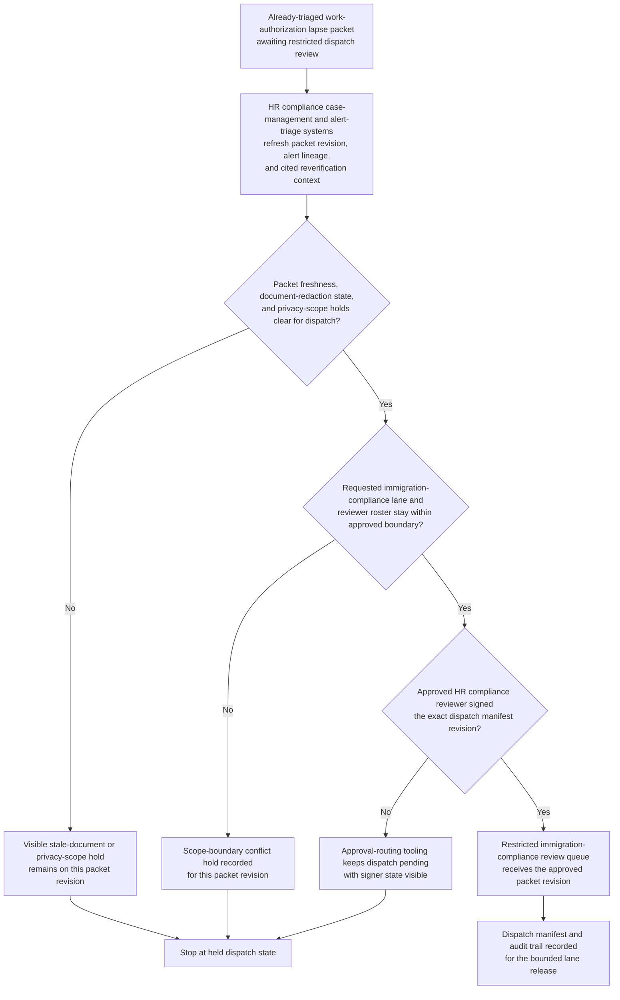

# Work authorization lapse triage packet approved for restricted immigration-compliance review dispatch

## Linked pattern(s)

- `approval-gated-triage-dispatch`

## Domain

HR.

## Scenario summary

An HR compliance operations team already has an evidence-backed work-authorization lapse packet assembled from earlier alert triage, with the worker's authorization window, employer-entity context, worksite and job-change history, renewal-case status, and unresolved uncertainty documented. The next step is not to contact the worker, instruct the manager, decide legal strategy, or change employment status; it is to decide whether the exact packet revision may cross into the restricted immigration-compliance review lane that can trigger those downstream human workflows. The dispatch workflow watches packet freshness, document-redaction state, signer approval, and bounded reviewer-roster rules, then releases the triaged packet only when the approved HR compliance reviewer signs the dispatch manifest for that lane.

## Target systems / source systems

- HR compliance case-management and alert-triage systems holding the already-triaged work-authorization lapse packet, alert lineage, and prior duplicate merges
- HRIS, immigration-vendor, and document repositories contributing freshness checks, employer-entity references, reverification status, and held evidence links already cited in the packet
- Restricted immigration-compliance review queue and dispatch-manifest service used to release the exact packet revision into the protected downstream lane
- Approval-routing tooling recording reviewer identity, audience boundary, signer state, and blocked dispatch attempts
- Audit and hold-tracking stores preserving superseded packet revisions, privacy-scope holds, stale-document blocks, and manual override history

## Why this instance matters

This grounds `approval-gated-triage-dispatch` in HR work where there is a meaningful governance gap between triaging a sensitive work-authorization risk and allowing that packet to enter a restricted review lane that may quickly lead to worker outreach, manager coordination, or legal escalation. Many HR teams can assemble a strong triage packet, but still require explicit approval before the case may cross into a lane with access to sensitive immigration detail and consequential next-step authority. The instance keeps the family boundary clean because the workflow owns packet release, privacy scope, and dispatch lineage only, not the downstream decision about outreach, work restriction, filing action, or case closure.

## Likely architecture choices

- Event-driven monitoring fits because vendor case status, reverification evidence, and job-change context can change while the packet waits at the dispatch gate.
- Approval-gated execution fits because the triaged packet is ready for restricted-lane release but remains concretely blocked until the required HR compliance approval is attached to the manifest.
- Human-in-the-loop review should remain in the normal path because releasing the packet into immigration-compliance review changes who can see and act on sensitive worker information even though this workflow still stops short of action.
- The workflow should emit only the released queue entry, dispatch manifest, hold register, and audit trail rather than a worker-notification plan, work-eligibility decision, or legal recommendation.

## Governance notes

- The manifest should bind approval to one exact work-authorization packet revision, one restricted review queue identifier, the approved reviewer identity, and the privacy scope that authorized dispatch.
- Dispatch should remain held when reverification evidence expires, the packet is superseded by a newer vendor or document update, or the requested downstream lane exceeds the approved immigration-compliance boundary.
- Broad queue views should minimize immigration category details, passport or document identifiers, personal contact data, and manager commentary while keeping traceable references in controlled HR systems.
- HR compliance governance owners must approve changes to signer roles, reviewer-roster boundaries, freshness rules, and privacy-hold logic; this workflow ends before worker outreach, manager escalation, employment-status action, or external filing begins.

## Evaluation considerations

- Median time from packet readiness to approved restricted-lane dispatch or explicit privacy hold placement
- Rate of wrong-version, wrong-audience, or stale-context corrections discovered after dispatch approval
- Completeness of audit lineage connecting packet revision, HR compliance sign-off, and downstream queue boundary
- Reliability of hold behavior when immigration-vendor or document context changes during the approval window
