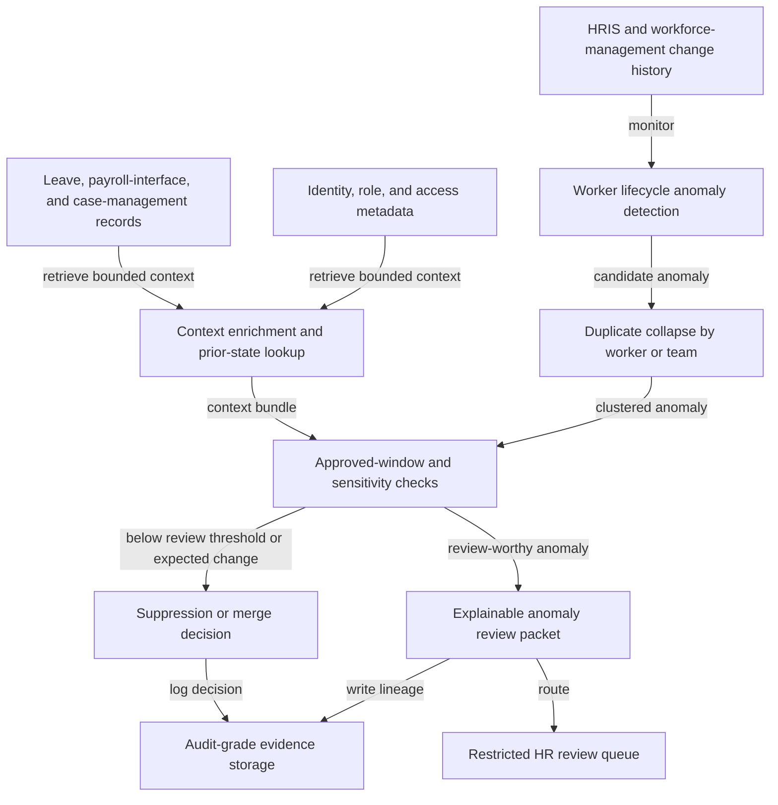

# Worker lifecycle change anomaly review

## Linked pattern(s)

- `anomaly-detection-review`

## Domain

HR.

## Scenario summary

An HR operations team monitors backdated worker-status changes, location transfers, pay-group updates, manager-chain corrections, leave returns, and manual override activity to detect mid-severity lifecycle anomalies before they turn into payroll, access, or compliance incidents. The workflow must collapse duplicate anomalies tied to the same worker or team, enrich each case with approved change windows, legal-entity context, prior HR reviewer notes, sensitive-field exposure, and any in-flight case history, and then prioritize which anomalies deserve restricted human review. A case should enter the review queue when, for example, several backdated status and pay-group changes land for one worker outside the approved effective-date window, a cluster of manager and location edits appears for a team during no planned reorganization, or repeated manual overrides follow a leave return without the expected supporting records. The goal is an explainable anomaly review packet for HR operations, payroll liaison, or people-compliance reviewers, not to rewrite records, contact the worker, suspend pay, or launch a formal investigation automatically.

## Target systems / source systems

- HRIS and workforce-management systems with effective-dated worker status, legal-entity, location, manager, and pay-group history
- Leave, payroll-interface, and case-management tools with return-to-work status, override notes, approved change windows, and prior reviewer dispositions
- Identity, role, and access metadata showing which update paths were used and whether unusual manual intervention occurred
- Restricted review queues used by HR operations leads, payroll liaisons, and people-compliance reviewers
- Audit-grade evidence storage preserving anomaly lineage, suppression decisions, routed packets, reviewer actions, and policy versions

## Why this instance matters

This grounds `anomaly-detection-review` in HR work where the early-warning problem is spotting unusual but not yet catastrophic change patterns that deserve human attention before they spill into payroll errors, compliance exposure, or access confusion. A weak workflow would either flood reviewers with every backdated edit during ordinary processing or hide the one pattern of unusual worker-lifecycle churn that indicates a broken intake path or an emerging sensitive case. The instance stays inside monitor/detect/triage because the agentic work is anomaly detection, bounded context assembly, duplicate suppression, prioritization, and routing into human review rather than record reconciliation, personnel decision-making, worker communication, or formal investigation.

## Likely architecture choices

- Event-driven monitoring should continuously ingest effective-dated worker updates, override events, leave-return changes, and payroll-interface signals, then reopen or merge anomaly clusters as new evidence arrives.
- A tool-using single agent can correlate worker identifiers across HRIS, leave, and payroll-interface systems; check approved change windows and restricted-field rules; attach bounded context; and publish a prioritized review packet with explicit anomaly drivers.
- Bounded delegation fits because routine mid-severity anomaly packets can route into a preapproved restricted HR review queue without case-by-case authorization, while higher-consequence or sensitive cases still escalate to accountable humans.
- Record correction, worker outreach, payroll intervention, legal interpretation, or disciplinary steps should remain outside the workflow and under explicit human control.

## Governance notes

- Review packets should show which anomaly features fired, which raw updates were merged, what approved-change context was checked, and why the case was routed to a particular restricted queue.
- Sensitive personal, payroll, leave, and identity details should be minimized in queue views and retained only in the restricted evidence path necessary for authorized reviewers.
- Reversibility should stay explicit: queue placement and packet contents can be recomputed as supporting records arrive or planned changes are confirmed, but missed review windows may be only partially recoverable once payroll or compliance downstream effects occur.
- Approval boundaries must remain firm: only authorized HR operations, payroll, or people-compliance owners may decide whether the anomaly becomes a correction task, a formal investigation, an employee communication, or a closed false positive.
- Auditability should preserve source timestamps, anomaly thresholds, duplicate handling, reviewer overrides, and routing history so later controls review can reconstruct why sensitive lifecycle-change anomalies were or were not surfaced promptly.

## Evaluation considerations

- Recall of historically meaningful worker-lifecycle anomalies that should have reached human review before downstream payroll, access, or compliance issues grew
- Reduction in duplicate reviewer work from merged update clusters without lowering capture of genuinely important lifecycle anomalies
- Median time from first anomalous change pattern to a review packet containing worker context, approved-window checks, prior notes, and routing rationale
- Reviewer override rate for anomaly packets that were over-ranked because normal seasonal processing was misread or under-ranked because cross-system context was not assembled clearly enough
- Auditability of suppression, merge, and routing decisions during people-controls review or payroll-interface retrospectives
