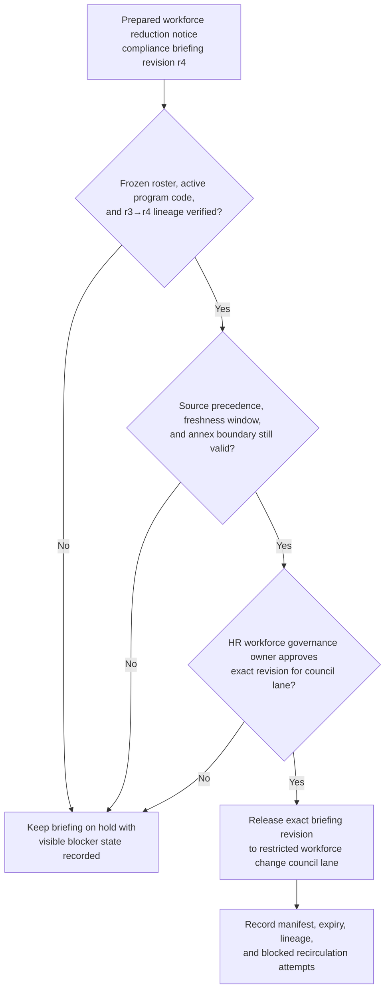
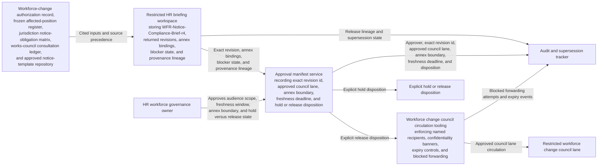

# Workforce reduction job elimination notice compliance briefing revision approved for workforce change council circulation

## Linked pattern(s)

- `approval-gated-briefing-release`

## Domain

HR.

## Scenario summary

An HR workforce-change governance workflow has already synthesized one revision of a workforce reduction and job elimination notice compliance briefing, `WFR-Notice-Compliance-Brief-r4`, after a planned role-elimination program surfaced conflicting jurisdiction timing summaries, incomplete works-council consultation evidence, template redaction questions, and unresolved role-to-jurisdiction mapping caveats. The release review uses explicit source precedence: the signed workforce-change authorization packet and frozen affected-position register outrank the jurisdiction notice-obligation matrix, consultation-status ledger, and approved notice-template set, which in turn outrank reviewer annotations and counsel working notes already cited in the prepared briefing revision. Prerequisite state requires the affected-position roster to remain frozen, the approved reduction program code to be active, the restricted workforce change council lane to be provisioned, and the returned `r3` revision lineage to be linked before circulation can proceed. Visible blockers include unsigned Germany consultation minutes, a stale Ontario timing summary, an unresolved remote-role jurisdiction assignment, and a missing redaction acknowledgment for executive-only annex language. Before that exact revision is circulated into the restricted workforce change council lane, a named HR workforce governance owner must approve the audience scope, freshness window, annex boundary, and hold-versus-release state so council readers receive the reviewed context package rather than a stale draft, a broadened copy, or a version with broken lineage. The workflow stops at governed release of that briefing revision; it does not adjudicate notice sufficiency, decide the reduction program, schedule notices, determine severance, contact employees or labor bodies, or execute downstream HR, legal, payroll, or communications actions.

## Target systems / source systems

- Restricted HR briefing workspace storing `WFR-Notice-Compliance-Brief-r4`, prior returned revisions, annex bindings, blocker state, and provenance lineage
- Workforce-change authorization record, frozen affected-position register, jurisdiction notice-obligation matrix, works-council consultation ledger, and approved notice-template repository already cited by the prepared briefing revision
- Workforce change council circulation tooling enforcing named HR, labor-relations, and executive-governance recipients, confidentiality banners, expiry controls, and blocked forwarding outside the approved lane
- Approval manifest service recording the HR workforce governance owner, exact revision id, approved council lane, annex boundary, freshness deadline, and explicit hold or release disposition
- Audit and supersession tracker preserving release lineage, blocked dissemination attempts, and expiry events when a newer consultation update, roster correction, or template redaction change appears before circulation

## Why this instance matters

This grounds the pattern in HR with a workforce-reduction scenario that is structurally different from bereavement leave or employee monitoring compliance while preserving the same release-control boundary. Reduction notice briefings often gather highly sensitive, near-final context that changes when consultation evidence, affected-population freezes, or jurisdiction mappings move by even one revision. The example shows that the hard governance step is approving bounded circulation of one already-synthesized briefing revision into a restricted workforce-governance lane, not deciding the program, the legal outcome, or any downstream employee action.

## Likely architecture choices

- Approval-gated execution fits because the notice compliance briefing remains held until the HR workforce governance owner approves one exact revision for the restricted workforce change council lane.
- Human-in-the-loop review is necessary because only accountable HR leadership should accept residual consultation and timing caveats, confirm annex scope, and authorize circulation of sensitive workforce-reduction context.
- A governed agent can assemble the release manifest, compare lineage, enforce source precedence checks, and block stale reuse or forwarding, but it should not determine legal sufficiency, choose notice timing, trigger communications, or launch downstream payroll or separation workflows.

## Governance notes

- Approval should bind to one immutable briefing revision, one named workforce change council lane, one freshness deadline, one explicit annex boundary, and the declared source-precedence stack so later edits or detached notes cannot inherit permission silently.
- The released brief should preserve unresolved consultation gaps, jurisdiction timing caveats, remote-role mapping uncertainty, and redaction limits rather than smoothing them into a false notice-ready narrative.
- If a new roster freeze, consultation record, jurisdiction summary, or template correction appears during approval review, the pending revision should remain on hold and be superseded rather than circulated under stale approval.
- Audit records should preserve the released or held revision id, approver identity, council-recipient scope, expiry timing, blocker state, lineage from `r3` to `r4`, and any blocked forwarding attempts to broader HR operations, people managers, payroll teams, communications staff, or other non-approved recipients.
- Named owner accountability sits with Amina Solberg, Senior Director of Workforce Change Governance, for release integrity, revision lineage, and bounded visibility rather than notice adjudication, employee communication, compensation decisions, or downstream execution.

## Evaluation considerations

- Percentage of workforce change council circulations where the released briefing revision id, annex boundary, source-precedence metadata, and manifest state align exactly without later correction
- Rate at which stale, superseded, expired, or out-of-scope workforce-reduction notice briefings are blocked before council visibility
- Time required to move from briefing-ready status to approved bounded circulation when roster freeze, consultation evidence, and lineage state are already complete
- Reviewer correction rate for missing blockers, wrong audience scope, broken lineage, or blocked-forwarding failures after the council receives the released briefing
