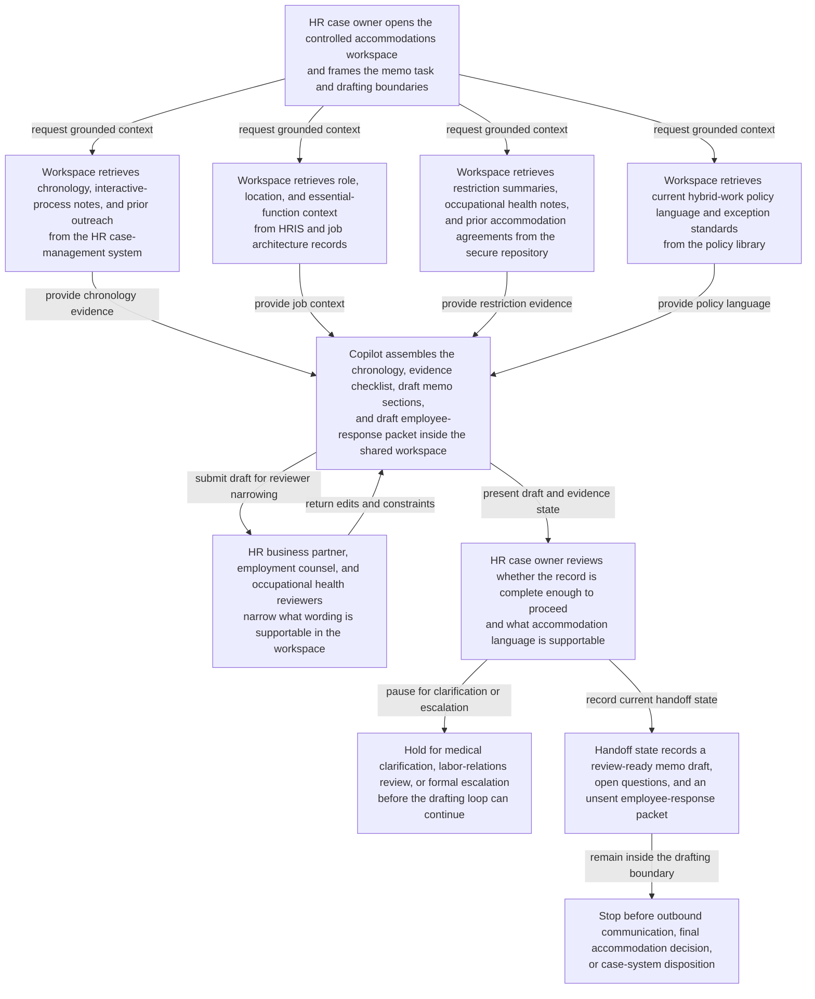
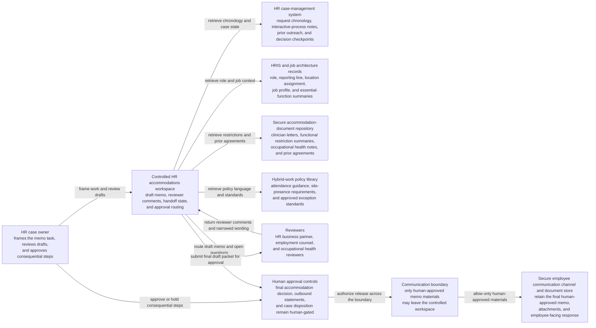

# Workplace accommodation exception memo copilot loop

## Linked pattern(s)

- `analyst-copilot-loop`

## Domain

HR.

## Scenario summary

An employee relations partner and accommodations lead are preparing an internal exception memo after a manager requests approval for a customer-facing workforce analyst to remain fully remote beyond the company's standard hybrid policy because the employee has presented medical restrictions, ergonomic constraints, and a long commute that may aggravate the condition. The HR case owner uses a copilot inside a controlled accommodations workspace to iteratively assemble the interactive-process chronology, pull the current hybrid-work policy language and job-essential-function notes, compare prior accommodation correspondence and manager-proposed alternatives, draft the exception memo and employee-response packet, and rewrite sections as the HR business partner, employment counsel, and occupational health reviewers narrow what wording is supportable. The human HR owner remains responsible for deciding whether the record is complete enough to proceed, what accommodation options are actually supportable, whether additional medical clarification or labor-relations review is required, and approving every outbound statement or commitment before anything is sent to the employee or recorded as a final case outcome.

## Target systems / source systems

- Controlled HR accommodations workspace with the draft memo, reviewer comments, handoff state, and approval routing
- Employee relations or HR case-management system containing the request chronology, interactive-process notes, prior outreach, and decision checkpoints
- HRIS and job architecture records with current role, reporting line, location assignment, job profile, and essential-function summaries
- Secure accommodation-document repository with clinician letters, functional restriction summaries, occupational health notes, and prior accommodation agreements
- Hybrid-work policy library, attendance guidance, site-presence requirements, and approved exception standards maintained by HR and legal
- Secure employee communication channel and document store where the final human-approved memo, attachments, and employee-facing response are retained

## Why this instance matters

This grounds the collaboration pattern in an HR workflow where the governed artifact is an accommodation exception memo and response packet rather than a recommendation score, an investigation file, or an automated case action. The hard part is sustained mixed-initiative drafting across sensitive medical context, policy language, job-function evidence, and reviewer edits without letting a polished copilot draft overstate what the documentation supports or imply accommodations and timing commitments the human owner never approved. The instance highlights why privacy controls, source traceability, and explicit approval boundaries matter when an agent helps produce a document that can affect employee trust, disability compliance posture, labor relations, and manager obligations.

## Likely architecture choices

- Human-in-the-loop collaboration should remain primary because accommodation sufficiency, undue-hardship reasoning, and employee-facing commitments require accountable HR and legal ownership.
- A tool-using single agent can retrieve policy excerpts, maintain a claim-to-source matrix, organize the interactive-process timeline, and propose successive rewrites for the shared memo inside one governed workspace.
- The copilot may update draft sections, open-questions logs, and evidence checklists, but issuing a final accommodation decision, contacting the employee with binding commitments, or recording the official case disposition should remain explicitly human-gated.

## Governance notes

- The shared artifact should distinguish employee-provided facts, clinician or occupational-health restrictions, quoted policy language, agent-drafted paraphrases, and human-approved conclusions so reviewers can see where interpretation entered the memo.
- Every material statement should link to inspectable evidence such as case-note timestamps, policy sections, job-function records, prior accommodation letters, or approved reviewer comments; unsupported narrative should not survive into the employee-facing packet.
- Medical details should be minimized in the copilot context to the least information necessary for the work item, with role-based access, retention controls, and audit history for every retrieved document or copied excerpt.
- The human owner must approve any statement about essential job functions, undue hardship, temporary versus ongoing accommodation duration, site-access expectations, or follow-up obligations because those assertions can create legal and employee-relations commitments beyond drafting assistance.
- If the record suggests discrimination risk, leave-of-absence overlap, safety-sensitive duty limits, works-council or union implications, or insufficient medical support for a defensible conclusion, the workflow should branch into formal legal, labor-relations, or occupational-health escalation instead of letting the copilot finalize a routine memo.

## Evaluation considerations

- Time to produce an internal-review-ready accommodation exception memo that preserves source lineage, privacy controls, and explicit human ownership of the final position
- Reviewer correction rate for memo sections where the copilot misstated policy limits, blurred medical restrictions with job assumptions, or implied unapproved commitments to the employee or manager
- Completeness of the evidence bundle, including whether each employee-facing claim can be traced back to case notes, approved policy text, job-function records, and authorized medical-support summaries
- Reliability of governance checkpoints that prevent agent-authored drafts from being treated as a final accommodation decision or being sent externally without human approval and visible audit history
