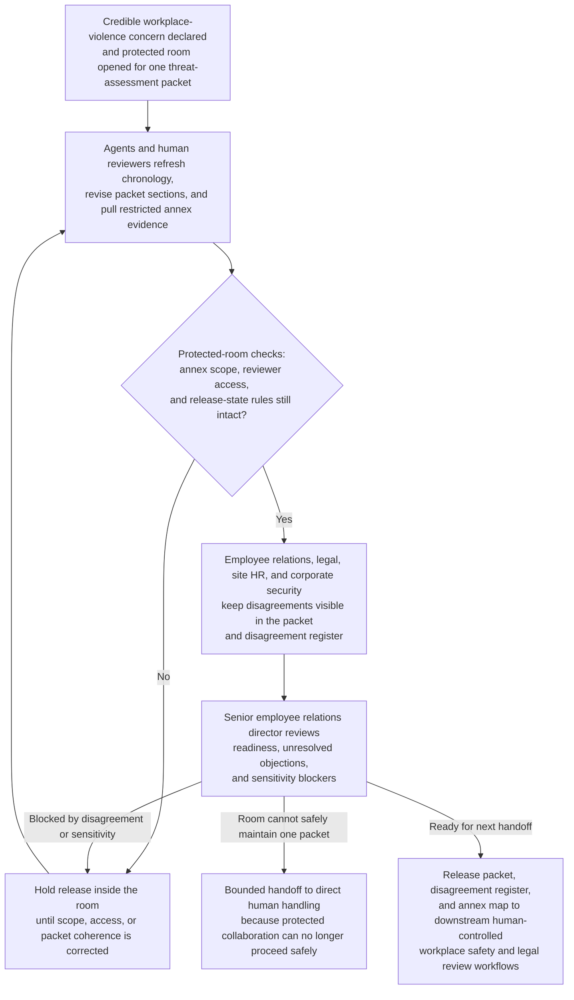
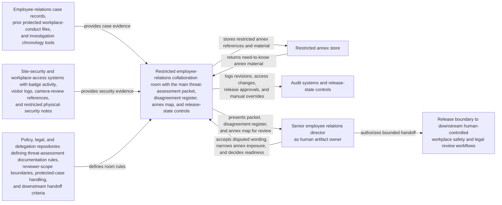

# Workplace violence threat protected assessment packet collaboration room

## Linked pattern(s)

- `critical-protected-artifact-collaboration`

## Domain

HR.

## Scenario summary

After a credible workplace-violence concern is escalated, employee relations opens a protected collaboration room around one threat-assessment packet that will later support human-controlled workplace safety and legal review. A senior employee relations director owns the artifact while agents help reconcile witness chronology updates, site-HR objections, legal wording disputes, corporate-security annotations, and restricted annex material about badge activity, prior protected case history, and personally sensitive location detail. The room stays centered on that one shared artifact: humans and agents jointly revise the packet, keep disagreement visible about threat framing and evidence sufficiency, and preserve strict boundaries between the main packet and need-to-know annexes. The human artifact owner remains responsible for deciding whether the packet is ready for the next bounded handoff and whether unresolved disagreement or sensitivity still blocks release, while protective-action decisions, employee communications, law-enforcement coordination, leave or discipline administration, and workplace response execution stay outside the workflow.

## Target systems / source systems

- Restricted employee-relations collaboration room with the main threat-assessment packet, disagreement register, annex map, and release-state controls
- Employee-relations case records, prior protected workplace-conduct files, and investigation chronology tools containing escalation history, witness interviews, and case-status references
- Site-security and workplace-access systems holding badge activity, visitor logs, camera-review references, and restricted physical-security notes relevant to the packet
- Policy, legal, and delegation repositories defining threat-assessment documentation rules, reviewer-scope boundaries, protected-case handling, and downstream handoff criteria
- Restricted annex store and audit systems logging annex retrievals, packet revisions, access changes, release approvals, and manual overrides

## Why this instance matters

This grounds the pattern in an HR severe-case setting where the reusable shape is protected co-authoring of one sensitive threat-assessment artifact, not deciding the response path or administering the case. The packet must stay honest about conflicting interpretations of threat severity, witness credibility, and evidence sufficiency while tightly controlling personally sensitive annex material. It shows why the family boundary matters: the workflow ends with a human-owned packet handoff, not with suspension decisions, facility-security actions, employee outreach, or law-enforcement escalation.

## Likely architecture choices

- Human-in-the-loop collaboration should remain primary because only accountable employee-relations and legal owners can accept disputed threat language, narrow annex exposure, and release the packet into the next critical review lane.
- An orchestrated multi-agent setup fits when separate agent roles refresh chronology evidence, normalize reviewer objections, maintain annex boundaries, and preserve the protected trace across successive revisions.
- Agents may draft revisions, reconcile evidence references, and maintain readiness state, but selecting protective measures, contacting employees or witnesses, initiating leave or discipline actions, or coordinating with law enforcement should remain outside the room and explicitly human-controlled.

## Governance notes

- The packet should distinguish verified chronology, disputed interpretation, restricted personal-safety or location detail, and accepted residual disagreement so downstream reviewers can see exactly what remains unsettled.
- Every material statement about threat indicators, witness observations, access activity, prior case relevance, or review readiness should link to inspectable evidence or remain labeled as contested.
- Home-address information, sensitive location routines, detailed security observations, medical or wellness references, and prior protected-case material should stay in annexes with tightly logged access and explicit promotion controls.
- The readiness record should name the human artifact owner, unresolved blockers, accepted residual disagreement, and the downstream boundary between the room and formal workplace safety, legal, or executive review workflows.
- If the room can no longer maintain one coherent packet because evidence is changing too quickly or reviewer-scope controls become unsafe, the workflow should hold release and escalate for direct human handling rather than smoothing over conflict or broadening access.

## Evaluation considerations

- Time to maintain a protected threat-assessment packet that keeps disagreement visibility, annex discipline, and human release ownership intact as new evidence arrives
- Rate at which downstream workplace safety or legal reviewers find hidden objections, stale chronology, or over-broad annex exposure after the room signals handoff readiness
- Reliability of the disagreement register and annex map as witness accounts, security evidence, and reviewer positions continue to shift
- Frequency with which humans reject agent-assisted revisions because they drifted into protective-action recommendation, employee communication planning, law-enforcement coordination, or case-administration execution
