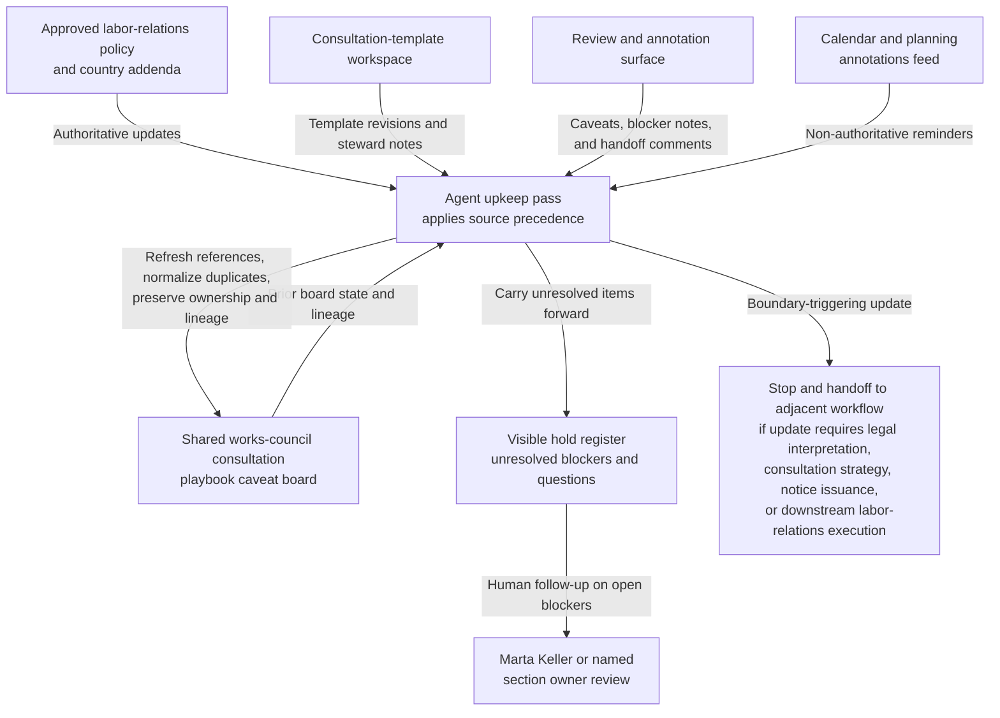

# Works-council consultation playbook caveat board shared workbench upkeep

## Linked pattern(s)

- `shared-workbench-orchestration`

## Domain

HR.

## Scenario summary

A labor-relations enablement team maintains one internal works-council consultation playbook caveat board while regional labor partners, policy owners, template stewards, and program reviewers continuously refine internal consultation-playbook readiness for recurring workforce-change scenarios. The board already carries prerequisite state for each section: the currently approved global playbook version, country or works-council scope, required trigger category, the active notice-template revision, the last counsel-reviewed timestamp, visible blocker fields, unresolved local-issue tags, append-only revision lineage, and named human ownership under Director of Labor Relations Enablement Marta Keller. Small updates arrive throughout the cycle: a DACH labor partner adds a caveat about unresolved local notice timing, a policy owner links a newly approved country addendum, a template steward flags a translation-template mismatch, and a program reviewer notes that one annex reference is missing from the approved source set. The agent keeps that bounded internal workbench usable by applying explicit source precedence from approved labor-relations policy and country addenda ahead of calendar annotations, template notes, and reviewer comments, refreshing linked references, normalizing duplicate caveat entries, preserving revision-to-revision lineage, updating owner or handoff markers, and carrying unresolved blockers forward in a visible hold register. Humans remain responsible for legal interpretation, consultation strategy, notice issuance, employee communication, whether a works-council engagement is required or sufficient, and any downstream labor-relations execution.

## Target systems / source systems

- Shared works-council consultation playbook caveat board with section rows, prerequisite-state columns, blocker tags, explicit source-precedence markers, ownership fields, and append-only revision history
- Internal labor-relations policy repository containing approved consultation playbook versions, country addenda, trigger-category definitions, and approved annex references
- Consultation-template workspace holding approved template revisions, localized translation templates, and steward notes about template applicability
- Labor-relations review and annotation surface where regional labor partners, policy owners, template stewards, and program reviewers add small edits, caveats, blocker notes, and ownership handoff comments
- Calendar and planning annotations feed capturing consultation-window reminders, review checkpoints, and non-authoritative schedule notes that may inform but not override approved policy or addenda

## Why this instance matters

This grounds the pattern in an HR labor-relations upkeep surface where the maintained artifact is one internal consultation-playbook caveat board rather than a formal notice packet, legal opinion, employee message, or execution plan. The useful work is keeping prerequisite state, source precedence, blocker visibility, revision lineage, and ownership synchronized as many small updates arrive from authoritative policy sources and human collaborators. That keeps the collaboration centered on one inspectable internal workbench and preserves a clean boundary before legal interpretation, consultation strategy, notice release, or downstream labor-relations action begins.

## Likely architecture choices

- Event-driven monitoring fits because upkeep should react when approved labor-relations policy, country addenda, template revisions, or board fields change.
- A tool-using single agent can refresh source links, reconcile prerequisite metadata, normalize duplicate caveat wording, and keep blocker plus lineage fields synchronized inside one bounded board.
- Human-in-the-loop review remains necessary when an update would resolve a local notice-timing dispute, reinterpret labor-relations policy, clear a blocker tied to missing annex approval, or make the artifact sound like consultation advice or notice-ready content.
- Bounded delegation works because Marta Keller and the labor-relations enablement team can predefine allowable field updates, source-precedence rules, handoff markers, and hold conditions without delegating legal interpretation, consultation planning, notice issuance, or downstream execution.

## Governance notes

- The board should clearly separate authoritative labor-relations policy and approved country addenda from lower-precedence calendar annotations, template steward notes, and reviewer comments so routine upkeep never implies that non-authoritative reminders override approved consultation guidance.
- Each section should retain inspectable provenance for the approved playbook version, country or works-council scope, trigger category, active template revision, last counsel-reviewed timestamp, accepted owner assignment, and prior revision references before a blocker is cleared or a caveat is removed.
- Explicit holds should remain visible for unresolved local notice timing, translation-template mismatches, missing approved annex references, and ownership handoff questions rather than being normalized away during board cleanup.
- The agent may normalize structure, merge duplicate caveat notes, refresh links, and update confirmed owner fields, but it should not decide what local labor law requires, determine consultation sufficiency, approve a playbook change, issue a notice, or remove a hold that Marta Keller or a named section owner still considers open.
- If a requested update would draft or approve labor-relations strategy, prepare employee-facing language, release a consultation notice, or trigger downstream works-council engagement activity, the workflow should stop and hand off to the appropriate adjacent pattern.

## Evaluation considerations

- Percentage of board refreshes that preserve correct policy and country-addendum precedence, prerequisite-state fields, named owner assignments, and unresolved-blocker visibility across repeated upkeep cycles
- Reviewer correction rate for normalized caveat text, refreshed template references, ownership handoff updates, or automatically maintained blocker markers
- Rate at which interpretation-heavy, strategy-like, or notice-adjacent edits are held for human review instead of being silently folded into the internal consultation-playbook board
- Usefulness of the maintained workbench for helping labor-relations enablement, regional partners, and template stewards resume caveat-board upkeep without reconstructing stale revision lineage, prerequisite state, or blocker context by hand
