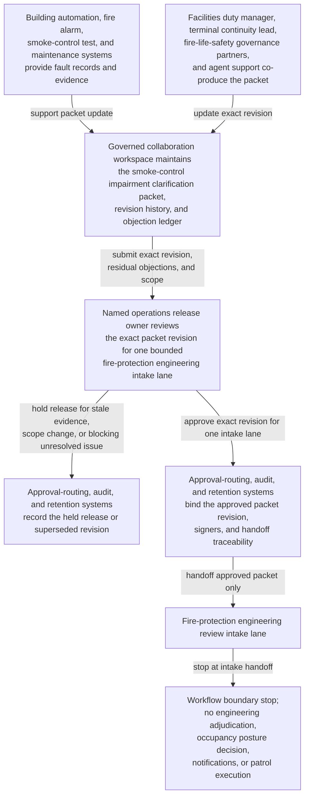
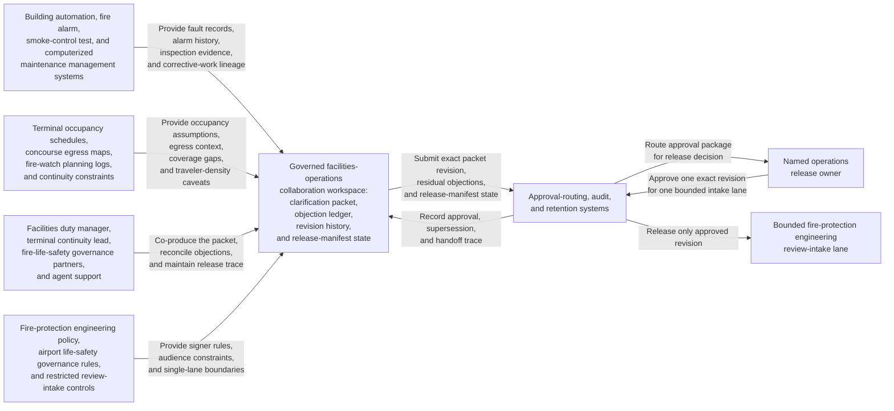

# Airport terminal smoke-control impairment clarification packet approved for fire-protection engineering review intake

## Linked pattern(s)

- `approval-gated-collaborative-artifact-release`

## Domain

Operations.

## Scenario summary

An airport facilities duty manager, a terminal operations continuity lead, and fire-life-safety governance partners are co-producing one governed smoke-control impairment clarification packet because a major terminal concourse has partial damper-actuator failures during a peak-travel week and the organization cannot let ad hoc email threads define what downstream reviewers see. Agents help reconcile building automation alarms, last-pass functional test results, compensating patrol plans, occupancy-loading assumptions, code-variance notes, and reviewer objections into the shared packet while preserving which concerns remain unresolved and which residual caveats the human artifact owner accepted explicitly. The workflow ends only when the named operations release owner approves that exact packet revision for one bounded fire-protection engineering review intake lane, where downstream reviewers may decide whether the impairment package is sufficient for formal facilities-safety review or needs narrower scope and fresher evidence. It does not adjudicate occupancy posture, authorize maintenance deferral, notify tenants or regulators, or execute compensating patrols.

## Target systems / source systems

- Governed facilities-operations collaboration workspace holding the smoke-control impairment clarification packet, revision history, objection ledger, and release-manifest state
- Building automation, fire alarm, smoke-control test, and computerized maintenance management systems providing actuator fault records, alarm history, last inspection evidence, and open corrective-work lineage
- Terminal occupancy schedules, concourse egress maps, fire-watch planning logs, and continuity constraints supplying compensating-control assumptions, traveler-density caveats, and unresolved coverage gaps
- Fire-protection engineering policy, airport life-safety governance rules, and restricted review-intake controls defining required signers, approved packet audience, and the single downstream intake lane
- Approval-routing, audit, and retention systems preserving superseded packet revisions, accepted residual objections, blocked-release reasons, and downstream handoff traceability

## Why this instance matters

This grounds the pattern in facilities-heavy operations governance rather than recommendation drafting, command briefing circulation, or readiness-only collaboration. The reusable challenge is collaborative stewardship of one impairment clarification artifact whose exact revision must be approved before it can cross into a bounded fire-protection engineering intake lane, while visible disagreements about actuator fault scope, patrol sufficiency, occupancy assumptions, and evidence freshness remain inspectable instead of being polished away. The example stays inside the pattern boundary because engineering adjudication, occupancy restrictions, tenant communication, and maintenance execution remain separate downstream workflows.

## Likely architecture choices

- Approval-gated execution fits because the clarification packet can be collaboration-ready while still blocked from fire-protection engineering intake until the human release owner approves the exact revision.
- Human-in-the-loop control is required because only accountable facilities and terminal-operations leaders may accept residual life-safety uncertainty, confirm audience scope, and authorize the packet's release boundary.
- Agents may compare fault logs, refresh evidence links, normalize objection wording, and maintain the release trace, but they must not decide impairment acceptability, open the engineering review outcome, or trigger field actions.

## Governance notes

- The release manifest should bind one exact packet revision, the named fire-protection engineering review-intake lane, signer identities, the affected smoke-control zone scope, and any residual objections the human release owner accepted explicitly.
- Conflicting actuator diagnostics, incomplete patrol coverage, unresolved egress-model caveats, and stale functional-test evidence should remain visible in the packet or boundary ledger rather than being normalized away before release.
- Audience scope should stay limited to the approved fire-protection engineering intake lane; reuse of the packet for tenant notices, regulator contact, airport-operations directives, or maintenance scheduling should require separate downstream approval.
- If new alarm behavior, changed terminal occupancy plans, or revised reviewer assignments alter the impairment picture materially during approval review, the workflow should hold release and supersede the prior packet revision rather than letting stale approval carry forward.

## Evaluation considerations

- Rate at which fire-protection engineering intake accepts the released packet without discovering hidden impairment scope drift, stale test evidence, or audience-boundary mistakes
- Time required to keep one collaborative clarification packet synchronized as alarm history, patrol assumptions, and signer state evolve
- Reliability of binding between the released artifact revision, accepted residual disagreement, affected-zone scope, and the bounded fire-protection engineering review-intake lane
- Frequency with which humans reject agent-assisted edits because they drifted into impairment adjudication, tenant or regulator communication, occupancy-direction decisions, or maintenance execution
