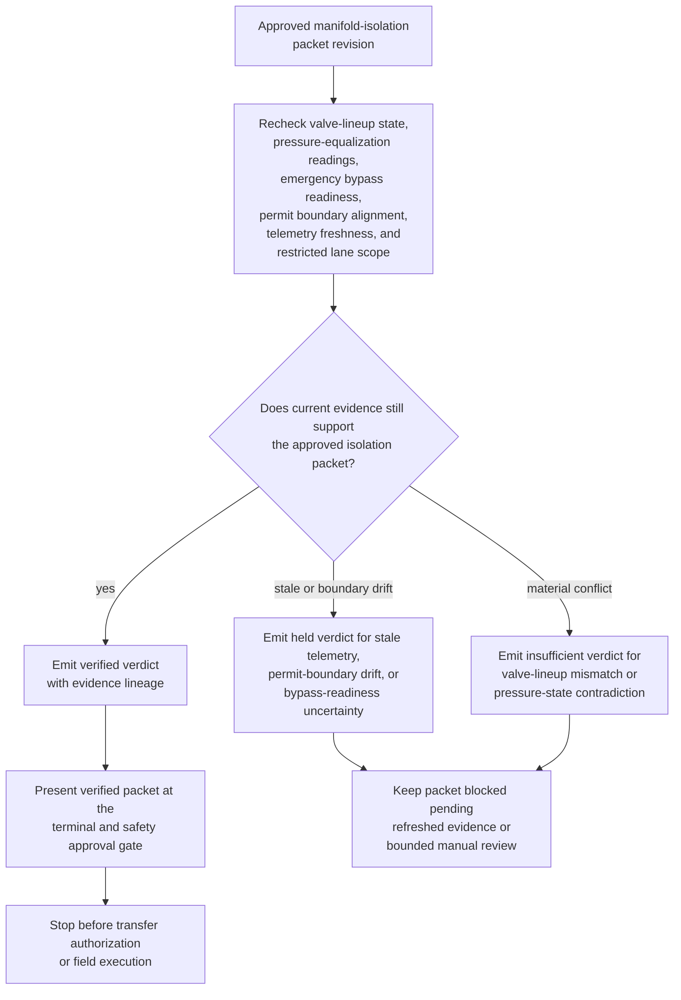
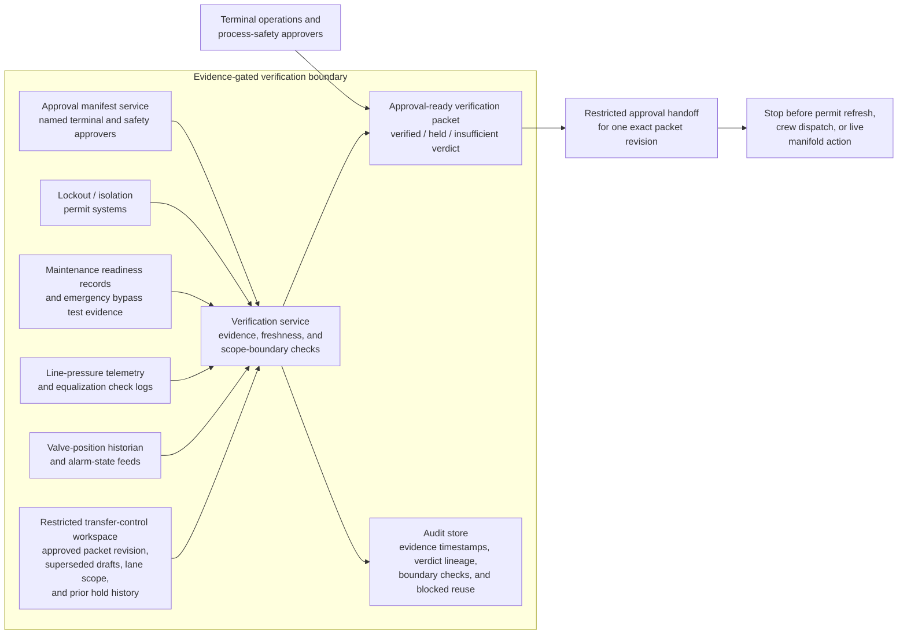

# Approved bulk-chemical transfer manifold isolation packet evidence gate verification

## Linked pattern(s)

- `evidence-gated-verification-for-release`

## Domain

Operations.

## Scenario summary

A terminal operations team already has one approved manifold-isolation packet revision for a restricted bulk-chemical transfer window, but that exact packet cannot be handed into the transfer-authority lane until current evidence still supports human reliance on it. The workflow rechecks valve-lineup state, pressure-equalization readings, emergency bypass readiness, permit boundary alignment, telemetry freshness, and the restricted downstream lane scope against the approved packet revision, then emits a verified, held, or insufficient verdict with explicit evidence lineage for named terminal and safety approvers. It must not redesign the isolation plan, choose whether the transfer should proceed, refresh the permit, reposition field crews, or open the manifold for live product movement.

## Target systems / source systems

- Restricted transfer-control workspace holding the approved manifold-isolation packet revision, superseded drafts, permitted transfer scope, and prior hold history
- Valve-position historian, line-pressure telemetry, equalization check logs, and alarm-state feeds used to confirm current isolation evidence against the packet
- Maintenance readiness records, emergency bypass test evidence, and lockout or isolation permit systems referenced by the approved packet revision
- Approval manifest service recording which terminal operations and process-safety leads may release one exact packet revision into the restricted transfer-authority lane
- Audit store preserving evidence timestamps, verified or held verdicts, scope-boundary checks, and blocked reuse of superseded packet revisions

## Why this instance matters

This grounds the pattern in high-consequence operations where the hard problem is not drafting a new isolation packet or deciding transfer strategy, but proving that one already approved packet revision is still trustworthy at the moment of downstream handoff. A manifold can drift out of the approved state when one valve is reworked after approval, pressure equalization ages past the allowed freshness window, or the permit boundary narrows because an adjacent line enters maintenance. The value is a bounded verification gate that shows whether one exact isolation packet revision remains evidence-sufficient for restricted downstream reliance without drifting into replanning, remediation, or live transfer execution.

## Likely architecture choices

- Approval-gated execution fits because the verification packet can be assembled automatically while transfer authorization remains concretely blocked until a named terminal or safety approver releases that exact packet revision.
- Human-in-the-loop review should remain mandatory because terminal operations, maintenance, and process-safety owners must interpret held conditions before anyone relies on the packet for a consequential handoff.
- Durable verification state should preserve superseded verdicts, repeated release holds, and packet-version lineage so later reviewers can distinguish genuine evidence refresh from repeated checks on a previously blocked revision.

## Governance notes

- The verification result should show packet revision lineage, valve-lineup confirmations, pressure-equalization timestamps, emergency bypass readiness evidence, permit-boundary comparisons, telemetry freshness, and the approved restricted downstream lane directly in the approval-ready packet.
- A packet should remain held whenever telemetry freshness falls outside the approved window, the requested downstream lane exceeds the named transfer-authority boundary, emergency bypass readiness cannot be confirmed current, or one permit boundary no longer matches the approved isolation scope.
- A packet should be marked insufficient whenever valve-position evidence conflicts with the approved lineup, pressure-state evidence contradicts the packet's safe-isolation assumptions, or one required corroborating source is missing for a high-consequence segment.
- Human approval is required before the verified packet is handed into restricted transfer authorization or used to justify downstream reliance by control-room staff, terminal operations, or safety teams.
- Any recommendation about whether to transfer product, any permit refresh, and any valve movement, crew dispatch, or live manifold action belongs in adjacent recommendation, reconciliation, or execution workflows rather than this verification gate.

## Evaluation considerations

- Percentage of approved manifold-isolation packets that receive a verdict with complete valve, pressure, bypass, permit, and lane-boundary lineage
- Rate at which stale telemetry, permit-boundary drift, or valve-lineup conflicts are caught before downstream transfer teams rely on the packet
- Reviewer agreement that verified, held, and insufficient outcomes reflect the intended sufficiency rules for evidence freshness, corroboration strength, and restricted-lane scope
- Reliability of repeated verification when telemetry updates, maintenance holds, or permit changes land near the restricted transfer window
