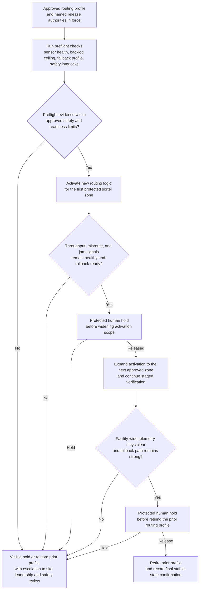
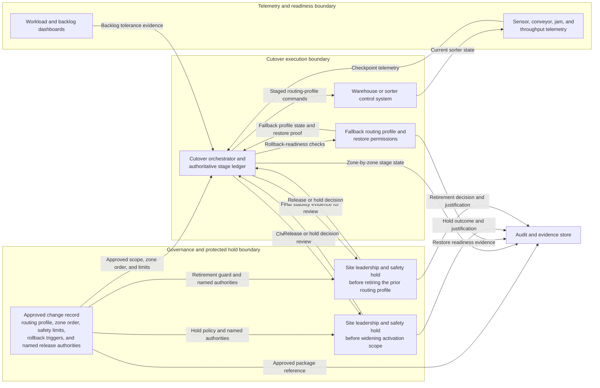

# Approved distribution sorter routing profile cutover staged execution

## Linked pattern(s)

- `staged-change-execution-with-rollback-holds`

## Domain

Operations.

## Scenario summary

After network operations, site leadership, and safety reviewers approve a new routing profile for a high-volume distribution sorter ahead of a peak-shipping weekend, an operations control team must execute the cutover across a live facility. The workflow should begin from that approved profile and move through explicit preflight on sensor health, current backlog, fallback-profile availability, and safety interlocks; then activate the new routing logic one zone at a time, verify throughput, misroute, and jam signals at each checkpoint, and stop at visible hold points before widening scope or retiring the prior profile. If telemetry becomes ambiguous or the rollback path weakens, the workflow should pause or restore the previous routing state rather than continue through a stressed live network.

## Target systems / source systems

- Operations change record with the approved routing-profile package, protected facility zones, safety limits, and rollback triggers
- Warehouse or sorter control system used to apply routing logic and restore the last trusted profile
- Sensor, conveyor, jam-detection, and throughput telemetry used to verify each stage of activation
- Workload and backlog dashboards showing whether current network state can tolerate the next blast-radius expansion
- Audit and evidence store preserving zone-by-zone checkpoint data, hold releases, and rollback or intervention notes

## Why this instance matters

This grounds the pattern in an operations workflow where the action changes live physical flow, not just software state. The need is not for initial planning or low-risk closure. It is for checkpointed execution of an already approved control change where misroutes, jams, or unsafe conditions can compound quickly unless the workflow proves each stage is healthy and keeps rollback available until the profile is genuinely stable.

## Likely architecture choices

- Orchestrated multi-agent coordination fits because control-system execution, telemetry verification, safety monitoring, and rollback-readiness checking should share one authoritative stage ledger.
- Human-in-the-loop holds should remain normal before widening activation from one sorter zone to the full facility and before retiring the prior routing profile from the console.
- Exception-gated autonomy is appropriate because the workflow may advance within approved throughput and safety thresholds, but jam-rate spikes, misroute drift, or degraded fallback health should force a visible stop.
- The workflow should preserve explicit lineage showing which operations or safety authority released each protected hold and what live facility metrics were reviewed.

## Governance notes

- The workflow should confirm that the approved zone order, safety interlocks, backlog ceiling, fallback profile, and restore permissions still match the change package before activation begins.
- Checkpoint evidence should include throughput, jam rate, misroute rate, and operator intervention volume rather than relying only on a single overall equipment status.
- Logs and evidence should minimize exposure of sensitive facility layouts, badge-controlled safety procedures, or worker-identifying details while still preserving operational lineage.
- If one-zone activation causes repeated manual clears, unsafe backlog growth, or unclear telemetry, the workflow should hold or restore the prior profile before broadening scope.
- Final retirement of the old routing profile should remain a protected hold because it narrows the speed and certainty of rollback if conditions worsen later in the shift.

## Evaluation considerations

- Percentage of approved routing-profile cutovers completed without unsafe operating conditions, large misroute spikes, or unplanned network-wide rollback
- Rate of telemetry anomalies or rollback-readiness problems caught at a visible hold before expansion beyond the initial zone
- Completeness of the stage ledger linking approved profile scope, zone activations, hold releases, and any fallback restoration
- Time and operational stability achieved when restoring the prior routing profile after a late-stage throughput or safety degradation
