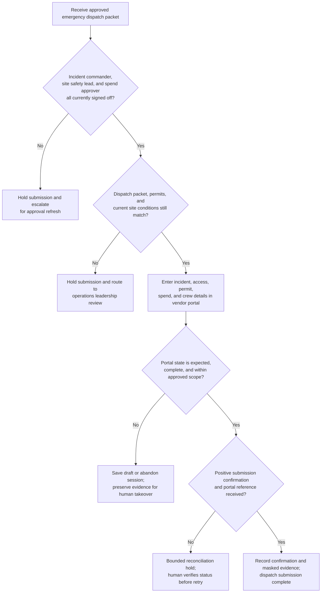

# Approved emergency maintenance vendor portal dispatch submission

## Linked pattern(s)

- `browser-based-form-completion-with-approval-gates`

## Domain

Operations.

## Scenario summary

An operations coordinator at a regional facilities command center needs to submit an already approved emergency dispatch request for a high-voltage switchgear failure that is threatening chilled-water service to a hospital-adjacent campus. The target contractor mobilization portal is browser-only, spreads the action across incident classification, site-access instructions, safety permits, not-to-exceed spend, crew callout details, and after-hours contact tabs, and final submission may proceed only after the incident commander, site safety lead, and facilities spend approver have all signed off in the operations work-management system. Because the portal action can mobilize external crews, trigger premium billing, and create site-entry authority that is difficult to unwind once accepted, the workflow must recheck approvals, confirm the approved dispatch packet still matches current site conditions, and halt safely if the live portal, permit state, or confirmation path becomes ambiguous.

## Target systems / source systems

- Operations work-management or incident case system holding the dispatch request, safety review, spend approval, and segregation-of-duties record
- Browser-only vendor or facilities portal used to request emergency contractor mobilization and site access
- Approved emergency scope packet, site hazard assessment, lockout-tagout or permit-to-work record, and asset-location reference data
- Contractor roster, rate-card policy, site access instructions, and after-hours escalation directory
- Evidence store for masked screenshots, uploaded approval artifacts, portal reference numbers, and exception or takeover notes

## Why this instance matters

This grounds the execution pattern in an operations workflow where the browser submission does not just update an internal record; it can immediately send external crews toward a live site hazard under emergency conditions. The value is not routine dispatch automation. It is disciplined approval-gated execution that proves safety, spend, and site-authority checks were satisfied before a consequential mobilization request was committed, while still stopping safely if portal drift or changing field conditions make the approved packet unreliable.

## Likely architecture choices

- Approval-gated execution should assemble the dispatch packet, verify that incident command, safety, and spend approvals are still current, and block final commit until those approvals are rechecked immediately before submit.
- A tool-using single agent can navigate the vendor portal, populate incident, access, and crew-request fields, upload the approved safety and scope attachments, and capture masked evidence at each gated checkpoint.
- Human-in-the-loop control should remain standard for changed hazard conditions, permit expiration, unexpected premium-rate warnings, site-access mismatches, or any portal prompt that suggests the request would authorize work outside the approved emergency scope.

## Governance notes

- The workflow should confirm that the approved site, asset identifier, hazard controls, contractor selection, and not-to-exceed spend all align before any browser entry begins.
- Screenshots and logs should preserve which approvals unlocked dispatch, which safety packet was attached, and which portal confirmation was received, while minimizing exposure of sensitive facility diagrams, badge codes, personal contact details, or security instructions.
- If the portal shows an unapproved contractor, altered pricing tier, missing permit field, conflicting site-access requirement, or an existing live dispatch that may overlap the same asset, the workflow should stop at a saved draft or abandon the session rather than guess and mobilize the wrong response.
- Human takeover steps should preserve current page state, entered-but-unsubmitted values, uploaded attachments, and the reason for the halt so facilities leadership can resume safely without duplicating dispatches or losing audit evidence.
- Safe halt behavior should be explicit when approvals are stale, weather or incident status changes invalidate the safety packet, or portal confirmation is ambiguous enough that a duplicate contractor callout could occur.

## Evaluation considerations

- Percentage of approved emergency dispatch submissions completed without duplicate mobilization, unauthorized spend, or post-incident correction to contractor scope
- Rate of stale approvals, permit mismatches, pricing anomalies, or portal drift caught before final submission
- Completeness of evidence bundles linking the submitted dispatch to the approved safety, spend, and site-authority records
- Reliability of safe halt and human takeover when the vendor portal changes, times out, or returns unclear confirmation during high-pressure incident conditions
