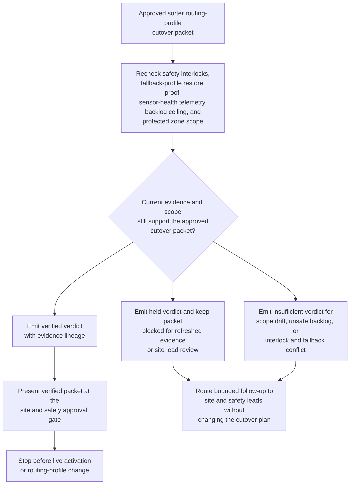

# Approved sorter routing cutover evidence gate verification

## Linked pattern(s)

- `evidence-gated-verification-for-release`

## Domain

Operations.

## Scenario summary

Site leadership has an approved routing-profile cutover packet for a high-volume sorter, but the packet cannot be released to live activation until current evidence still supports safe downstream use. The workflow rechecks safety interlocks, fallback-profile availability, sensor-health telemetry, backlog ceiling, and protected zone scope against the packet, then emits a verified, held, or insufficient verdict for site approval. It must not alter the routing profile, recommend a different zone order, or start the cutover itself.

## Target systems / source systems

- Operations cutover packet store holding the approved routing profile, protected zone sequence, and fallback plan
- Sorter control console, sensor-health telemetry, jam-detection dashboards, and backlog monitoring systems
- Safety interlock records, maintenance holds, and fallback-profile restore validation sources
- Approval workspace recording which site and safety leads may authorize downstream activation from the verified packet
- Audit store preserving telemetry snapshots, scope checks, hold reasons, and approval decisions

## Why this instance matters

This grounds the pattern in operations where a live facility change may already be approved in principle, yet the evidence that justified the packet can drift before activation starts. Backlog can spike, one safety interlock may degrade, or the fallback profile may no longer restore cleanly. The value comes from a bounded verification workflow that shows whether the packet is still safe to trust for downstream activation without drifting into replanning or live control execution.

## Likely architecture choices

- Approval-gated execution fits because the packet becomes ready for use only after site leaders approve a fresh verification verdict.
- Human-in-the-loop review should remain routine because safety and operations leads must interpret held conditions before any live sorter activation proceeds.
- Durable verification state should track superseded telemetry snapshots, repeated safety holds, and packet revisions so later approvals remain auditable.

## Governance notes

- The workflow should show current safety interlock state, fallback-profile restore proof, zone-scope comparison, and material telemetry checks directly in the approval-ready packet.
- A packet should remain held whenever backlog exceeds the approved ceiling, one protected zone drifts out of scope, or fallback restore evidence becomes stale.
- Human approval is required before the verified packet is handed into the staged activation workflow or used to justify live sorter reliance by downstream operators.
- Any recommendation to resequence zones, repair telemetry inputs, or execute the routing change belongs in planning, reconciliation, or execution patterns instead.

## Evaluation considerations

- Percentage of approved sorter cutover packets that receive a verdict with complete telemetry, safety, and fallback lineage
- Rate at which stale fallback proof, scope drift, or unsafe backlog conditions are caught before live activation begins
- Reviewer agreement that verified and held verdicts reflect the intended safety thresholds and protected zone rules
- Reliability of repeated verification when telemetry, maintenance holds, and packet revisions change during the final activation window
