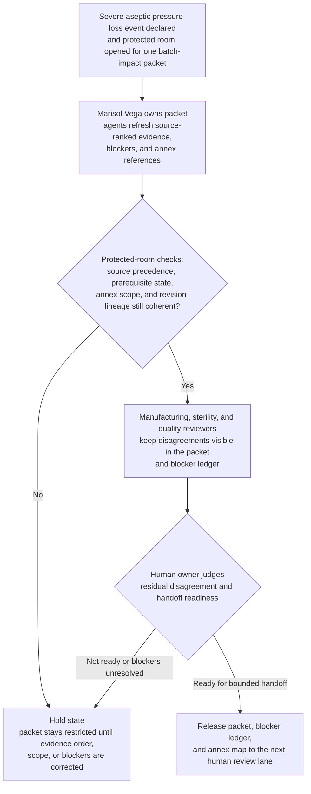

# Aseptic fill suite pressure-loss protected batch-impact packet collaboration room

## Linked pattern(s)

- `critical-protected-artifact-collaboration`

## Domain

Operations.

## Scenario summary

After a severe aseptic fill suite pressure-loss event is declared, site manufacturing operations opens a protected collaboration room for one batch-impact packet that will later support bounded sterility-assurance, site-quality, and executive manufacturing-risk review. Marisol Vega, Senior Director of Aseptic Operations, owns the artifact while agents help reconcile environmental-monitoring timeline updates, manufacturing objections, sterile-operations wording disputes, and restricted annex material about operator access traces, intervention video references, and incubator-status detail. The room stays centered on keeping one inspectable protected artifact current: the qualified environmental-monitoring historian remains authoritative for the pressure-loss and room-recovery timeline, the electronic batch record and line-clearance system come next for lot and intervention state, the deviation log and sample-chain records provide supporting governed context, and handwritten shift notes or bridge comments remain lowest-precedence annotations. The packet carries explicit prerequisite state that must already be true before collaboration can continue, including frozen affected-lot genealogy, the active cleanroom-containment SOP version, current sensor-calibration attestation, and the approved protected-room membership policy. Visible blockers such as unresolved glove-fingertip sampling, a missing contractor-badge segment, disputed stopper-bowl exposure wording, and an annex-scope mismatch remain attached to the packet and its append-only revision lineage. The human artifact owner remains responsible for deciding whether residual disagreement is tolerable and whether the packet is ready for the next bounded handoff, while batch disposition, restart sequencing, regulator communication, and downstream containment execution stay outside the workflow.

## Target systems / source systems

- Restricted manufacturing-severe-case collaboration room with the batch-impact packet, blocker ledger, annex map, release-state record, and append-only revision history
- Qualified environmental-monitoring historian and building-management telemetry containing differential-pressure alarms, recovery timestamps, room status, and calibration references that outrank all other timeline evidence
- Electronic batch record, line-clearance system, and lot-genealogy records containing active batch state, intervention timing, component exposure windows, and affected-lot freeze status
- Deviation-management, sample-chain, and sterile-operations repositories containing investigation notes, glove-fingertip and settle-plate status, SOP versions, and controlled reviewer comments
- Restricted annex store, access-control logs, and audit systems preserving operator badge traces, intervention video references, incubator-status detail, annex access changes, release approvals, and packet revision lineage

## Why this instance matters

This grounds the pattern in a critical operations workflow where the hard problem is maintaining one protected batch-impact artifact under severe sterility risk, not choosing product disposition or running the site response. The packet has to stay honest about evidence order, prerequisite production state, unresolved objections, and sensitive annex boundaries while humans and agents repeatedly revise it under time pressure. It deepens the governed-artifact slice by showing how one operations packet can preserve source precedence, blockers, and revision lineage without collapsing into command planning, approval adjudication, or downstream execution.

## Likely architecture choices

- Human-in-the-loop collaboration should remain primary because only accountable manufacturing and quality leaders can decide whether disputed sterility language, residual blockers, and restricted annex exposure are acceptable for handoff.
- An orchestrated multi-agent setup fits when separate agent roles refresh environmental evidence, reconcile batch-record deltas, normalize reviewer objections, maintain annex boundaries, and preserve append-only packet lineage across revisions.
- Agents may rewrite sections, refresh citations, and keep blocker state synchronized, but recommending batch disposition, resequencing restart windows, contacting regulators, or directing containment work should remain outside the room and explicitly human-controlled.

## Governance notes

- The packet should make source precedence explicit on every material claim: qualified environmental-monitoring evidence first, electronic batch and line-clearance state second, governed deviation and sample-chain records next, and handwritten notes or bridge commentary only as lowest-precedence context.
- Collaboration should remain blocked unless prerequisite product and policy state is current and inspectable, including frozen affected-lot genealogy, the active cleanroom-containment SOP version, valid sensor-calibration attestation, and approved room-membership rules.
- Visible blockers and unresolved items should remain attached to the packet rather than normalized away, especially pending microbiology results, missing access-trace segments, disputed exposure-interval wording, annex-scope mismatches, and any uncertainty about which interventions belong in the main packet versus the restricted annex.
- The readiness record should name Marisol Vega as the current human artifact owner, preserve accepted residual disagreement, and version the packet, blocker ledger, annex map, and release decision together so downstream reviewers can inspect exact revision lineage.
- If new evidence breaks the stated source order, expands annex exposure unsafely, or makes the packet audience inappropriate, the workflow should revert to held state rather than silently broadening scope or implying that batch disposition or restart planning has begun.

## Evaluation considerations

- Time to maintain one handoff-ready protected batch-impact packet while environmental evidence, reviewer objections, and annex content continue to change
- Rate at which downstream sterility-assurance or site-quality reviewers find hidden disagreement, stale source precedence, or over-broad annex exposure after packet release
- Consistency between the main packet, blocker ledger, annex map, prerequisite-state record, and append-only revision lineage across repeated revisions
- Frequency with which humans reject agent-assisted revisions because they drifted into batch disposition recommendation, restart sequencing, regulator communication, or downstream containment execution
