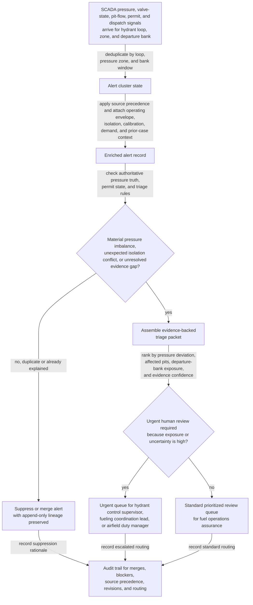

# Aviation-fuel hydrant pressure imbalance alert triage

## Linked pattern(s)

- `risk-alert-triage`

## Domain

Operations.

## Scenario summary

An airport fuel operations assurance team monitors continuous hydrant-network risk signals across SCADA pressure telemetry, pump and valve state changes, pit-level flow readings, approved maintenance isolations, permit acknowledgments, dispatch fueling assignments, and verified flight-bank demand updates. The workflow must collapse duplicate alerts tied to the same hydrant loop, pressure zone, and departure bank; enrich each case with current operating envelope, active isolation boundaries, recent pit-sensor calibration state, prior triage history, and whether the loop is already under governed watch; and then prioritize which cases need immediate human review. Evidence posture is explicit for one exact governed triage artifact, `AFH-Pressure-Imbalance-Triage-Case-2026-03-22-0938Z-r4`: authoritative SCADA pressure and valve-state telemetry outrank dispatch forecasts, fueling network workbench summaries, and informal radio traffic, while approved maintenance isolation and permit state outrank local notebook entries or unverified crew commentary when deciding whether the imbalance is expected, unsafe, or unexplained. The case starts only after prerequisite state is present for the active hydrant control envelope `HCO-7.3`, approved loop-topology release `Hydrant-Zone-Map-2026-03`, current maintenance permit ledger, current flight-bank demand snapshot, and prior open-case lineage; visible blockers such as stale pit-sensor calibration at Stand 42, unresolved valve-isolation mismatch on Segment B7, missing 0945Z flight-bank demand refresh, lagging inventory reconciliation from Tank Farm 2, or incomplete permit acknowledgments remain attached to the triage packet. Priority logic must stay explainable by showing pressure differential from the approved operating band, count of affected pits and assigned turns, minutes to the next protected departure cluster, and confidence penalties when telemetry freshness, permit state, or demand context conflict. The goal is to produce an evidence-backed triage queue for hydrant control supervisors, fueling coordination leads, or airfield operations duty managers before a true pressure instability compromises safe fueling continuity, but not to isolate hydrant segments, stop fueling, dispatch mechanics, resequence aircraft stands, or declare downstream operational action automatically. Named human owner: Sofia Rahman, Director of Airfield Fuel Operations Assurance.

## Target systems / source systems

- Hydrant SCADA and pump-control systems with authoritative pressure-zone readings, pump status, valve positions, alarm thresholds, and telemetry freshness metadata
- Pit-monitoring and fueling-stand systems with pit pressure snapshots, flow anomalies, hose connection state, and last calibration or maintenance references
- Approved maintenance isolation, permit-to-work, and acknowledgment systems showing active segment isolations, work windows, countersignatures, and safe-boundary declarations
- Dispatch and fueling-network operations records with verified stand assignments, departure-bank demand, fueling sequence updates, and coordinator-confirmed turn coverage
- Fuel inventory and tank-farm reconciliation systems with supply-path availability, replenishment timing, and lag indicators that may explain or block confident triage
- Audit-grade triage case queue preserving raw alert lineage, source-precedence decisions, blocker flags, priority-factor calculations, routing rationale, and human overrides

## Why this instance matters

This grounds `risk-alert-triage` in an operations environment where the hard problem is not merely detecting one low-pressure spike, but deciding whether an apparent hydrant imbalance is a genuine fueling-continuity risk once authoritative telemetry, governed isolation state, and near-term departure demand are weighed together. A weak workflow would either flood fuel operations reviewers with repetitive pressure chatter caused by already approved maintenance boundaries or under-rank the one case where informal radio reassurance masks a real imbalance building across an active departure bank. The instance stays inside monitor/detect/triage because the agentic work is continuous watching, duplicate-aware enrichment, blocker visibility, explainable prioritization, and governed routing into human review rather than hydrant isolation, mechanic dispatch, fueling resequencing, aircraft communication, or downstream operational execution.

## Likely architecture choices

- Event-driven monitoring should continuously ingest SCADA telemetry, pit-flow changes, permit acknowledgments, dispatch assignment shifts, and tank-farm reconciliation updates, then reopen, merge, or reprioritize alert clusters as evidence changes.
- A tool-using single agent can correlate hydrant loop identifiers across SCADA, permit, dispatch, and fueling records; suppress duplicate pressure-chatter bursts; apply explicit source precedence; and publish a prioritized queue with urgency drivers and blocker visibility.
- Human-in-the-loop review should remain mandatory for any alert involving authoritative out-of-band pressure behavior during active fueling windows, conflicts between telemetry and approved isolation state, or blocker conditions such as stale pit calibration, incomplete permit acknowledgment, or missing demand refresh.
- Approval-gated escalation is the right boundary because the workflow can recommend urgent routing to hydrant control, fueling coordination, or airfield duty leadership, but it should not independently stop fueling, isolate a segment, clear a permit boundary, or resequence flights.

## Governance notes

- Triage packets should show which pressure-band, isolation-boundary, departure-bank, and evidence-confidence rules fired; which raw alerts were merged; which sources were treated as authoritative versus provisional; and why the case entered a given urgency tier.
- Source precedence should be explicit and reviewable: authoritative SCADA pressure and valve-state telemetry outrank dispatch summaries and fueling workbench estimates for current network truth; approved maintenance isolation and permit state outrank local notes or informal radio reports for expected boundary conditions; and unverified crew commentary may inform context but cannot close or materially down-rank the alert on its own.
- Visible blockers and unresolved items should travel with the alert, including stale pit-sensor calibration, unresolved valve-isolation mismatch, missing flight-bank demand refresh, lagging inventory reconciliation, and incomplete permit acknowledgments that prevent confident urgency scoring.
- Append-only lineage should be preserved across every evidence update so reviewers can reconstruct how `AFH-Pressure-Imbalance-Triage-Case-2026-03-22-0938Z` moved from `r1` through `r4` as telemetry stabilized, permits were acknowledged, or dispatch demand changed after the original signal arrived.
- Broad queue views should minimize aircraft tail numbers, airline identifiers, exact fuel-load figures, and security-sensitive stand details while retaining traceable evidence in restricted fuel operations systems for authorized reviewers.
- Approval boundaries must remain firm: only authorized hydrant control supervisors, fueling operations managers, airfield duty managers, or designated engineering leads may decide whether a segment is isolated, fueling is paused, departures are resequenced, or a case can be closed as benign.

## Evaluation considerations

- Recall of historically material hydrant pressure imbalance cases that should have reached urgent human review before an active departure bank or fueling wave was exposed
- Reduction in duplicate reviewer work from merged SCADA, pit-flow, and dispatch alerts without lowering capture of genuine fueling-continuity or unsafe-pressure risk
- Median time from first authoritative pressure deviation or isolation conflict signal to a triage packet containing source-ranked evidence, blocker visibility, revision lineage, and routing rationale
- Reviewer override rate for alerts that were over-ranked because provisional dispatch context looked authoritative or under-ranked because permit state or pressure-zone topology was not surfaced clearly enough
- Auditability of suppression, merge, source-precedence, priority-factor, policy-version, and escalation decisions during airport fuel operations review, safety assurance testing, or post-event reconstruction
