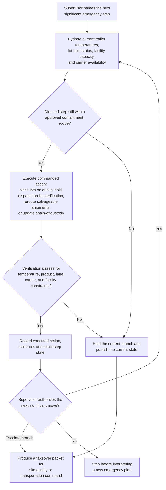

# Cold-chain emergency supervised step-through task orchestration

## Linked pattern(s)

- `human-directed-task-orchestration`

## Domain

Operations.

## Scenario summary

A regional cold-chain operations lead is directing emergency response after multiple reefer trailers at a cross-dock begin reporting rising temperatures during a snowstorm-driven power instability event. The agent may execute only the significant steps the supervisor calls: place affected lots on quality hold, dispatch probe verification to named trailers, reroute salvageable shipments to two approved facilities, update chain-of-custody records, and verify that the next planned move still respects product, lane, and carrier constraints before continuing. Because inventory quality, field conditions, and available carriers are changing minute by minute, the workflow must preserve exact step state, stop before interpreting a new emergency plan on its own, and produce a takeover-safe handoff if the supervisor escalates one branch to site quality or transportation command.

## Target systems / source systems

- Cold-chain control tower, shipment visibility, and route-execution systems
- Quality-hold, lot genealogy, and chain-of-custody records for temperature-sensitive inventory
- Carrier dispatch tools, site-capacity dashboards, and facility acceptance rules for emergency reroutes
- Emergency SOP fragments, supervisor direction log, and product-specific containment boundaries
- Audit and evidence store for temperature snapshots, executed system actions, and takeover packets

## Why this instance matters

This grounds the pattern in an operations scenario where the outcome is executed physical-work coordination under tight human supervision, not a recommendation packet or collaborative planning room. The agent helps by doing the system work, preserving state, and validating each directed move, but the supervisor remains responsible for which emergency branch to take and when to stop or transfer control.

## Likely architecture choices

- A tool-using single agent can update hold codes, dispatch probe checks, write reroute actions, and capture current quality and shipment state after each directed step.
- Human-in-the-loop control is required because the cold-chain lead decides which lots can move, which facilities may receive them, and when changing field conditions require a new branch or full stop.
- The workflow should generate resumable takeover packets whenever a product-quality lead, transportation manager, or site commander must assume control of one branch of the response.

## Governance notes

- Directed steps should remain tied to explicit supervisor instructions and current containment scope; the workflow should not infer extra reroutes, releases, or disposition decisions from prior emergency context.
- Each step should recheck trailer temperatures, destination capacity, lot restrictions, and carrier constraints before the next commanded action is accepted as safe.
- Quality-sensitive product data, customer routing detail, and facility security notes should be minimized outside the approved operations and audit systems.
- If probe readings conflict, if a planned reroute would cross a product restriction, or if field conditions change fast enough that the current directed branch is no longer defensible, the workflow should halt and publish the current state instead of improvising a rescue sequence.
- Takeover packets should preserve executed holds, current shipment locations, pending transfers, and unresolved branch decisions so successor leaders can continue without re-deriving physical inventory state.

## Evaluation considerations

- Percentage of supervised emergency runs completed or safely handed off without unauthorized shipment movement, lost chain-of-custody state, or duplicated control actions
- Rate of stale temperature data, facility-capacity conflicts, or product-restriction breaches caught before the next directed emergency step
- Completeness of evidence linking supervisor instructions to hold updates, reroutes, verification checks, and chain-of-custody state
- Reliability of resumption packets when quality, transportation, or site command takes over one branch of the emergency workflow
