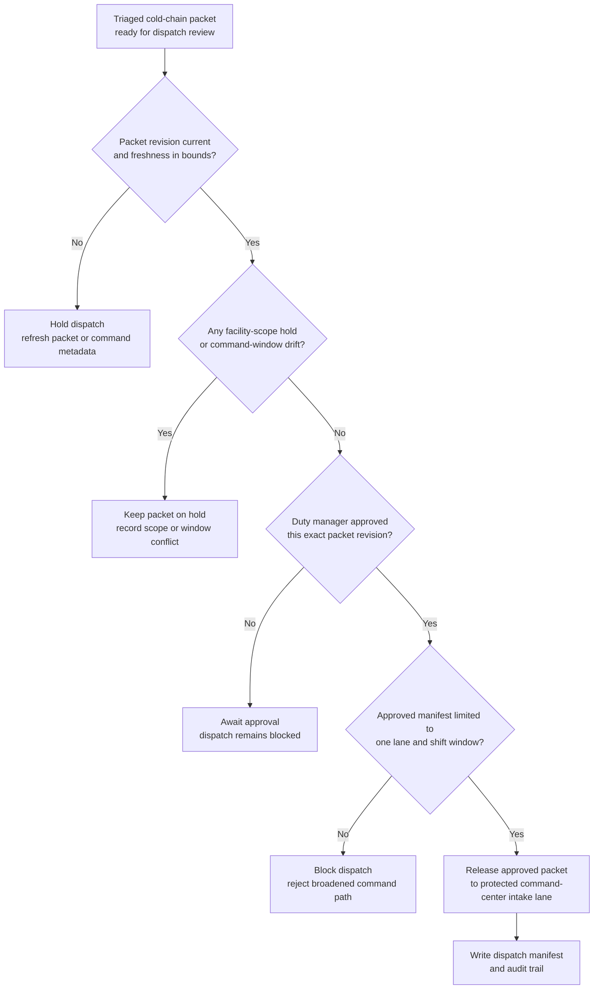

# Cold-chain excursion triage packet approved for network command-center dispatch

## Linked pattern(s)

- `approval-gated-triage-dispatch`

## Domain

Operations.

## Scenario summary

A logistics control team has already triaged a cold-chain excursion packet that groups the affected facilities, shipment cohorts, sensor corroboration, route metadata, and unresolved uncertainty about product exposure. The next step is not to choose the reroute, quarantine, or product-disposition response; it is to decide whether the exact packet revision may be released into the protected network command-center intake lane that coordinates those downstream actions. The dispatch workflow watches packet freshness, facility-scope holds, command-window metadata, and duty-manager approval state, then releases the packet only when the approved manifest authorizes one bounded command-center lane and shift window.

## Target systems / source systems

- Cold-chain monitoring and triage systems holding the already-triaged excursion packet, correlated sensor evidence, and duplicate lineage
- Shipment, facility, route, and quality systems contributing freshness and hold-state references already attached to the packet
- Network command-center intake queue and dispatch-manifest tooling used to release the approved packet revision into the protected downstream lane
- Duty-manager approval systems recording signer identity, command boundary, shift window, and blocked dispatch attempts
- Audit and hold-tracking stores preserving packet supersession, facility-scope conflicts, command-window changes, and override history

## Why this instance matters

This grounds `approval-gated-triage-dispatch` in operations work where severe monitored conditions often need one more explicit gate before they enter a command workflow that can mobilize scarce response capacity. The value lies in releasing the right triaged packet into the right protected lane with visible hold state, not in deciding the operational response itself. The instance therefore sits cleanly at the monitor family boundary between earlier excursion triage and later contingency planning or live command execution.

## Likely architecture choices

- Event-driven monitoring fits because sensor state, shipment exposure, and command-window availability can change while the packet waits at the dispatch gate.
- Approval-gated execution fits because the packet is ready for network command-center intake but stays blocked until the duty manager approves the exact facility scope and lane boundary.
- Human-in-the-loop review should remain in the normal path because a released command-center packet can mobilize downstream responders even though this workflow itself does not trigger the reroute or product decision.
- The workflow should emit only the dispatched queue entry, manifest, hold register, and audit trail rather than a reroute recommendation, shared command brief, or executed operations order.

## Governance notes

- The dispatch manifest should bind approval to one excursion packet revision, one command-center lane, one facility scope, and one protected shift window.
- Dispatch should remain held when facility scope drifts, command-window metadata changes, or shipment-quality references lapse outside the approved freshness boundary.
- Broad queue views should minimize shipment identifiers, customer details, and sensitive facility information while preserving traceable references in governed operations systems.
- Operations governance owners must approve changes to command boundaries, signer roles, freshness windows, and dispatch-hold criteria; the workflow ends before reroute activation, product disposition, or downstream command coordination begins.

## Evaluation considerations

- Median time from excursion packet readiness to approved command-center dispatch or explicit blocked state
- Rate of wrong-scope, wrong-window, or stale-context corrections discovered after dispatch approval
- Completeness of audit lineage linking packet revision, duty-manager sign-off, and protected command-lane release
- Reliability of hold behavior when facility scope or shipment exposure changes during the approval cycle
