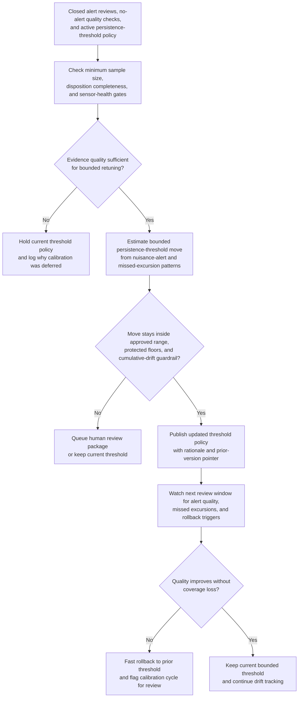
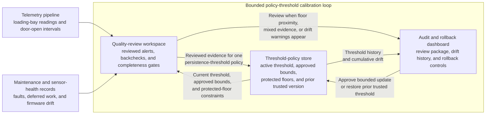

# Cold-chain loading-bay excursion persistence threshold calibration

## Linked pattern(s)

- `adaptive-threshold-calibration`

## Domain

Operations.

## Scenario summary

A cold-chain operations engineering team maintains the temperature-excursion persistence threshold used at refrigerated loading bays where pallets briefly leave trailer airflow during cross-dock transfer. The live policy currently raises an exception when a staging-lane probe stays above the product-class limit for six minutes after approved door-open compensation, but recent depot reviews show too many nuisance alerts during normal high-throughput transfer waves while one slow condenser failure was detected later than operators wanted. The calibration workflow should retune that one persistence-threshold policy only within pre-approved bounds, require minimum reviewed sample sizes and disposition-completeness gates before moving anything, preserve protected sensitivity floors for vaccine and oncology lanes, show cumulative drift from the trusted baseline, and restore the prior threshold quickly if confirmed missed-excursion evidence rises after a change.

## Target systems / source systems

- Cold-chain telemetry pipeline carrying loading-bay probe readings, door-open intervals, lane identifiers, and refrigeration-state signals
- Quality-review workspace with confirmed nuisance alerts, validated missed excursions, no-alert backchecks, and operator disposition completeness metrics
- Threshold-policy store holding the active persistence threshold, protected product-lane floors, approved calibration bounds, and prior trusted versions
- Depot maintenance and sensor-health records used to block calibration when probe faults, deferred maintenance, or firmware drift make feedback unreliable
- Audit and rollback dashboard showing threshold history, cumulative drift from baseline, blocked moves, and one-click restoration of the prior policy

## Why this instance matters

This grounds the pattern in operations without drifting into live alert handling. The workflow changes only the future persistence threshold used to surface loading-bay excursion alerts; it does not triage current alerts, dispatch mechanics, quarantine product, or decide whether any shipment can move. That narrow boundary makes the adaptation loop low risk, reversible, and meaningfully distinct from cold-chain triage or command workflows elsewhere in the repository.

## Likely architecture choices

- Event-driven monitoring should trigger recalibration only after enough reviewed excursion outcomes accumulate for a depot and product lane, not every time a single noisy transfer wave occurs.
- A tool-using single agent can read reviewed outcomes, compute a within-bounds threshold move, update the policy store, and write the calibration record when feedback-quality gates pass.
- Human-in-the-loop review should remain normal when a proposed move approaches a protected floor, when cumulative drift reaches the delegated warning band, or when evidence quality is mixed across depots.
- Fast rollback should stay operationally simple: restoring the previous threshold version must not require code redeployment or broader cold-chain incident coordination.

## Governance notes

- Vaccine, oncology, and other regulator-sensitive product lanes should keep protected maximum persistence values that autonomous tuning cannot relax.
- Calibration should require a minimum trailing window such as enough reviewed alerts and no-alert backchecks to separate systematic nuisance patterns from one-off dock congestion or probe chatter.
- Feedback-quality gates should block retuning when case dispositions are incomplete, sensor-fault rates are elevated, or maintenance work makes recent telemetry unrepresentative.
- Audit records should capture the baseline threshold, proposed and applied values, cumulative drift, blocked moves, rollback events, and the exact review evidence used for each change.
- The workflow must stop at threshold-policy calibration; it should not reprioritize exception queues, release incident packets, assign responders, or execute product-hold decisions.

## Evaluation considerations

- Reduction in confirmed nuisance loading-bay excursion alerts without an increase in validated missed excursions after the calibrated threshold is applied
- Percentage of calibration cycles blocked correctly because sample size, disposition completeness, or sensor-health quality was too weak to justify a move
- Frequency of human-review triggers caused by cumulative drift or protected-floor proximity, which helps show whether the delegated bounds are stable or too permissive
- Time required to roll back to the prior trusted threshold after post-change evidence shows weaker cold-chain coverage than expected
