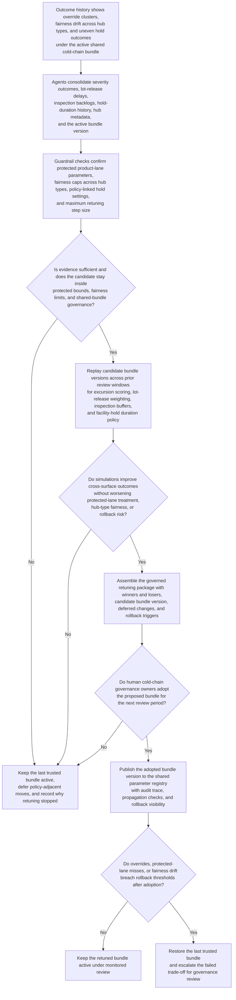
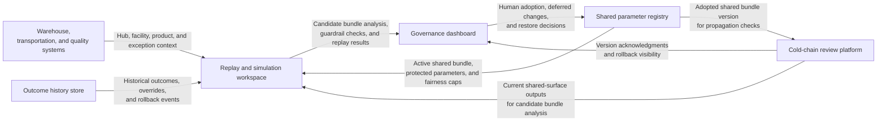

# Cold-chain network review bundle retuning

## Linked pattern(s)

- `governed-optimization-bundle-retuning`

## Domain

Operations.

## Scenario summary

A cold-chain governance lead owns a shared optimization bundle used across a refrigerated distribution network to influence several coupled review surfaces: temperature-excursion severity scoring, lot-release prioritization weighting, pending-inspection urgency buffers, and facility-hold duration policy for cold-storage exceptions. Recent outcome history shows that the active bundle improved average review throughput at large automated hubs, but human overrides, late quality interventions, and prolonged holds are clustering at smaller spoke depots, third-party partner sites, and product lanes with tighter regulator-visible protection requirements. The workflow must produce a governed retuning package and candidate bundle that make cross-surface trade-offs explicit, reduce fairness drift across hub types, and preserve protected parameters for sensitive product classes, without reprioritizing live queues, scheduling inspections, remediating facilities, releasing lots, or activating the new bundle without human adoption.

## Target systems / source systems

- Cold-chain review platform with current excursion scores, lot-release priority outputs, pending-inspection buffers, and facility-hold policy state across the network
- Warehouse, transportation, and quality systems with hub type, facility ownership, product sensitivity tier, regulator-visible handling requirements, and exception metadata
- Outcome history store showing reviewer overrides, reopened quality packets, hold-duration variance, delayed lot-release reviews, missed inspection windows, and prior rollback events
- Shared parameter registry containing the active cold-chain optimization bundle, protected product-lane parameters, fairness caps across hub classes, and bundle version lineage
- Replay and simulation workspace used to test candidate bundles against prior seasonal windows, disruption periods, and mixed hub cohorts before adoption
- Governance dashboard used by cold-chain quality and network-operations leaders to compare bundle options, defer policy-linked changes, and restore the last trusted bundle

## Why this instance matters

This grounds the pattern in operations where one shared optimization bundle shapes several quality-review surfaces at once across a physically uneven network. A naive optimizer could improve average throughput at large hubs while silently worsening treatment at smaller depots, partner facilities, or high-sensitivity product lanes that need stronger protection and longer review dwell. The workflow remains strictly inside optimize/adapt territory because it ends at a governed retuning package and human-adopted candidate bundle rather than current alert triage, inspection scheduling, facility remediation, lot release, or downstream cold-chain execution.

## Likely architecture choices

- Orchestrated multi-agent coordination fits because separate roles can analyze cross-surface outcome drift, test hub-type fairness constraints, replay candidate bundles, and assemble one auditable retuning packet over shared cold-chain state.
- Human-in-the-loop review should remain standard because cold-chain governance owners must explicitly adopt, narrow, defer, or reject bundle changes before any shared optimization state becomes active.
- Recommendation-only autonomy keeps the boundary clean: the workflow can compare candidate bundle versions and surface trade-offs, but it must not activate live queue changes, decide individual lot treatment, or reschedule inspections on its own.
- Operations leaders should remain able to freeze retuning, hold policy-adjacent parameter moves for quality-governance review, and restore the prior trusted bundle quickly if the new version weakens protected-lane handling or fairness across hub types.

## Governance notes

- Parameters affecting vaccine, biologic, pediatric, or other regulator-sensitive product lanes should remain protected bundle components that ordinary retuning cannot relax.
- Every retuning package should show cross-surface winners and losers explicitly so throughput gains on severity scoring or lot-release handling cannot hide longer holds, weaker inspection coverage, or unequal treatment across hub classes.
- Fairness checks should compare company-owned hubs, third-party sites, high-volume automated depots, and lower-volume spokes so the bundle does not overfit to the network segments with the cleanest data.
- Auditability should preserve the current and proposed bundle versions, replay cohorts, override clusters, deferred changes, adoption decisions, propagation checks, and rollback triggers for each retuning cycle.
- Optimization views should minimize exposure of shipment identities, customer details, and exact facility-sensitive evidence while retaining the bounded information needed for authorized governance review.
- The workflow must stop at governed bundle retuning; it must not reprioritize live queues, recommend hold or release decisions for specific lots, schedule inspectors, dispatch remediation, or execute facility policy changes.

## Evaluation considerations

- Reduction in reviewer overrides, prolonged facility holds, delayed lot-release review, and missed inspection-urgency protection after a retuned bundle is adopted
- Change in treatment of smaller spoke depots, third-party partner hubs, and regulator-sensitive product lanes across the coupled surfaces that share the bundle
- Frequency with which policy-adjacent parameter moves are correctly deferred instead of being folded into ordinary optimization
- Speed and clarity of rollback when a bundle improves average network throughput but harms protected-lane treatment, cross-hub fairness, or cross-surface stability
