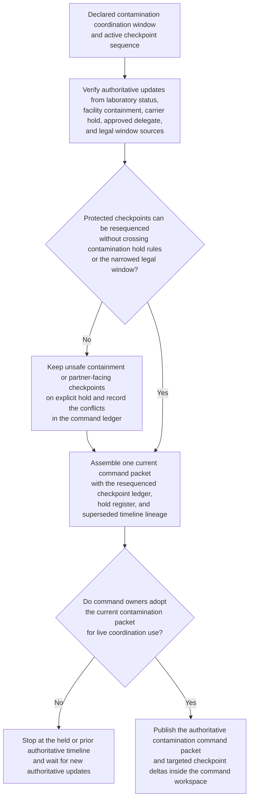

# Contamination command-window checkpoint resequencing

## Linked pattern(s)

- `critical-command-window-resequencing`

## Domain

Operations.

## Scenario summary

A food-distribution command center has already declared a critical contamination coordination window with an active checkpoint sequence for laboratory readiness review, facility containment confirmation, carrier hold verification, legal review, and partner-briefing preparation. As the event unfolds, authoritative conditions change: laboratory turnaround slips, one facility confirms containment earlier than expected, and legal narrows the latest safe partner-briefing window while a carrier review owner rotates to an approved after-hours delegate. The workflow must rebuild one authoritative checkpoint order, preserve explicit holds for any partner-facing or containment checkpoint that is not yet safe to advance, and issue one current command packet so operations, quality, and legal teams stop coordinating from diverging whiteboard timelines.

## Target systems / source systems

- Command-center incident record with the declared contamination scope, protected checkpoints, and prior coordination packets
- Laboratory status, facility containment, and carrier-hold systems publishing authoritative readiness and dependency changes
- Delegate rosters, calendars, and on-call schedules for quality, operations, legal, and carrier-coordination roles
- Command workspace used to track acknowledgements, superseded timelines, and held checkpoints across the safety event
- Notification tooling that can send role-targeted checkpoint deltas without approving downstream partner communication or recall action

## Why this instance matters

This grounds the pattern in an operations safety workflow where the critical need is one trustworthy command timeline, not deeper root-cause work, recall recommendation, or execution. Under contamination pressure, teams can easily drift into parallel unofficial schedules if laboratory, containment, and legal windows keep moving. The value of the pattern is maintaining one authoritative checkpoint ledger with explicit holds and human adoption boundaries so downstream actions rely on a shared current sequence.

## Likely architecture choices

- An orchestrated multi-agent design can separate authoritative readiness intake, protected-checkpoint validation, resequencing, and packet publication while preserving one shared command-window ledger.
- Human-directed control fits because operations, quality, and legal leadership must adopt any changed checkpoint order before the new packet becomes authoritative for severe-event coordination.
- The workflow should retain superseded timeline lineage and pending acknowledgements so facility teams and partner-facing owners can see which sequence is current.
- The workflow should stop at the current checkpoint ledger, hold register, and coordination packet rather than recommending recall scope, issuing partner notices, or changing inventory state.

## Governance notes

- Protected checkpoints such as legal review and partner-briefing preparation should never move ahead of required containment or laboratory checkpoints without explicit human approval.
- Approved delegate handling is essential for after-hours carrier, facility, and legal roles so live checkpoint ownership does not drift through informal chat substitution.
- Coordination packets should share only role-relevant checkpoint timing and hold state, leaving restricted shipment, partner, or legal detail in narrower governed systems.
- Human command ownership is required before the updated sequence is used for consequential partner, facility, or regulator-facing coordination.

## Evaluation considerations

- Time from authoritative lab, containment, or legal change to a human-reviewable resequenced contamination command packet
- Rate of protected partner-facing checkpoints correctly held when prerequisite readiness or authority is unresolved
- Ability of facility, quality, and legal teams to identify the latest authoritative sequence without reconstructing the event manually
- Stability of the resequencing loop when multiple facilities and carrier checkpoints change during the same active safety window
