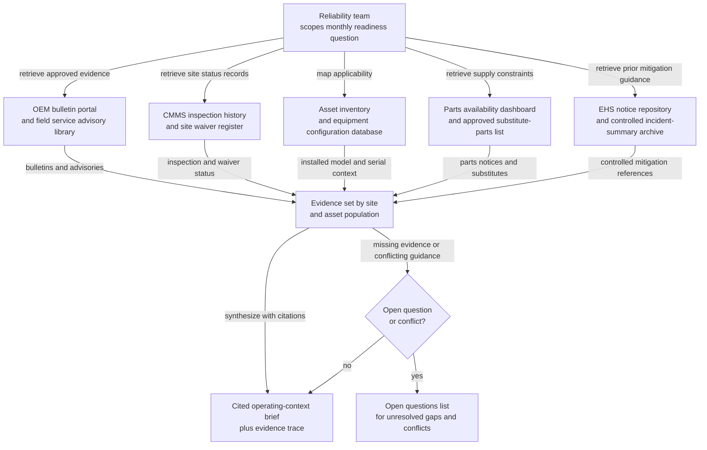
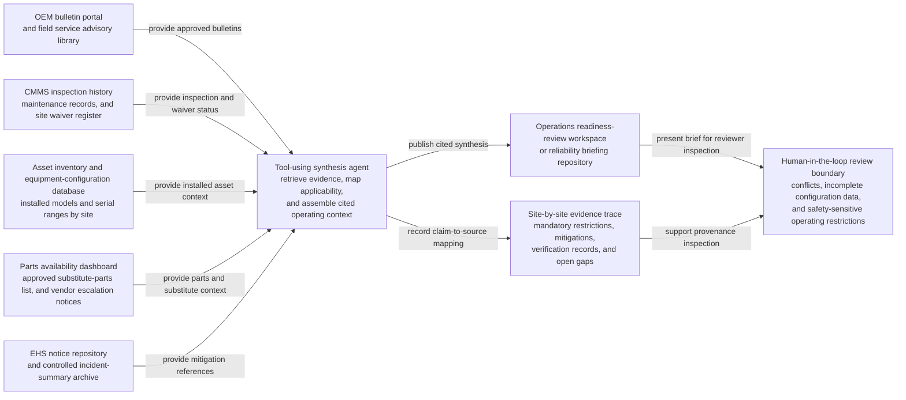

# Conveyor safety bulletin synthesis for network readiness review

## Linked pattern(s)

- `research-synthesis-with-citation-verification`

## Domain

Operations.

## Scenario summary

A central fulfillment operations reliability team is preparing a monthly network-readiness review for conveyor and sorter assets ahead of peak volume. The workflow must gather OEM safety bulletins, field service advisories, site-specific operating waivers, completed inspection records, and parts-availability notices to produce a grounded synthesis of which restrictions, mandatory checks, temporary mitigations, and unresolved conflicts currently apply at each affected site. The goal is not to decide shutdowns, reprioritize work orders, or assign crews, but to assemble a cited operating-context brief that site leaders and planners can trust before any downstream action.

## Target systems / source systems

- Operations readiness-review workspace or reliability briefing repository that stores the cited synthesis and evidence trace
- OEM bulletin portal, warranty notices, and field service advisory library for conveyor and sorter models in service
- CMMS inspection history, maintenance-completion records, and site waiver register
- Asset inventory and equipment-configuration database showing which models and serial ranges are installed at each site
- Spare-parts availability dashboard, approved substitute-parts list, and vendor escalation notices
- EHS notice repository and controlled incident-summary archive for prior temporary mitigation guidance

## Why this instance matters

This grounds the gather/synthesize family in an operations setting where the real value is assembling scattered operating evidence into a trustworthy current-state brief. Sites often receive overlapping bulletins, local waivers, and inspection updates at different times, so a generic summary can miss whether a restriction is mandatory, superseded, or limited to one asset configuration. The instance shows why retrieval scope, source precedence, and citation-backed synthesis matter before maintenance planning, peak-readiness decisions, or site-level execution begin.

## Likely architecture choices

- A tool-using single agent can retrieve applicable bulletins, map them to installed equipment populations, pull current inspection and waiver status, and draft a structured synthesis with claim-to-source traceability.
- Human-in-the-loop review should remain required when OEM guidance conflicts with local waivers, when asset configuration data is incomplete, or when the brief could affect safety-sensitive operating restrictions.
- The workflow should maintain a site-by-site evidence trace that distinguishes mandatory OEM requirements, locally approved temporary mitigations, completed verification records, and unresolved data gaps.
- Retrieval should favor approved technical bulletins, CMMS records, and controlled waiver registers; unsupported inference about safe run-time, repair sufficiency, or shutdown necessity should be prohibited.

## Governance notes

- Mandatory restrictions, advisory recommendations, and expired temporary waivers should be labeled separately so site teams can see what is actually in force.
- Superseded bulletins and stale inspection completions should not remain silently blended into the synthesis, because outdated technical guidance can distort readiness reviews.
- Access to incident summaries and safety notices should follow least-privilege rules, with copied narrative details minimized when a citation or controlled reference is enough.
- Any site or asset with incomplete configuration data, missing inspection evidence, or conflicting waiver status should be flagged as an open question rather than presented as fully cleared.

## Evaluation considerations

- Percentage of material operating-restriction, inspection, and waiver-status claims backed by inspectable citations to the current approved source set
- Reviewer correction rate for bulletin applicability, asset-population matching, or supersession status during reliability review
- Rate at which expired waivers, missing inspection evidence, or conflicting technical guidance are surfaced explicitly before downstream planning or execution
- Stability of the synthesis workflow when OEM bulletin formats change, serial-range mappings are incomplete, or site records lag behind the latest field advisory
